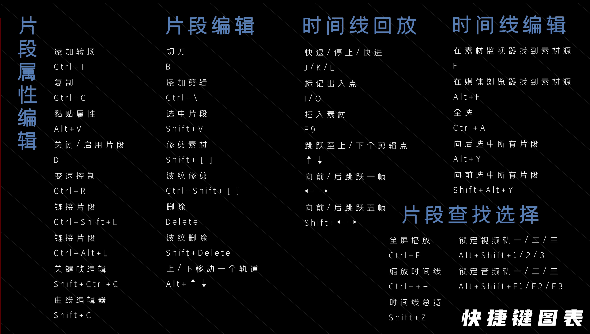

[影视飓风-达芬奇教程](https://space.bilibili.com/946974/channel/seriesdetail?sid=30829)

## 第一集：入门简介

用户-项目保存和加载，勾选“实时保存”“项目备份”

在媒体界面导入素材，使用媒体夹分类

先使用右下角⚙️的项目管理设置帧率，再导入素材

先在素材监视器中 IO，再按 F9 插入素材

## 第二集：剪辑面板

按 `T` 切换到修剪剪辑模式，这样在拖动剪辑素材时，后面的素材也会跟着移动 

打开素材监视器的快捷键与 Pr 相同：`F`

右键一个轨道上的视频和音频，选择 `链接片段` （最底部）即可将断开的素材链接，快捷键 `Command+Option+L`

旗标 `G` 标记整段素材，可以用来区分不同类型素材；标记 `M` 打在素材或时间上

右键- `片段色彩`，修改成不同颜色来区分素材

## 第三集：添加效果与关键帧

调整检查器上的数字如缩放数值时，可以通过按住 Option 来放慢数值变化速度

点击数值旁边的小菱形，打上关键帧，时间线拖到另一个地方，修改数值，自动打上第二个关键帧

点击时间线上素材的小菱形，同样可以进行关键帧的调整

时间线上素材小菱形旁边的按钮就是加曲线，一般用四个曲线里的第二个

想要复制属性，先复制素材片段，再选中需要应用的片段，右键-`粘贴属性`（`Option+V`）

项目设置-图像缩放调整-输入缩放调整 可以调整不同比例适应时间线的方式

检查器-动态缩放，可以非常方便的添加缩放效果。时间线监视器左下角，选到动态缩放，用两个框调整缩放范围

推荐插件：Red Giant Universe（效果和转场）、FilmConvert Nitrate（胶片风格调色）

## 第 3.5 集：代理文件的生成

播放-时间线代理模式，可以选择二分之一或四分之一的画质来回放

媒体池选中素材，右键-生成优化媒体文件，就可以生成代理，代理的参数在设置-主设置-优化的媒体和渲染缓存

Mac 建议的设置参数是 1/2 分辨率，ProRes 422 LT

播放-渲染缓存，设置是智能预渲染卡顿的地方还是用户手动选择

## 第 3.8 集：智能媒体夹与双时间线剪辑

智能媒体夹-右键-添加智能媒体夹，可以按照时间、标签（人为标注）等来筛选

可以并行开两条时间线，直接把上面时间线的内容拖到下面，这样上面时间线的内容也还在。应用场景是上面时间线放所有素材，下面放筛选后素材，也可以同时开一条 A roll 的时间线和一条 B roll 的时间线

 编辑-删除空隙，删除掉时间线上的所有空隙

## 第四集：快编界面

## 第五集：关于变速的一切

右键片段-`更改片段速度`。勾选波纹序列，后面素材会跟着前移或后移，冻结帧与 AE 相同，音调校正保持声音音调

保持定时和拉伸以匹配会影响原先打在上面的关键帧如何处理，但不建议使用这个功能，有时会让曲线错乱，比较好的做法把打了关键帧的素材先右键-`新建复合片段`，再做变速处理。

右键片段-`变速控制` `Command+R`，移动播放头到想要的位置，点击下方速度，添加速度点，就打上了关键帧，上面拉杆改变速度，下面拉杆改变关键帧时间点

右键片段-`变速曲线`，修改变速的曲线

对于**升格**，右键素材-片段属性，选择你希望回放它的帧率（通常和时间线一致），这样做能避免变速时不能整除导致的跳帧

项目设置-主设置-帧内插值，可以选择插值模式，光流法一般算不出来

检查器-变速与缩放-运动估计- Speed Warp 变速，是一个 AI 功能，能够让光流更自然，但算的也更慢

## 第六集：软件交互与工程打包

## 第七集：快捷键

| 操作                 | 快捷键            |
| -------------------- | ----------------- |
| 快退/停止/快进       | J/K/L             |
| 添加剪辑点           | Command+B         |
| 波纹删除             | Shift+Delete      |
| 将素材移到上/下轨道  | Option+上/下      |
| 同时添加淡入和淡出   | Command+T         |
| 关闭/启用片段        | D                 |
| 关键帧编辑器         | Command+Shift+C   |
| 曲线编辑器           | Shift+C           |
| 在媒体池中找到源素材 | Option+F          |
| 向后选中所有片段     | Option+Y          |
| 时间线总览           | Shift+Z           |
| 全屏                 | P/Command+F       |
| 波纹剪辑             | Command+Shift+[/] |

## 第八集：秘传技

偏好设置-用户-剪辑-时间线的智能媒体夹，勾选后就会有一个把所有时间线都筛出来的智能媒体夹

编辑-复制当前时间线，可以快速复制一个当前的时间线

时间线-选区跟随播放头

时间线-清理视频轨道，删掉不用的片段

时间线-输出加遮幅

   

## 第九集：调色界面

底下四个轮：暗部、中灰、亮部、全局

中间调类似 Lr 的清晰度

色彩增强类似自然饱和度

`Shift+D` 开关调色节点，方便对比效果

建议一开始只开波形图和矢量图

可以自己用达芬奇自带的工具生成一个黑白渐变，来理解不同工具和波形图的作用

## 第十集：调色节点

`Option+S` 添加串行节点，`Option+P` 添加并行节点，建议二级调色互相之间使用并行节点

`Option+L` 图层节点，三个节点就可以指定混合模式，外部蒙版如噪点炫光可以直接拖进节点界面，再叠加

复制调色：先选中缩略图再中键点击需要复制的缩略图；使用前一个片段调色 `+`，使用前两个片段 `-`；或者先选中要粘贴的缩略图，右键静帧-应用调色；

## 第十一集：认识 LUTS

## 第十二集：秘传技

光箱筛选素材 可根据 是否调色/降噪/片段修改时间/元数据 筛选片段，也可以按类似智能媒体夹的方式筛选

| 操作              | 快捷键    |
| ----------------- | --------- |
| 启用/关闭单独节点 | Command+D |
| 绕过所有调色操作  | Shift+D   |
| 突出显示选区      | Shift+H   |
| 影院模式          | Option+F  |

批处理，选中几个片段，右键-添加到新群组 片段前/片段/片段后都可以调整，类似**调整图层**，不习惯的话也可以用工具箱里的`调整片段`，和 Pr 调整图层一样

利用稳定器可以做简单的文字跟踪，先用旧版稳定器进行点跟踪，再把跟踪信息粘贴给文字

蒙版跟踪，增加马赛克等效果

魔法蒙版： 在任何人身上画一条线，点跟踪，再点蒙版按钮，达芬奇用 AI 直接就把人抠出来了，抠完后右键添加 alpha 输出，即可完成抠除

## 第十三集：二级调色

色相对色相、色相对饱和度、亮度对饱和度曲线，根据色相确定选区

人眼对暗部敏感，如果暗部脏，整个画面会显得特别难看，通常会单独给暗部降饱和

限定器，用吸管吸颜色，自定义范围，降噪是减少跳来跳去的色块

3D 限定器可以同时选择多种颜色，比方说红色和蓝色，做到普通限定器做不到的事

曲线和限定器建议和跟踪蒙版一起使用

## 第十四集：达芬奇 17 的新功能

HDR 色轮比传统色轮强大很多，且不只用于 HDR 视频的调整，可以单独调整每个局部区域，还能在旁边的滑杆上定义影响范围，甚至还可以自定义更多选区

颜色扭曲器，非常好用，整合了用户需求，不用再来回切换工具了，还可以用取色器按住后拖动；可以用固定工具固定住不想移动的点；电影色彩都是有统一性一致性的，颜色扭曲器的收缩工具就可以让其他点向一个点收缩；基本上是一个万能工具

## 第十五集：最终集

文本用“文本”，不要用“Text+”，后者非常吃资源

轨道上右键-增加字幕轨道，检查器里就会出现字幕添加界面

文件-导入- 字幕，就可以把 srt 字幕导入

交付时需要勾选导出字幕-烧录到视频中

1080p 码率限制 35000，4k 码率限制 55000，如果只是预览可以 720p 1500-3000

如果图片放大时有锯齿，打开高级设置-`强制图像大小调整为最高质量`

建议 Mac 用户将项目设置-色彩管理-时间线色彩空间设到 Rec.709-A

能不降燥就不降燥，因为会损失细节且让导出时间翻倍，可以通过拉曲线直接把暗部噪点压掉

OpenFX-去闪烁，去掉画面频闪

OpenFX-物体移除-构建纯净图层，去掉不需要的物体或人

OpenFX-面部修饰

## 音频第一集：认识Fairlight面板

LUFS 是绝对响度的表示，单位是 LU。网络视频的基准值一般设到 -16LUFS 即可。一般响度表选到 BS.1770-4(LU)

## 其他

达芬奇导入 iPhone 的录音只有单声道！需要右键片段属性进行修改。

达芬奇无法像 pr 一样手动输时码定位，原因不明
