# 1.C++ 编程简介
## 1.1 Object Based

- 基本功
- with pointer
- without pointer
- 面对的是单一 calss 设计
## 1.2 Object Oriented

- 有关联的 calss
- 多个类的设计
## 1.3 History

- C 1972
- C++ 1983
- new C -> C with Class -> C++
- 大部分版本 C++ 98
- C++ 11 (2.0) 新的关键字
- C++ 14
## 1.4 推荐书
### 1.4.1 语言类

- 左侧：编译器作者
- 右侧：C++之父

### 1.4.2 如何书写

### 1.4.3 标准库

- 牛人 Scott Meyers, Stan Lippman
- C++ Primer 中规中矩
- Effective C++/More Effective C++/Inside C++ Object Model

# 2.头文件与类声明
## 2.1 关于数据和函数

- C语言

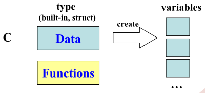

   - 语言没有关键字，数据必须是全局的
- C++语言
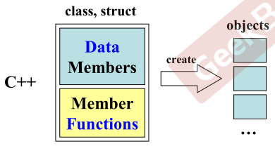
   - 数据和函数包在一起
   - 数据之间不会混杂
   - class：就是增强的 C 中的 struct结构，提供了很多关键字。C++ 中的 struct 和 class 区别很微小。
- C++，关于数据和函数
   - 不带指针的复数 class 设计
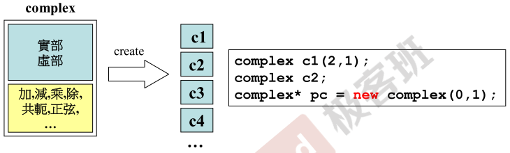
      - 涉及到实部虚部的设计
      - 各种运算关系
   - 带指针的字符串的 class 设计
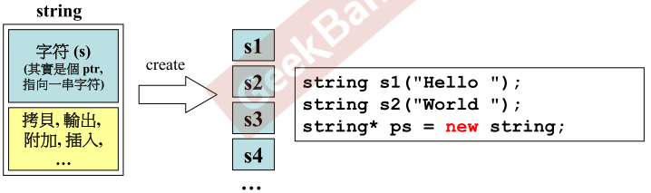
      - 内容通过指针来查找
      - 四个字符串，但大小只包含一个指针
## 2.2 代码的基本形式

- 不同平台的文件的命名不同 .h, .hpp, .cpp
- 标准库 include <iostream.h>
- 非标准库 include "complex.h"

- 数据的输出
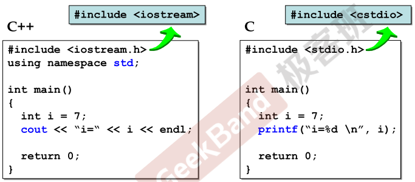
   - C++使用 cout 方式输出数据来调试，更加自然，什么都可以丢（<<就好像往 cout 里送一样）
   - C的 printf 必须明确数据的类型
### 2.2.1 Header 中的方式声明

- 防卫式声明
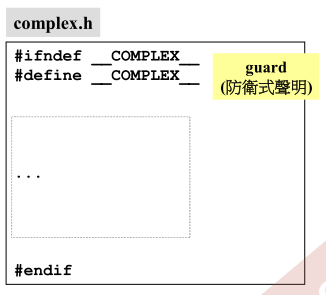
   - 这样就不需要考虑 `.h` 文件的调用顺序，即使多个文件同时调用时，也不会重复调用。
   - 未来进入公司编写大型项目的话，是很好的编程习惯
- 各类声明
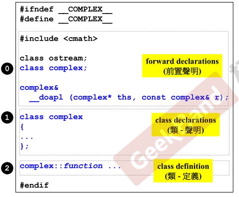
# 3.构造函数

- 复数的类的基本组成

- class template 介绍
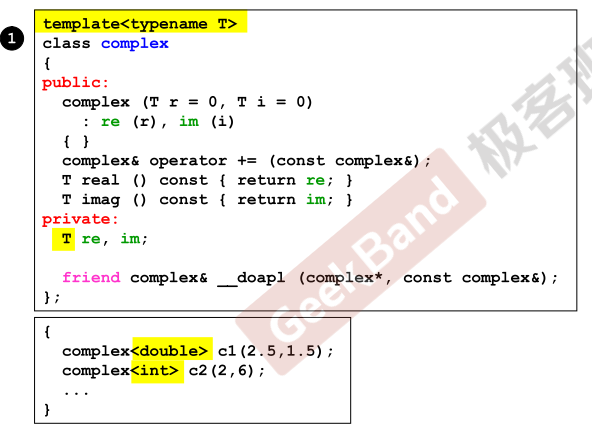
   - T 根据不同的定义 <double> 或 <int> 来重新定义
- inline 内联函数

   - 函数在本体里面定义，就成为 inline
   - 调用效率高
   - 如果函数太复杂，则没法写成 inline，所以 inline 只是给编译器的建议，最后是否会被处理为内联函数由编译器决定。
- 访问级别（数据在 private 是好习惯）
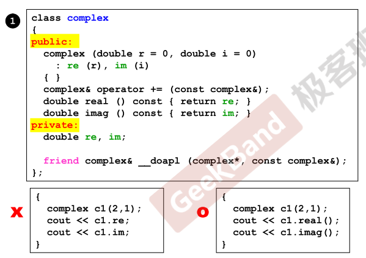
   - private 不可直接调用，一般是数据部分
   - public 可以被外界调用
- 构造函数（不带指针）

   - 函数名称与类相同，没有返回类型
   - 初始函数列，用 : re(r), im(i) 的写法，这种写法表示初始化，只有构造函数可以这么做。虽然也可以用平时赋值的写法，但和初始化不是一个阶段，效率会更低，所以推荐这么干。
   - 不带指针的类多半不需要写析构函数
   - complex c1(2,1)，调用构造函数，直接赋值 r=2, i=1
   - complex c2，调用构造函数，默认参数
      - complex * p = new complex(4)，调用构造函数，得到指针。这三种方式都在创建对象，
- 构造函数的overloading（重载）
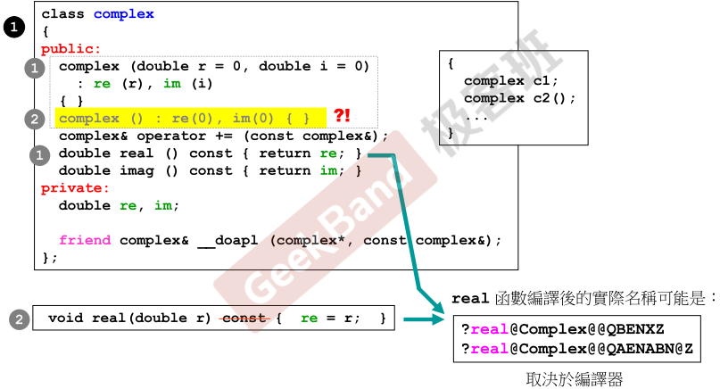
   - 两个 real 函数分别取得实部或设定实部，之所以可以这么做是因为编译时有所不同（如右下角所示）。注意不能添加 const
   - complex () : re(0), im(0) {} 构造函数重构是不行的，因为上面的函数有默认参数，也可以调用，二者冲突。
# 4.参数传递与返回值

- 构造函数放在 private 位置

   - 构造函数放在 private 后，则不能直接调用，也无法创建对象
- 构造函数的设计模式

   - 外界不能用传统方式创建对象，而是用 getInstance（名称随意）来取得内部函数
   - 也就是说确实有把构造函数放到 private 里的需求
- const member functions（常量成员函数），设计更好的函数
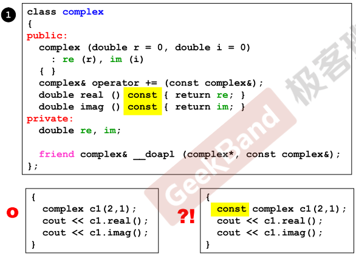
   - 函数的后面添加 const，在 real() 和 imag()之后，只是将数据取出来
   - 不会改变数据内容的函数，要加上 `const`
   - 如果没有添加 const，但使用者调用 const complex c1(2,1)，说明函数不改变数据，二者矛盾，编译器报错。虽然使用者不这么用就不会报错，但我们都要考虑到。
- 参数选择 pass by value or pass by reference (to const)（传 reference 是好习惯）
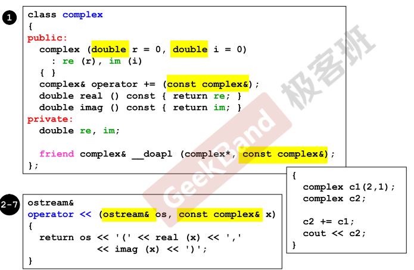
   - by value，将所有的数据的传递过去，比方说 double 4 个字节就传 4 个字节。但是可能导致 stack 数据过大
   - by reference，C 语言是通过指针，C++ 是通过reference（引用的底部就是指针，速度快），形式更漂亮
   - const complex& 传递到 const，传递过去但不修改数值
   - ostream& os 传递到非 const，传递过去，修改数值
   - c2 += c1 传递的是引用
   - ostream& os, const complex& x，第一步分是非 const，第二部分是 const
   - 加上 `&` 符号说明返回值传递的是 reference
- friend 友元
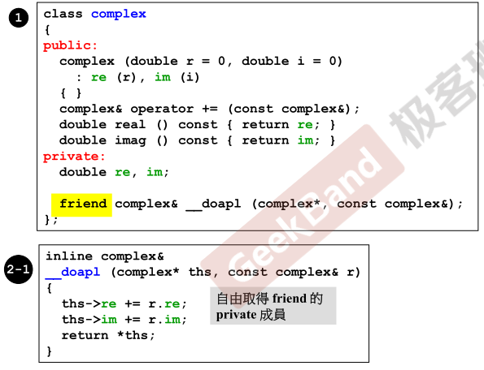
   - friend 可以来拿 class 里面的数据
   - complex& __doapl (..) 是 frined
   - 因为是友元，ths 直接读取 re 和 im
- 同一个 class 的各个 object 互为友元
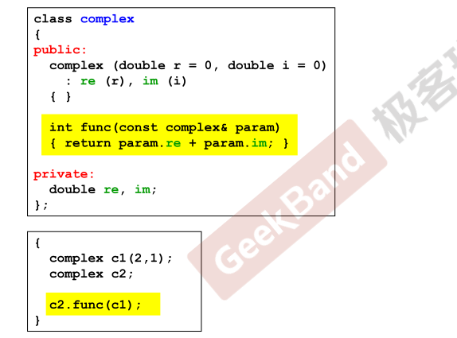
   - int func(..) 目的是计算实部虚部之和，直接读取 re 和 im
   - 为什么可以这么干？因为相同 class 的各个 object 互为友元
   - c2.func(c1)，用 c2 的函数来处理复数 c1
- class body 外的各种定义

   - complex* ths 的数值会被改动
   - const complex& r 的数值不会被改动
   - 函数的操作结果
      - 情况1：创建一个地方存放（返回创建的东西，函数执行完后消失）
      - 情况2：放在其中一个参数
   - 情况 1 不能传引用，因为引用的本体内容在函数执行完就消失了。其他情况都能传引用。
# 5.操作符重载与临时对象

- operator overloading 操作符重载之一，成员函数
   - 本质上就是一种函数，是 C++ 的特点

   - 所有成员函数都有隐藏成员_ _this，指的是函数调用者
   - 这里 c2 就是 this，编译器会把 c2 地址传递过去
   - c1 就是 r
   - 实际写的时候，函数成员列表不必写 this ，但可以在函数里面直接使用
   - _doapl，do assignment plus，赋值加法，这段其实是标准库里的复数代码
- return by reference
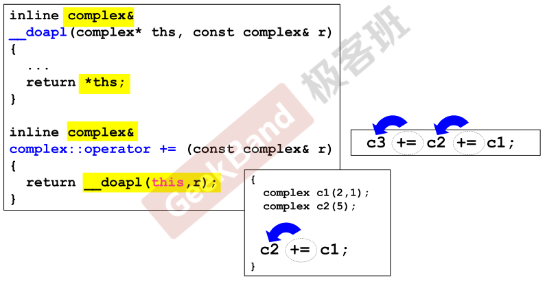
   - return *ths，返回的是 object，但声明的是 complex&，是引用。二者可以搭配使用
   - * 指返回的value，传递者无需知道接收端用 reference 形式来接收。也就是说接收端用 value 或 reference 都可以，只不过后者更快。
   - c1 是 value，用 complex& r 来接收。
   - 如果要实现 c3 += c2 += c1 ，则重载函数的返回值必须明确 complex&，而不能使用 void（如果只有 `c2+=c1` 没问题）
- class body 之外的重定义

   - 获取虚部和实部，很简单，没什么要特别注意的，用引用来传递 const complex& x
- 非成员函数的操作符重载
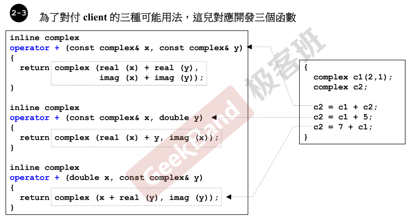
   - + 也许找成员函数，也许找非成员函数，但不能重复
   - 这里是全局的函数，没有 this。如果把 + 设计到类里，就只能处理负数+负数的情况了。
   - 这里的三个版本对应不同的情况，复数+复数，复数+实数，实数+复数
- temp object 临时对象
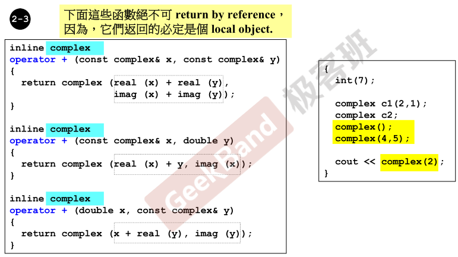
   - 蓝色部分，不是 return by reference，而是 return by value
   - 运算的返回值，必定是 local object
   - 在本体运算的结果，如果用 reference 传出去，如果本体死掉，则数据也就没有了
   - 因为这里只是 + 运算，还没有执行 =，所以运算的结果在执行 + 运算时，其实不知道要传递给谁
   - 而 += 运算，在执行 += 时，已经知道运算结果是要赋值给左侧的变量，因此可以传 reference
   - 这里使用 typename() 的语法，创建临时对象
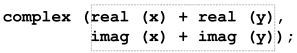
   - 临时存储临时计算的结果，因为结果既不放在左侧也不放在右侧
   - 右侧黄色部分也是临时对象，complex() 得到(0,0)，complex(4,5) 得到(4,5)，这两个执行完，内容就消失了
   - + 和 - 的使用需要明确是加减还是正负
   - 这里通过参数的个数来确定
- 特殊的操作符，必须写成全局函数
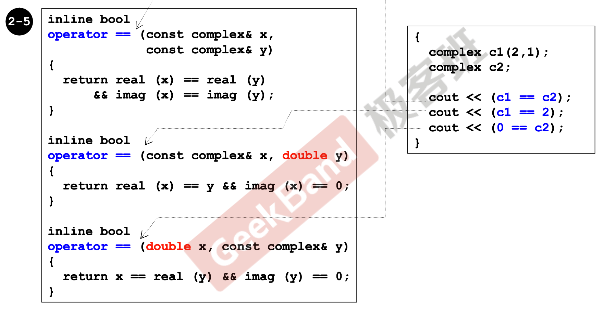
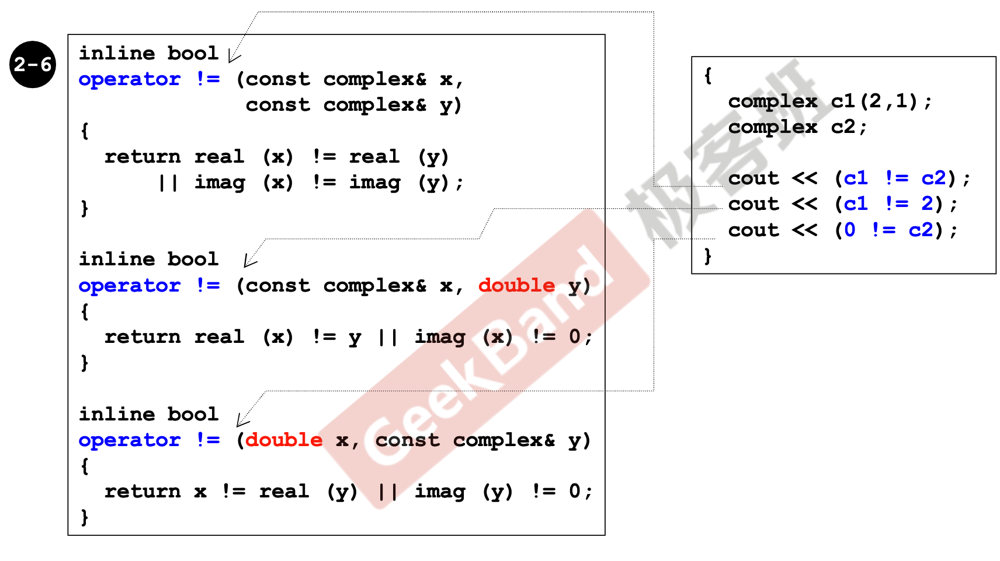
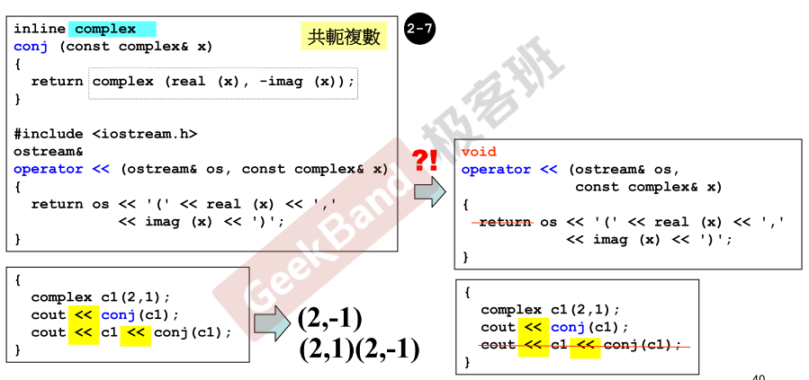
   - `==`和`!=`没有什么特别的，要注意的内容和上面都一样。
   - `cout` 是对象，其 class name 是 `ostream`，传递引用 `ostream& os`，但不可以用 `const`。因为 `const` 代表 `os` 不可以改变，可实际上每次执行 `<<`，`os` 都在改变，所以不能添加 `const`。
   - 不能改成 `void`，否则不能使用连续 `<<`
   - 函数设计：考虑是否用引用，是否用 const 
# 6.Complex 的实现过程

- Step 1: 防卫式定义
- Step 2: 考虑数据类型，在 privatre 书写
- Step 3: 书写哪些函数 const after a function declaration means that the function is not allowed to change any class members (except ones that are marked mutable). So this use of const only makes sense, and is hence only allowed, for member functions. ([http://stackoverflow.com/questions/3141087/what-is-meant-with-const-at-end-of-function-declaration](http://stackoverflow.com/questions/3141087/what-is-meant-with-const-at-end-of-function-declaration))
   - 构造函数是否需要默认值和初值列
   - 其他函数是成员函数还是非成员函数
   - 每个函数的参数传递是 by reference/value
   - 取得私有数据的函数
   - 函数是否需要添加 `const` double real() const {return re;} double imag() const {return im;} 
- Step 4: 本体之外的函数
   - 操作符重载 inline complex& complex::operator += (const complex& r) { return _doapl (this, r) } 
      - 考虑函数作用在左侧变量，因此存在隐藏参数 this
      - 右边变量不动，因此需要 const complex & r，r <-> right

- 返回值，仍然需要是复数。如果返回的左侧本来存在，则传引用。
# 7.字符串处理：三大函数

- Class with pointer member(s)
- 基本框架
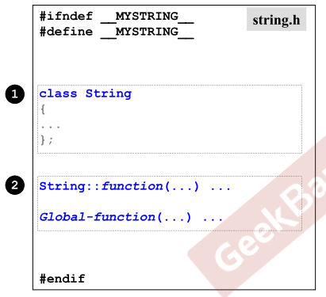
- 基本功能
   - 初始化
   - 拷贝构造
   - 拷贝赋值
   - 操作符重载
- 字符串用指针，因为不确定字符串的长短
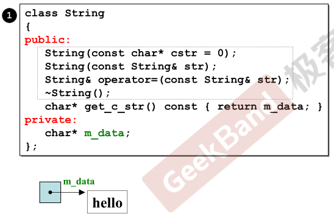
   - 指针`char*`指向字符
   - 重新写四个函数（构造、拷贝构造、字符串重载、析构函数）
- 构造函数和析构函数

   - 字符串的末尾是 \0
   - 如果初值=0，则分配一个字符的内存，new char[1] 并添加结束符 \0
   - 如果输入有字符串，则需要先测量长度 strlen(cstr)+1，之后进行数据的拷贝。
   - 析构函数，释放动态分配的内存。delete[] m_data
   - 用动态创建的方式和删除，在 {...} 作用域里面 String* p = new String("hello"); delete p; 
- 拷贝构造函数
   - 初始两个字符串

   - 如果没有自己写的 copy 函数，会出现泄露。（浅拷贝）
      - b 和 a 都指向了相同的内容，原先 b 指向的内容内存泄露

   - 深拷贝

      - String s2(s1); 就是对拷贝构造函数的调用
      - String s2 = s1; 与上一句话含义完全相同，因为s2没有，所以需要重新创造，再完成复制。
- 拷贝赋值函数
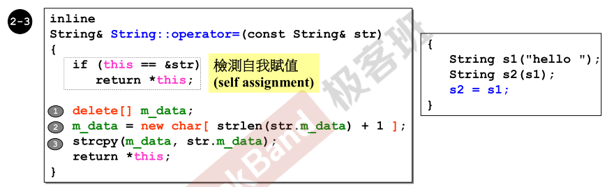
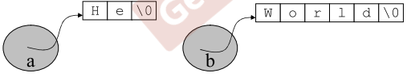
   - 清空delete[] m_data

   - 分配新的m_data = new char {strlen(str.m_data) +1];
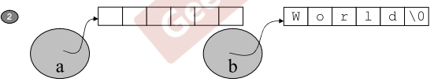
   - 赋值strcpy(m_data, str.m_data)
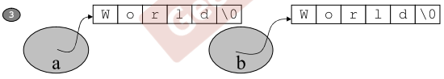
   - 特别要注意检测，检测是否**自己赋值给自己。**不光是效率的问题，还可能出错。

- output函数
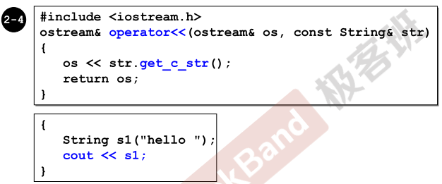
# 8. Stack, Heap 的应用
## 8.1 基本概念

- Stack：栈，存在于某作用域（scope）的一块内存空间
- Heap：堆，系统提供一块 global 内存空间，动态取得
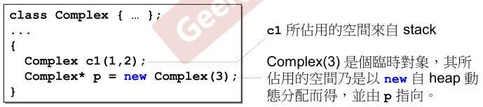
- 大小括号，是作用域（scope）。
   - c1占用的空间来自 stack
   - 函数本身也是 scope
   - 可以在全局用 new 来动态从 heap 中取得空间，new Complex(3)，初值是3，动态（dynamic allocated）得到内存，**动态获得就意味着必须 delete**
## 8.2 Stack Object 的生命周期

- 自动被清理（因此 local object 也称为 auto object）
- 生命在大括号之内
## 8.3 static local Object的生命周期
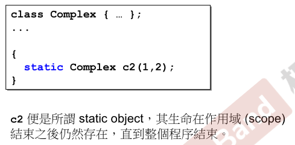

- 离开大括号，仍然存在
- 在程序结束后，声明结束
## 8.4 Global Object

- 声明在整个程序结束后
## 8.5 Heap Object
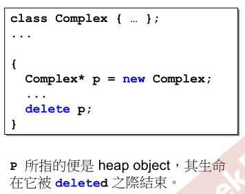

- 正确写法，**new 与 delete 搭配使用**

- 上述为错误写法，会出现内存泄漏
- 内存失去控制，无法将内存还给操作系统

- Complex* pc = new Complex(1,2)，里面的 new 函数分解为三个动作。定义一个指向 Complex 的指针。
   - 第一个是分配内存，使用 operator new 函数来完成。
      - 该函数的整体名称就是 operator new
      - operator new 函数，进一步调用 malloc(n) 函数
      - 所需要内存的计算是 sizeof(Complex) 完成
      - Complex 类的设计由实部和虚部两个 double 完成，因此 sizeof(Complex) 的结果=8
   - 第二个动作，相对不重要，就是转型
      - 第一个动作 operator new 反馈的结果是指向 void 的指针。
      - 因此第二个动作将第一个动作的返回值转型。
   - 第三个动作，通过第二步得到的指针，调用 Complex::Complex，函数名称与类相同的函数。
      - 构造函数是一个成员函数，因此有 list pointer。是 pc 调用的 Comple::Complex 函数，因此 this 就是 pc。而 pc 就是两个 doulbe 内存的起始位置。

- delete 是 new 的反作用。
- delete pc 主要转化为两个动作
   - Step 1: 调用析构函数
   - Step 2：释放内存。

- 对于String而言，会执行两次delete
## 8.6 动态分配内存
### 8.6.1 分配一个复数
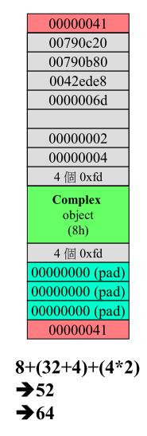

- 在 VC 环境下
- 会得到 8 Byte，即浅绿色部分。
- 在调试过程中
   - 绿色区域以上（灰色）：还会得到以上 8 组 4 个 Byte。
   - 绿色区域以下（灰色）：4 个 Byte
   - 首尾红色：各 1 个 Byte，Cookie
- 总共 52 Byte。VC 给出的是 16 的倍数，填补深绿色 pad，因此给 64 Byte。
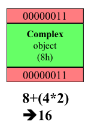
- 非调试模式情况下，一个复数的大小是 16
- Cookie 主要记录内存块的大小。
   - 00000041 = 64 的十六进制 40 + 最后一位（1：系统给出去，0：没给出去）
### 8.6.2 动态分配

- 注意pad的占位符
### 8.6.3 动态分配的 Array
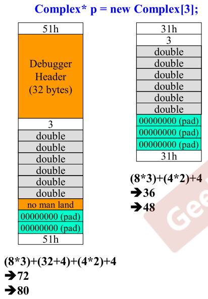

- 三个复数（8*3 灰色部分）
- 调试部分（32+4）
- 上下cookie（4）
- 对于数组，VC的做法添加 3，用一个整数记录。

- 与数组类似

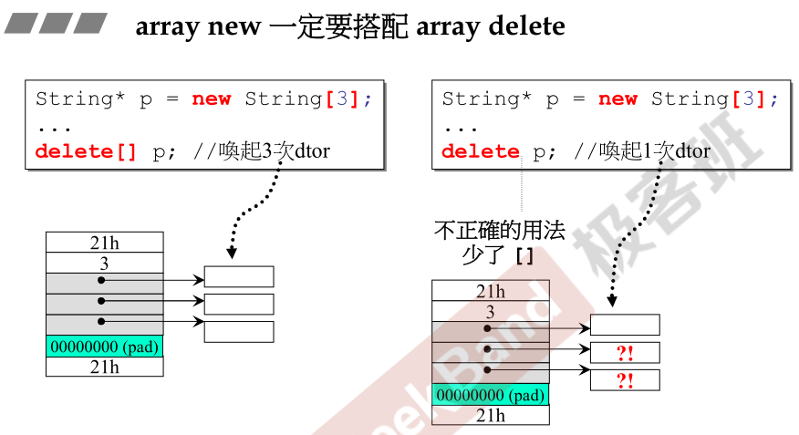

- 左侧，使用 delete []，即 array delete，执行三次
   - 编译器知道，删除的是数组，因此执行三次 delete
- 右侧，没有中括号，则执行一次。
   - 编译器不知道，删除的是数组，只执行一次 delete
   - 内存泄漏是 ?! 的位置
- 如果是复数数组，可以使用 delete 直接删除，因为内部没有再次动态分配。但建议养成良好习惯。
# 9. 复习String类的实现过程
Step 1：防卫式定义
Step 2：用指针形式存储字符串 `char* m_data`
Step 3：思考准备哪些函数给外界调用

- 构造函数
   - 初始化
- 三大函数
   - 拷贝构造
   - 拷贝赋值
   - 析构函数
- 辅助函数，方便 cout 输出，比较简单，可以直接写出来，上面的四个函数需要在外部实现。
- 思考需不需要返回 reference，加不加 `const`

Step 4：实现刚才的接口

- array new 一定要搭配 array delete
- 都写成 inline 也没有关系，不会有副作用
- 拷贝赋值必须检查是不是自我赋值
- `**&**`**的意义会因出现位置不同而不同**，放在 typename 后面的`&`意思是 reference，如`const String& str`，而 object 前的`&`则意味着取地址，得到的是指针，如`if (thie == &str)`
# 10.扩展补充：类模板，函数模板，及其他
## 10.1 static
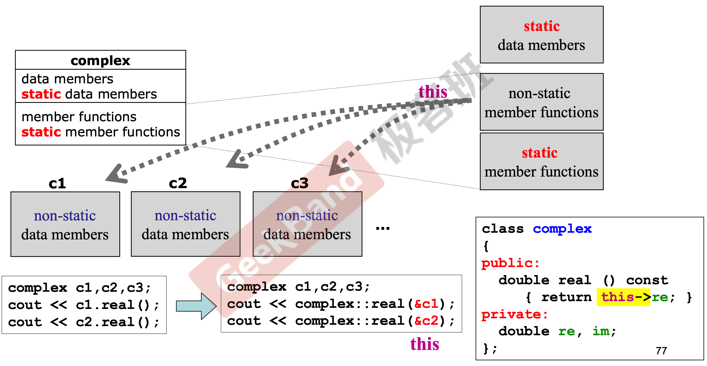

- 数据或函数前加`static`使其成为静态数据/函数
- 在引入`static`前，成员函数只有一份，要处理的对象却有很多个，需要通过 this 指针告诉它要处理谁
- 右下角的黄色高亮部分可写可不写（参数部分是一定不能写），不写的话编译器会为你添加。
- 数据加上`static`后，不再属于对象，而是单独在内存里存储，只有一份。
   - 假设编写一个银行程序，有几百个人来开户，程序就要创建几百个对象作为账户，但是利率不应该和账户有关，几百个账户的利率都是一样的，因此利率不能设计为一般的数据，而应是静态的数据。
- 静态函数和一般函数的区别在于静态函数没有 this 指针。因此它也不能像一般函数一样处理非静态对象里的数据，只能处理静态的数据

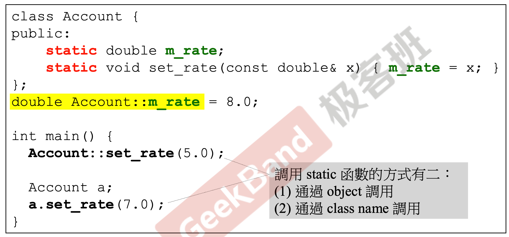

- 静态数据，一定要在类外做声明（黄色高亮的部分）。给不给初值都可以。
- 调用静态函数的方法有两种：（1）通过对象调用；（2）通过类名调用。
## 10.2 **把构造函数放到 private 区域**
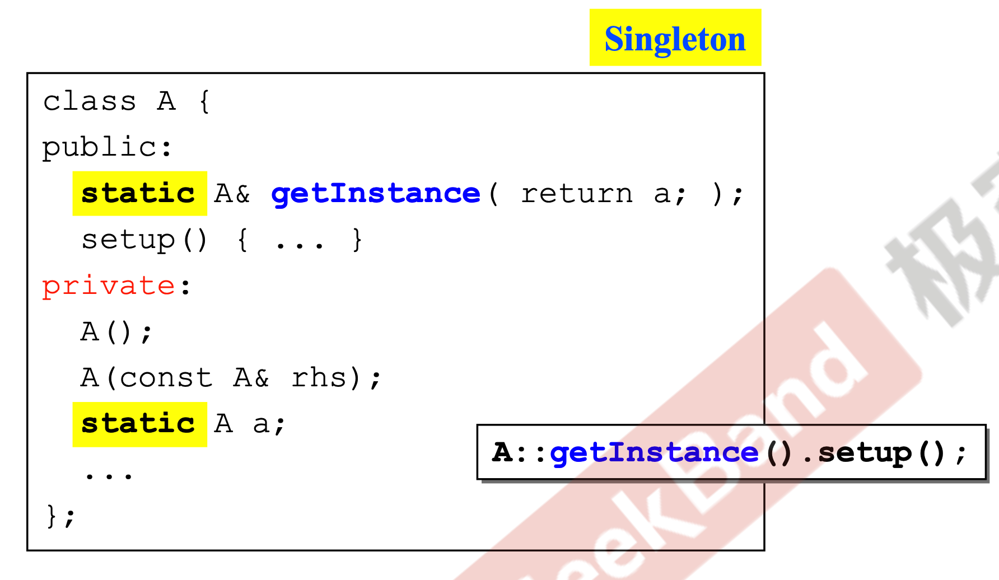

- a 只有一份，外界无法创建，外界必须通过`getInstance`获取这个唯一的 a，再通过 a 调用其他函数
- 如果外界不需要用到 a，静态的 a 也依然存在，有一些浪费，所以有更好的写法：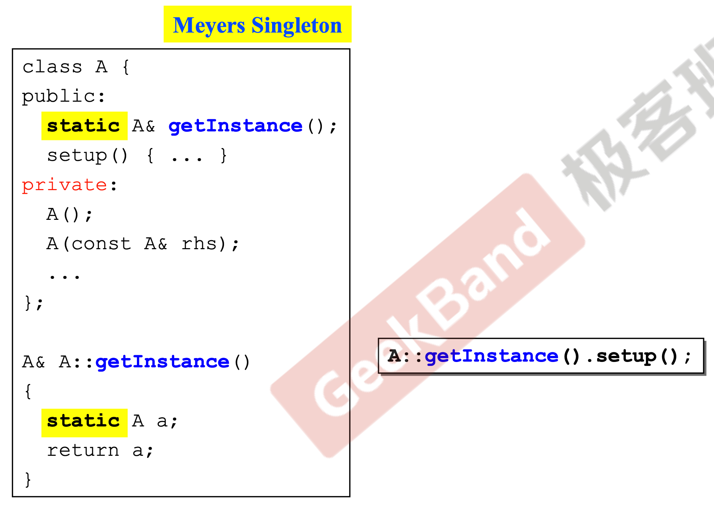
- 把静态的 a 放到函数里，只有当有人调用这个函数时，a 才会被创建且仅此一份，离开该函数作用域后 a 依然存在。
## 10.3 cout
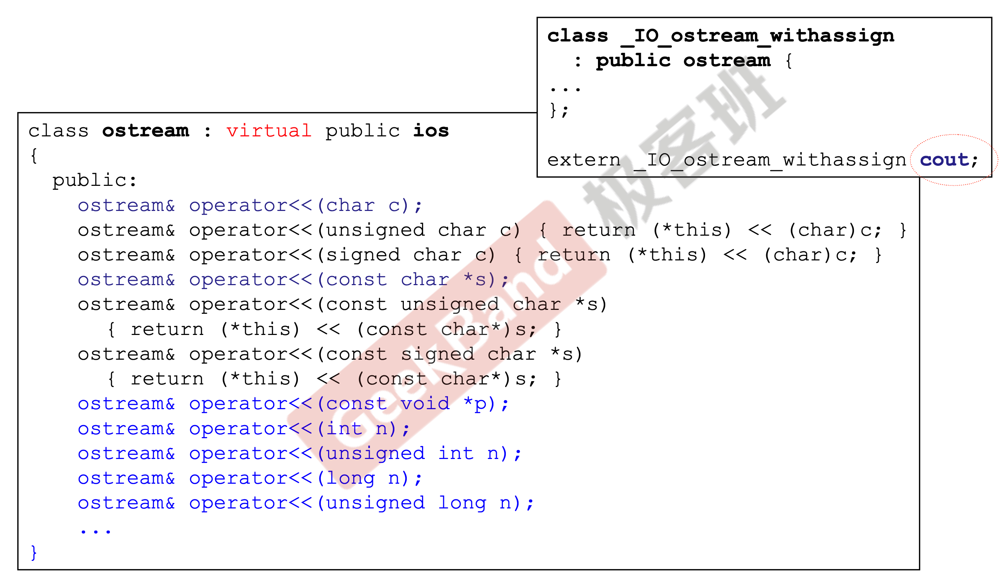

- 观察源代码可以发现，`cout`能够打印如此多类型的数据，确实是因为它实现了很多的重载
## 10.4 **class template 类模板**
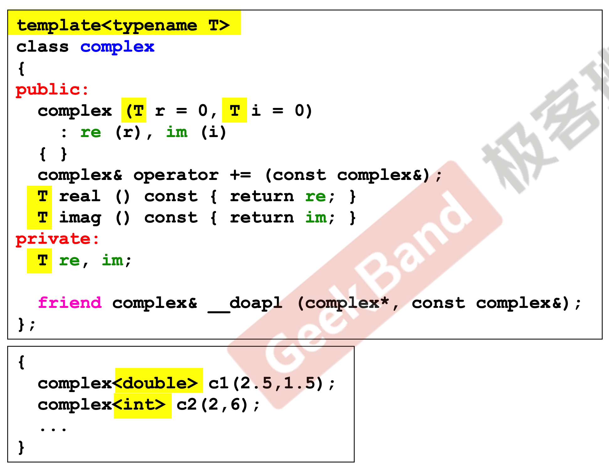

- 编译器会先把 T 都替换成 double 生成一份代码，再把 T 都替换成 int，再生成一份代码，其实是生成了两份代码。有人说模板会造成代码的膨胀，但这种膨胀是必要的，因为需要针对两种情况生成两份代码。
## 10.5 函数模板
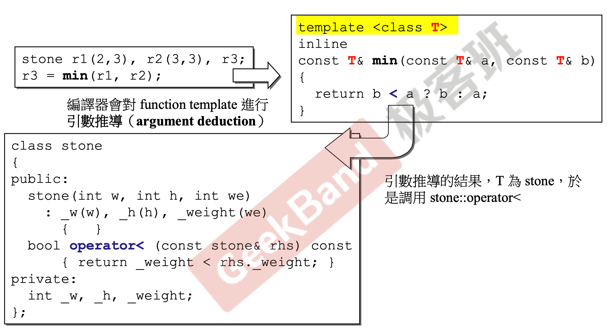

- 任何类型的比大小都可以这么写，所以我们不把类型局限在 stone，而是写成 T
- 函数模板在使用的时候不需要像类模板一样添加`<>`指明类型，因为编译器会自己进行实参推导
## 10.6 namespace
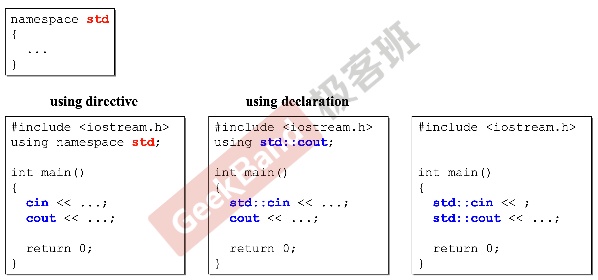

- 使用 namespace 避免重名
- 三种方法
   - 全开`using namespace std`
   - 一条一条开`using std::cout`
   - 打全名 `std::cin`  `std::cout`
## 10.7 更多细节与深入
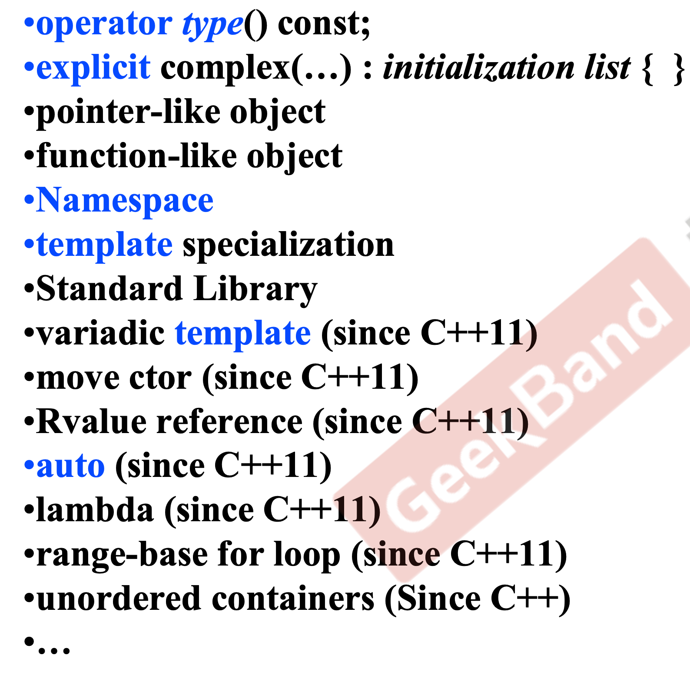

- 转换函数
- 特殊的构造函数
- 像指针的对象
- 像函数的对象
- namespace 细节
- 模板特化/偏特化
- 标准库（包含算法与数据结构的实现）
- C++ 11 之后增加的特性
# 11.组合与继承
前面的都是基于对象的设计，不管是带指针的还是不带指针的我们都能应对了
Object Oriented（面向对象）：面对的是多重 classes 的设计
**Object Oriented Programming, Object Oriented Design**（OOP，OOD）
面对对象编程中，牢固掌握以下三种关系就足够应付绝大多数情况。

- **Inheritance (继承)** 
- **Composition (复合)**
- **Delegation (委托)**
## 11.1 Composition（复合），表示 has-a
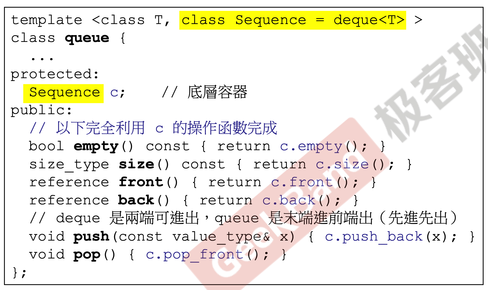

- 最简单的情况
- 左边的对初学者理解起来可能有点困难，右边是替换的写法，意思完全相同
- class queue 里有 deque 的对象，就是复合。
   - C 语言中 struct 里放其他 struct 或 int、float 等内容，也是相似的理念
- 学会看图，黑色菱形的一端是容器
- 底下的函数 queue 都没有自己写，而是调用自己拥有的 c 来完成
- deque 可能有几百个功能，但 queue 只开放了 6 个功能，这是 Adapter（适配器）的设计模式，并非所有复合都是 Adapter，只不过例子是这样的情况

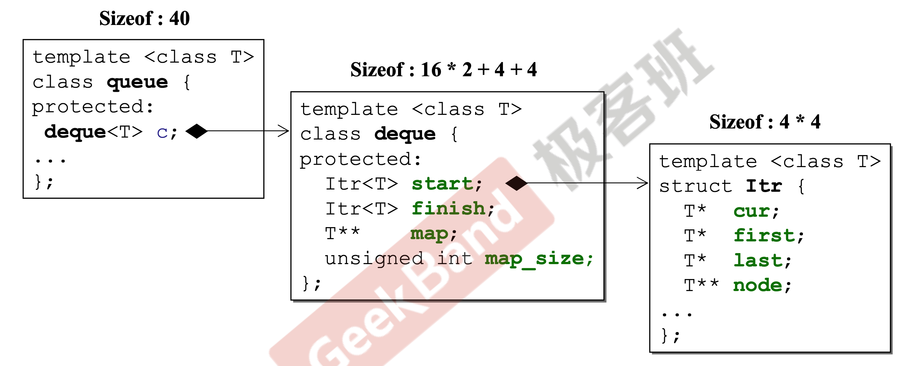

- 一个复合类的大小 = 该类数据大小 + 该类中复合类的大小

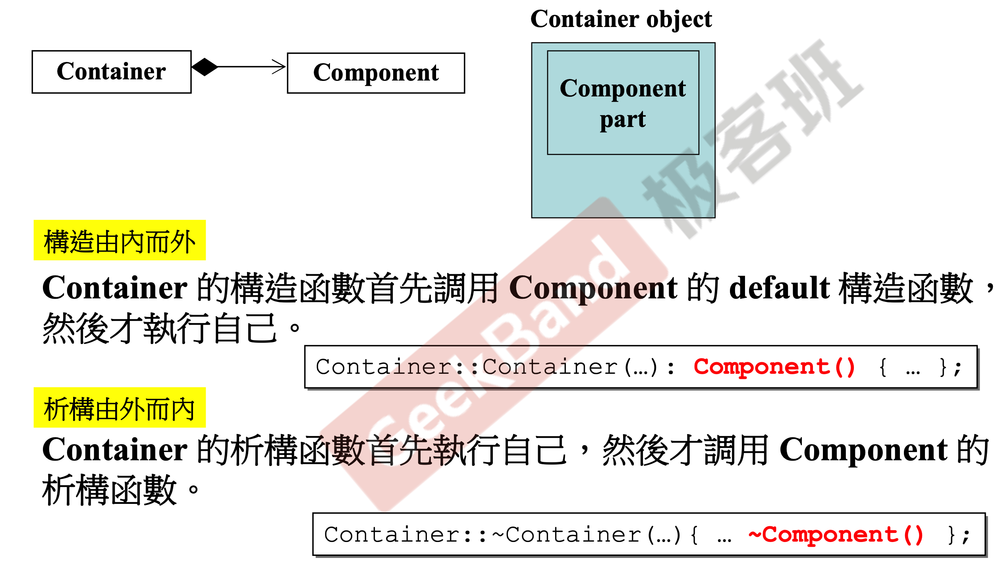

- **构造由内而外**，Container 先调用 Component 的构造函数，再执行自己的构造函数
- **析构由外而内**，Container 先执行自己的析构函数，再调用内部 Component 的析构函数
- 红色部分是编译器帮我们加上去的。编译器只会调用默认的构造函数，如果你不希望这么做，需要自己写上参数
## 11.2 Delegation（委托） composition by reference
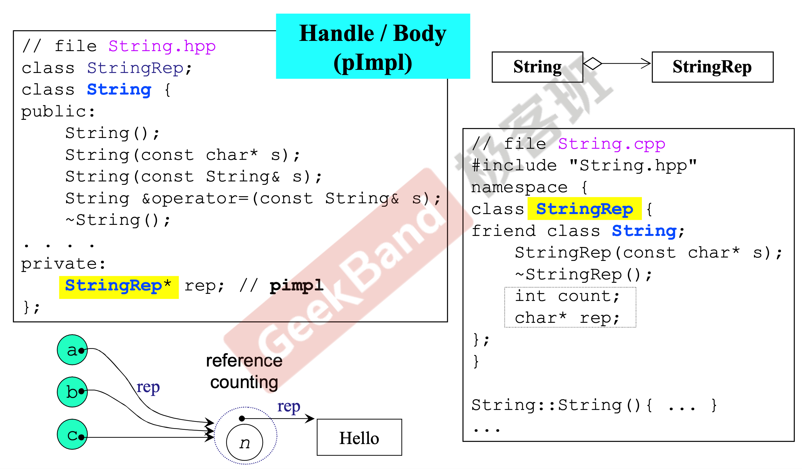

- String 有一个指针指向 StringRep 
- 为什么叫委托呢，我有一个指针指向你，在我需要的时候就可以调用你做事情，把任务“委托”给你
- 空心菱形代表指针，因为这个拥有比较“虚”
- 复合的生命是一起出现的，有了外部就有内部。委托则是不同步创建的，因为委托的那个类在用的时候才会创建
- 这种写法很有名：pimpl（pointer to implementation），也叫 Handle/Body，因为指针可以指向各种不同的实现类，右边怎么变都不会影响左边，所以很有名。
## 11.3 Inheritance（继承），表示 is-a
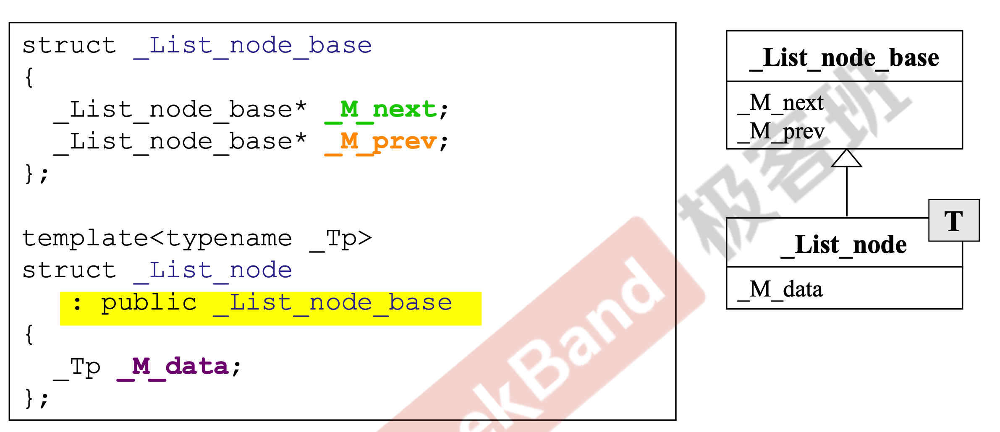

- 使用 class 和 struct 定义类唯一的区别是默认的访问权限（struct 默认是 public，class 默认是 private），所以这里用 struct 举例并不影响
- 语法就是高亮黄色这一行，说明要继承`_LIST_node_base`
- 画图表示是子类指向父类的空心箭头
- C++ 提供 public、protected、private 三种继承，但 Java 只有 public，当然这三个最重要的还是 public
- 父类的数据是完全继承过来的

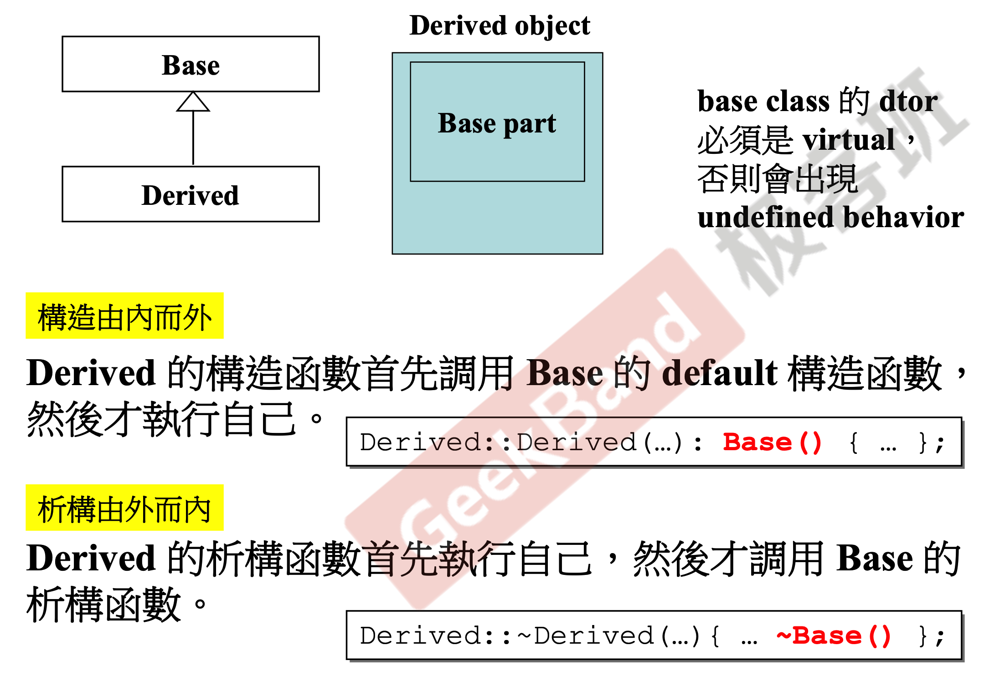

- **构造由内而外**，子类先调用父类的构造函数，再执行自己的构造函数
- **析构由外而内**，子类先执行自己的析构函数，再调用父类的析构函数
- 好的习惯是，如果这一个类是父类或未来要成为父类，就把它的析构函数设为 virtual
# 12. 虚函数与多态
## 12.1 虚函数
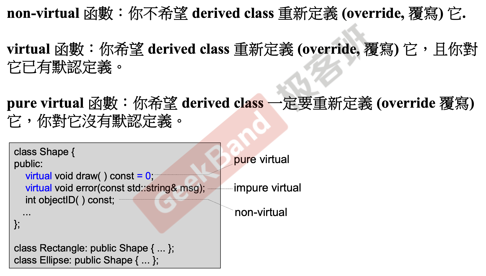

- 在成员函数前加上`virtual`就会变成虚函数
- 函数中的继承，继承的是调用权，父类的函数子类通通可以调用
- 成员函数的三种类型
   - non-virtual 函数：没有加`virtual`的函数，你不希望子类重新定义（override，重写）它
   - virtual 函数：加了`virtual`的函数，你希望子类重写它，且它已有默认定义
   - pure virtual 函数：纯虚函数，加了`virtual`且等于 0，你希望子类一定要重写它，它没有默认定义。
- 我们设计一个 shape 基类，让不同形状的类去继承它。无论什么形状都要产生 ID，我不需要子类重写它，所以设计为非虚函数。我希望下面的子类有更具体的报错信息也可以显示出来，所以将 error 设计成虚函数，报错时自然就会调用特定形状的 error 函数。我根本不知道要怎么去定义 draw 函数，因为世界上没有 shape 这个形状，这是一个抽象的概念，所以设计为纯虚函数。

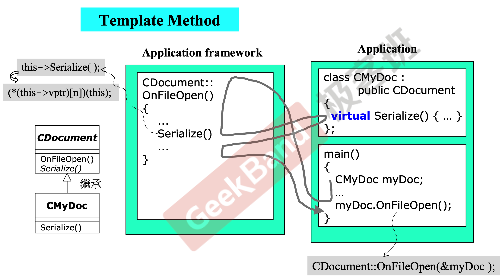

- 假设编写一个打开文件的程序，打开对话框、检查文件名这些操作都一样（前后省略的 ... 部分），关键在于打开特定类型文档后要如何处理（如 word）
- Serialize 函数就要设计为虚函数，框架可能是三年前就写好的了，子类延缓实现
- 这种把关键函数交给子类实现的做法就是设计模式中的 Template Method（模板方法模式）。注意这里的 template 和 C++ 中的模板不是一个东西
- 微软的 MFC 就是这个思路
- 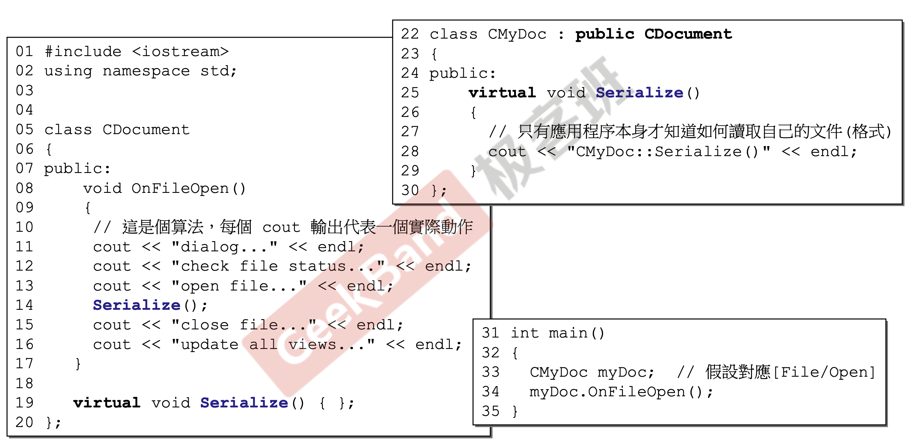
## 12.2 继承+复合 下的构造和析构
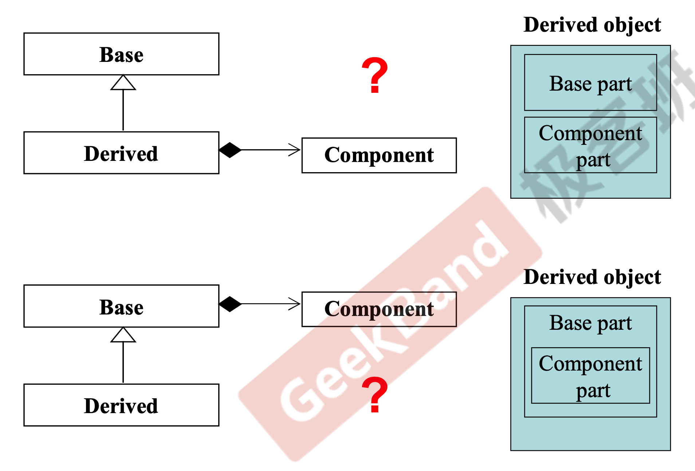

- 子类继承了父类，又复合了 Component。它的构造函数会先调用父类和 Component 的构造函数。
   - 父类和 Component 谁先谁后？留作课后作业
   - 答案是先调用父类构造函数、再调用 Component，最后自己；析构反过来，先自己、再 Component、再 Base
- 子类继承了父类，父类中有 Component。这个没有疑问，先调用最里面的 Component 的构造函数、再父类、再子类。
## 12.3 委托+继承
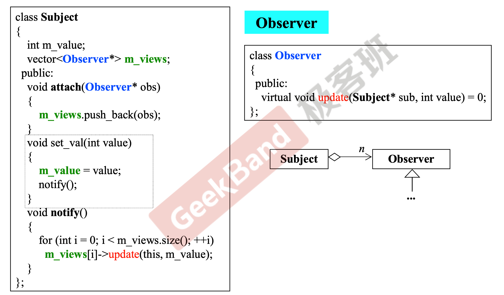

- 情境是 UI（呈现数据） 和数据（存储数据）分为两个 class，当数据发生变化时 UI 也应随之变化
- 我们设计 Subject 类放置数据，设计 Observe 类观察数据。左边可以拥有很多右边（因为使用者应该可以开出很多窗口查看数据）。
- 左侧使用指针指向右侧，而右侧是父类，可以派生多个子类，所以是委托+继承
- 这是 Observe（观察者）设计模式

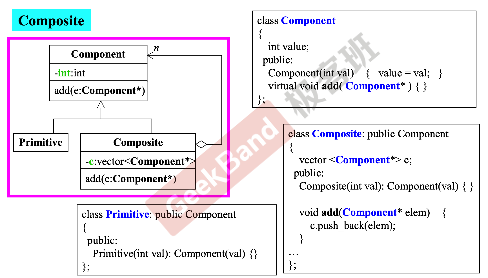

- 现在的情境是，有目录有文件，目录里可以放文件，目录也可以和文件一起被放到其他目录里
- 代表文件的 class 是 Primitive，代表目录的 class 是 Composite。Composite 既应该可以放 Primitive 也应该可以放 Composite，为了解决这个问题，让它们俩都继承 Component，这样 Composite 可以放的就是 Component
- add 不能定义为纯虚函数，因为子类 Primitive 没法实现 add，但是可以像这样写成空函数
- 这是一种 Composite（组合）设计模式

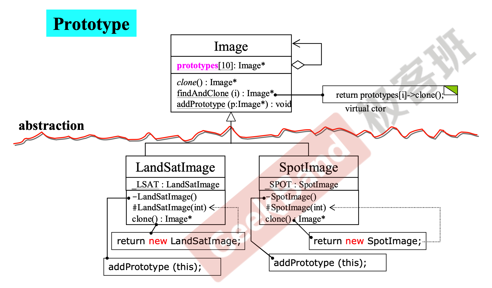

- 情境：子类未来才会出现，但我现在就要创建未来的对象
- 解法是子类每个都创建一个自己，只要我可以看得到，就能拿过来当原型
- 下划线代表静态对象。`-`号代表 private，`#`号代表 protected，理论上 public 是`+`，这里省略。
- 我们创建 LandSatImage 类的 LSAT 静态对象，即创造自己，此时调用构造函数`LandSatImage()`，构造函数中调用`addPrototype(this)`函数，这个函数是父类 Image 的，会把内容放到 Image 的容器里。子类也都应该有`clone()`函数，作用是 new 自己。
- `LansSatImage(int)`这个构造函数可以是 protected 也可以是 private。这个构造函数是为了和第一个做区分的，因为`clone()`时 new 自己也会调用构造函数，但不应让它调用的到，不然又会把这个加到父类里面去，父类只应该存放原型，所以写了第二个构造函数让它调用。加 int 参数仅仅是为了区别于原来的构造函数，通过后面的代码可以发现，这个参数实际上并没有用到。
- 这是一种 Prototype（原型）设计模式

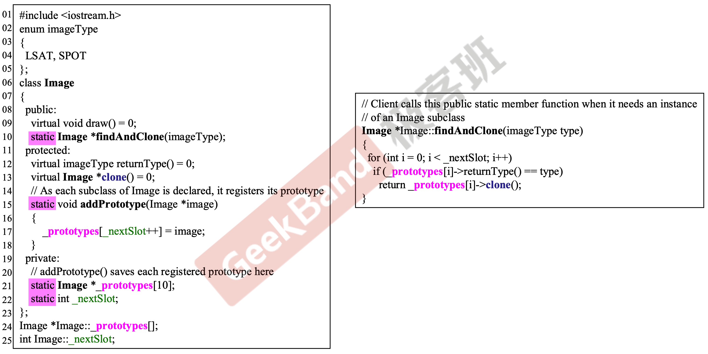

- 代码仅供示例用，所以数组只存 10 个。

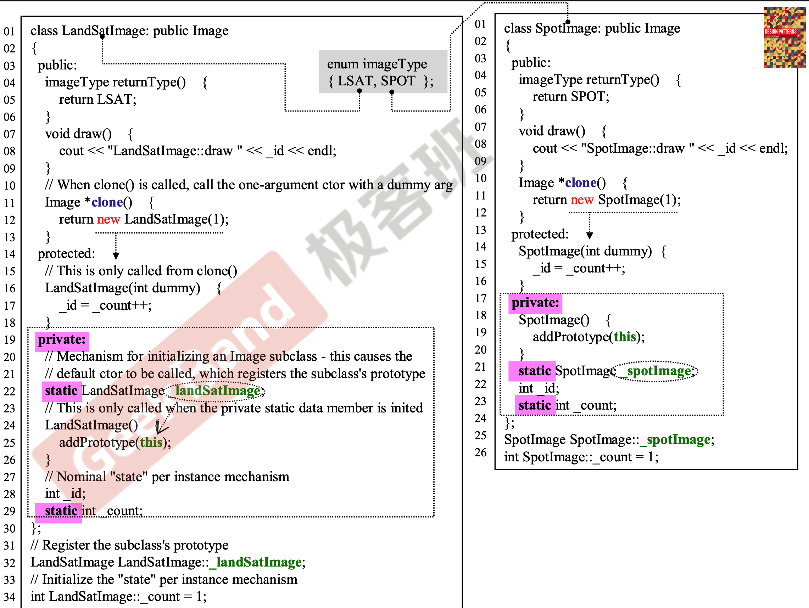

- 有的名字可能和图中对不上，没关系，只是因为图上写不下了

