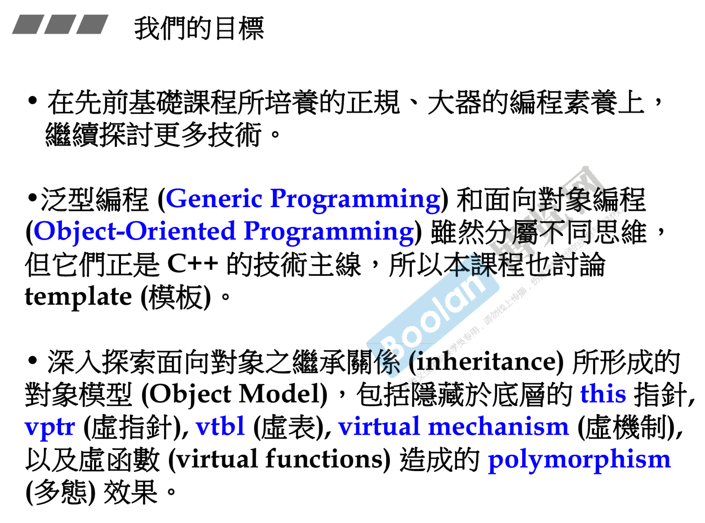
整个标准库都是按照模板化编程的思维来写的，而不是面向对象思维。 
# 1.C++ 常用功能函数
## 1.1 数据类型转换
### 1.1.1 conversion function（转换函数）
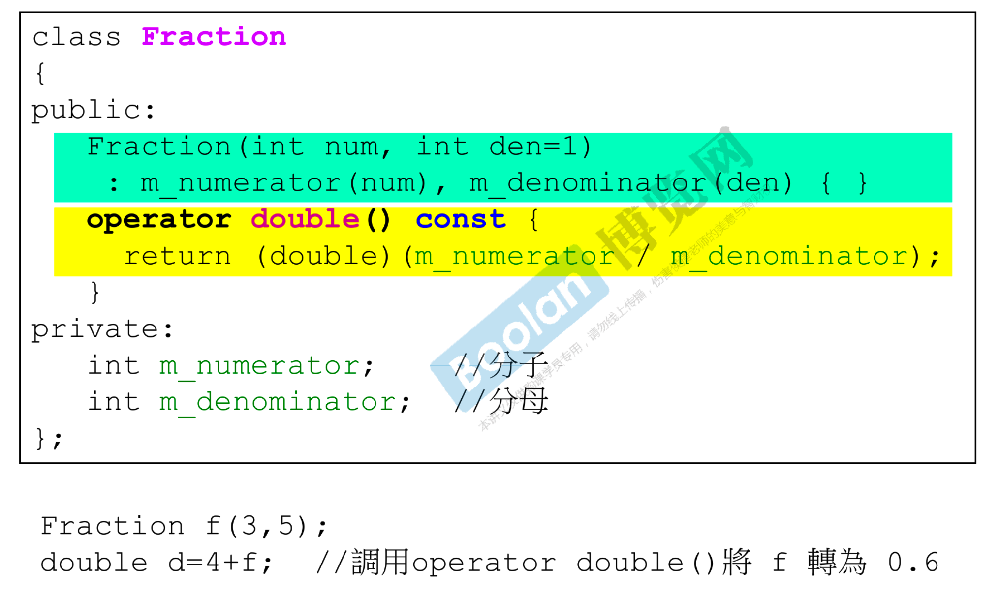

- 我们这里有一个分数，可以认为分子/分母就是 double，因此设计者希望分数可以被当成 double，于是编写黄色高亮部分。意思是 Fraction 可以被转为 double，编译器在碰到任何需要把 Fraction 转为 double 的时候就调用黄色部分。
- 作用：把一个 class 的类型转换成你想要的、自认为合理的类型。
- 格式：`operator double() const {...} `(以转换成 double 类型为例)
   - `double()`不可以有参数；没有 return type（毕竟后面已经写清楚是 double 了）；分子和分母都不应该改变，所以通常要加`const`
- 只要你认为合理，你可以在类中写多个转换函数，将 class 类型转换成多个其他类型。
### 1.1.2 non-explicit-one-argument ctor 与 explicit-one-argument ctor
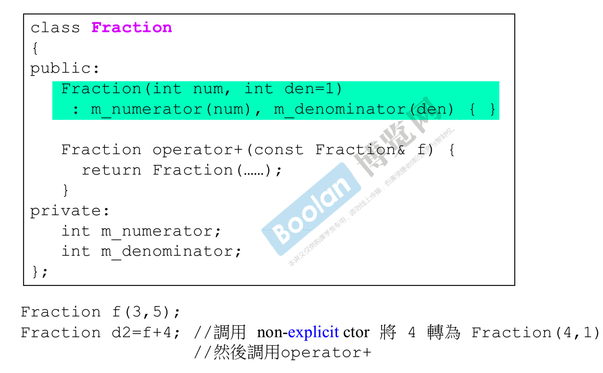

- 这种构造函数很特别，称为** non-explicit-one-argument ctor**，one argument 指的是一个实参（两个也可以，但是一个就够了），explicit 是关键字，这里没有加，所以是 non-explicit
- 作用：把其他类型转换为这个 class 的类型。与转换函数刚好相反。
- 执行到`f+4`时，编译器发现 Fraction 定义了 +，但是参数要是 Fraction，于是编译器尝试将 4 转为 Fraction，由于有绿色的部分，4 变成了 4/1，可以正常相加。

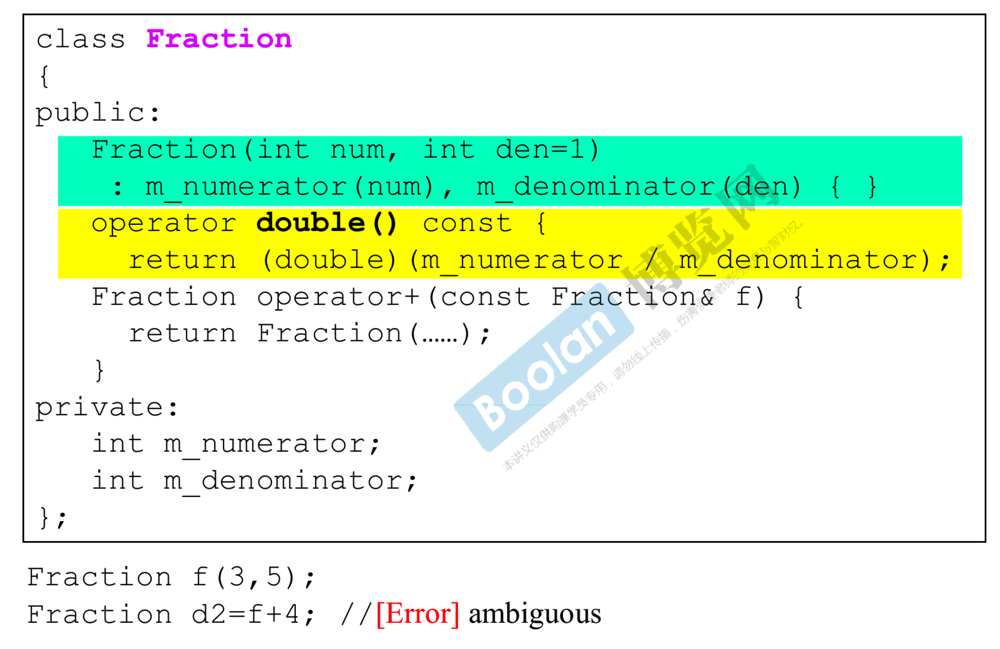

- 如果黄绿二者并存，且代码为`Fraction d2=f+4;`编译器发现会有两条路可以走：
   - 可以通过 non-explicit-one-argument ctor 把 4 转换成 Fraction 类型，再与 f 相加。
   - 可以通过转换函数把 Fraction 类型的 f 转换成 0.6，再与 4 相加，再通过 non-explicit-one-argument ctor 把 4.6 转换成 Fraction 类型。
- 此时会产生二义性（歧义），编译器报错

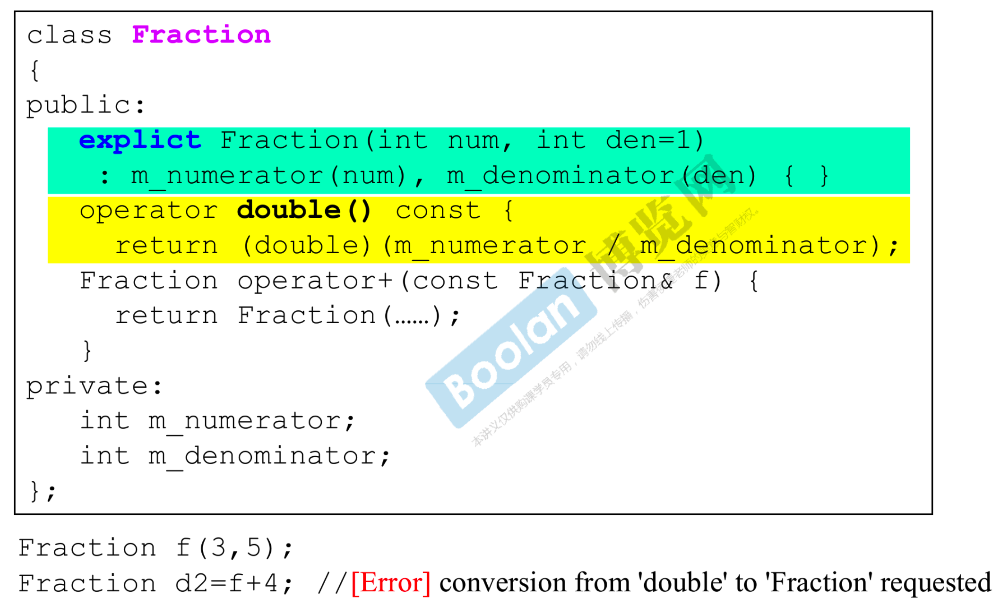

- explicit 的意思是明确的。告诉编译器，只有真正需要构造函数的时候再调用构造函数，编译器不能擅自把 4 转为 4/1
- 这个关键字只在这里使用（其实模板的一个很小的地方也会用到，但是太细微了）
## 1.2 **pointer-like classes**
### 1.2.1 智能指针
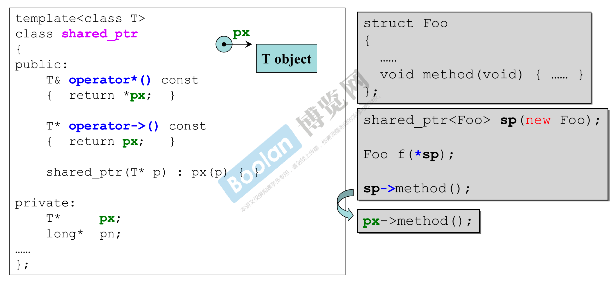

- 为什么我们要设计像指针的类，是为了做比指针更多的事
- 智能指针中一定有一个一般的指针。这里 px 就是那个指针。
- 指针能做的它也应该能做，所以它一定有`*` 、`->`这两个操作符的重载，且实现手法都是固定的。
- `sp->method()`等同于 `px->method()`，这时大家可能会困惑，`->`已经把 sp 变成 px 了，怎么还会有一个`->`，这是因为 C++ 语法规定`->`不会被“消耗”，在发挥作用之后依然可以使用。注意，`*`使用一次之后就会被“消耗”，*sp 就是变成 *px。
### 1.2.2 迭代器
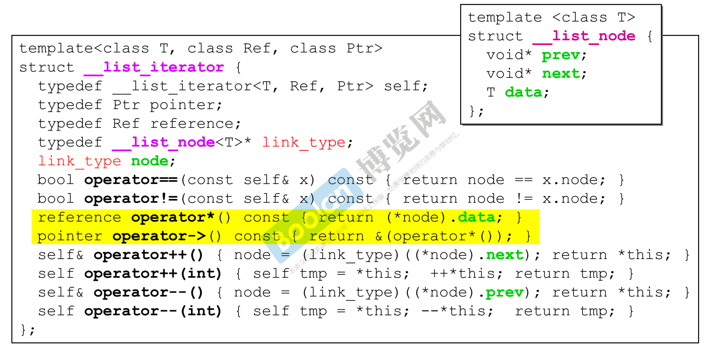

- 迭代器主要用来遍历容器
- 迭代器和上面一般的智能指针有些不同，不光要处理`*`和`->`，还要重载`++`、`--`等，对`*`和`->`的处理也有所不同

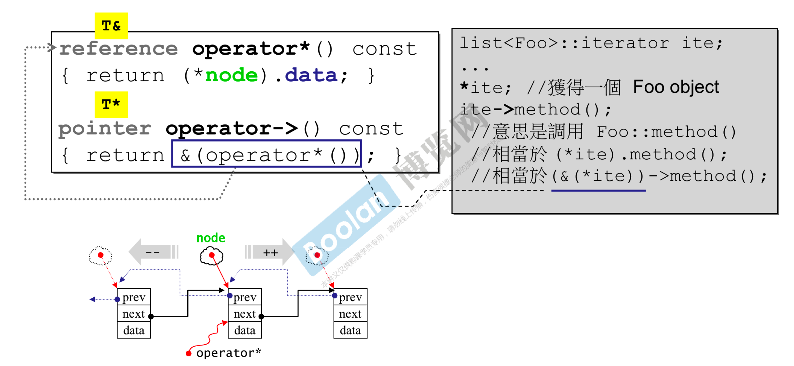

- 这里用双向链表的迭代器举例
- 绿色的 node 就是这里真正的指针
- 用户使用`*`是为了取得数据，于是我们解参考，再把 data 返回给用户
- 用户使用`->`等同于`(*ite).method()`等同于`(&(*ite))->method()`，于是我们设计成返回`&(operator*())`，其中`operator*()`就是上面的`*`部分
## 1.3 function-like classes
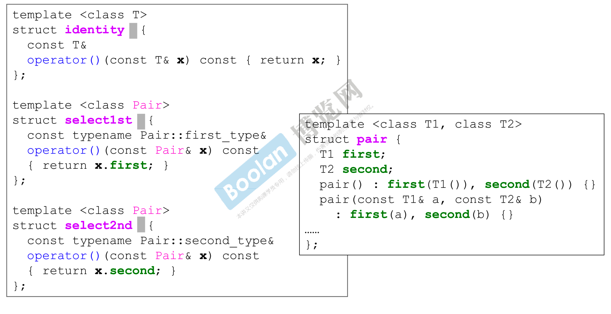

- `()`被称为函数调用操作符，所以任何一个东西如果能接受`()`，我们就称它为 function-like
- 例子中的三个类都重载了`()`，所以他们都是 function-like
   - `identity`的意思是同一个东西，所以它接收 x 就传回来 x
   - `select1st`接收 Pair 类型的元素，取出第一个。代码示例：`select1st<Pair>()()`，前面的括号负责创建临时对象，后面的括号才是调用函数，两者不同
   - `select2nd`，同理，取出第二个
- 这样的 class 生成的对象称为函数对象或仿函数
- 灰色部分其实是有内容的，还很长，继承了其他的 class 

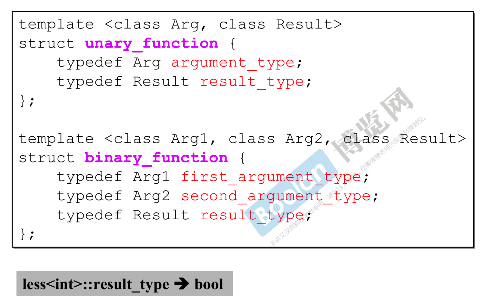

- `identity` `select1st` `select2ed`继承了`unary_function`，`plus` `minus``equal_to``less`继承了`binary_function`，前者意思是一个操作数，后者是两个操作数
- 这些奇特父类的大小理论上为 0（实现上 sizeof 可能会得到 1），且没有数据、没有函数，只有一些 typedef 定义。具体为什么继承这些是一个很大的话题，请参见标准库课程。
## 1.4 namespace 经验谈
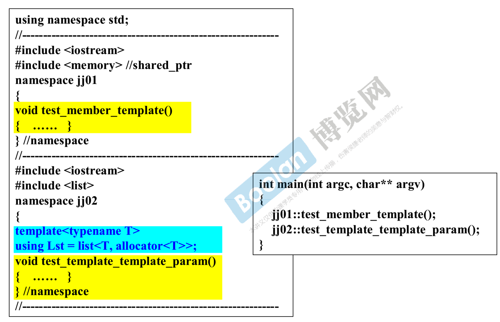

- namespace 的主要用途就是为了避免命名冲突，在大型工程中尤为常见，自己在写一些测试代码时也可以使用命名空间封装起来。
- 这里的例子是测试程序
## 1.5 模板
### 1.5.1 class template（类模板）
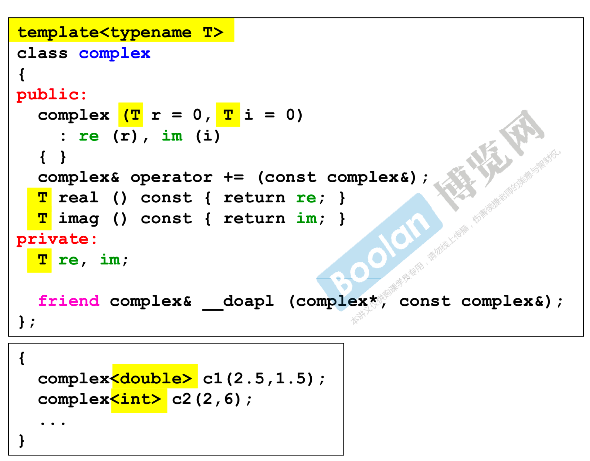

- 前面的课程讲过，这里简单带过
- 其实比面向对象简单，因为在涉及到继承和虚函数的时候可能会有很多层、很复杂
- 把类型"提取"出来，在用的时候在进行替换补充就好
### 1.5.2 function template（函数模板）
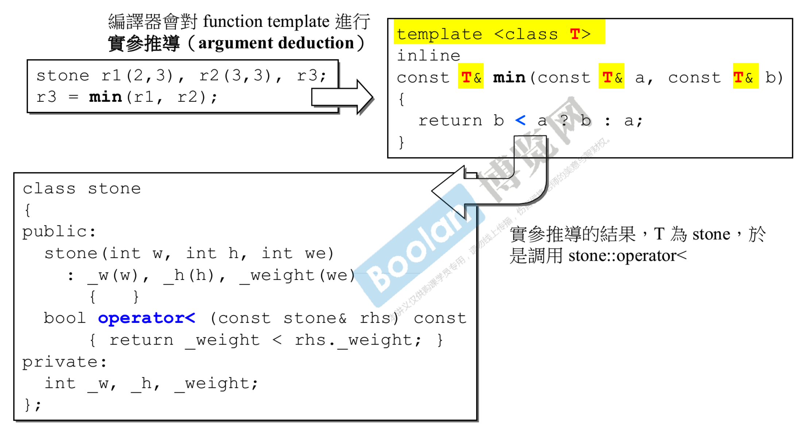

- 前面的课程讲过，这里简单带过
- 使用比类模板更简单，使用时无需指明 type
- 如果 stone 没有重写`<`，就会编译失败
### 1.5.3 member template（成员模板）
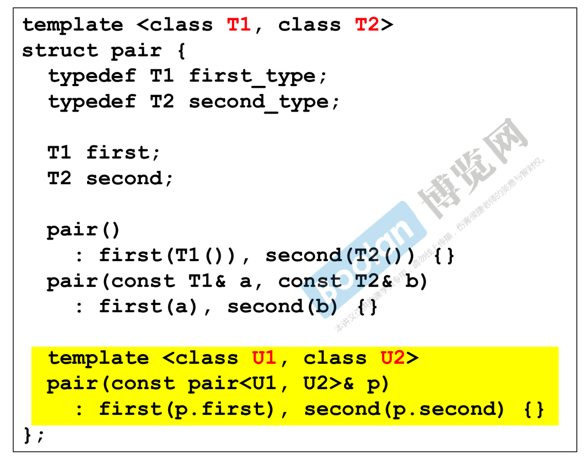

- 黄色部分是模板里的一个 member，而它本身又是一个模板，我们将它称为成员模板。

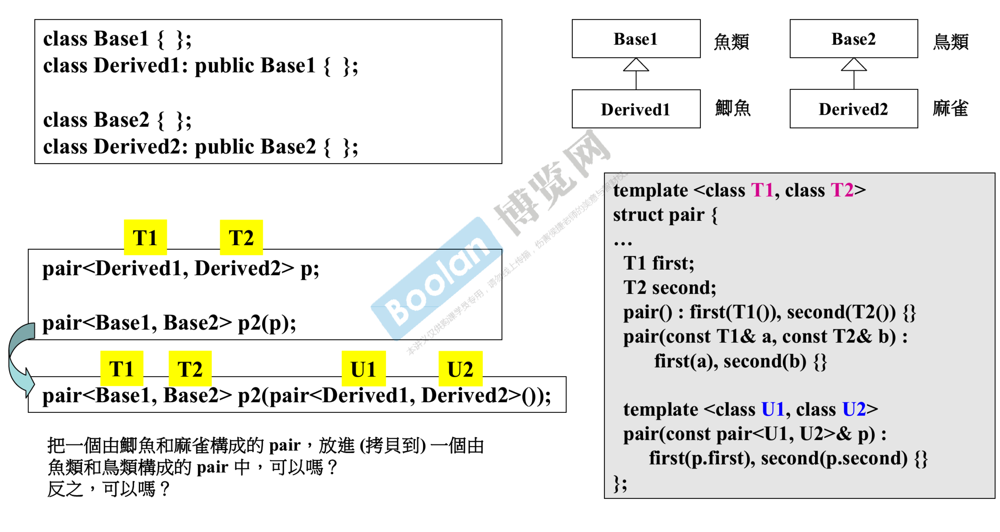

- 一般用在构造函数中
- 设计四个类，鱼类、鸟类、鲫鱼、麻雀
- 把鲫鱼和麻雀构成 pair，鱼类和鸟类构成 pair，可以把鲫鱼和麻雀的 pair 作为初值放到鸟类和鱼类的 pair 里，但反之不行
- 如何体现这种设计，我允许你放任意的 T1 T2，并且构造的时候可以放任意的 U1 U2，但 U1 U2 必须满足赋值动作`first(p.first), second(p.second)`初值是鲫鱼和麻雀，鲫鱼是鱼类满足转型`first(p.first)`，同理，麻雀也是鸟类，所以可以。如果初值是鲸鱼和麻雀便不行，因为鲸鱼不是鱼类。

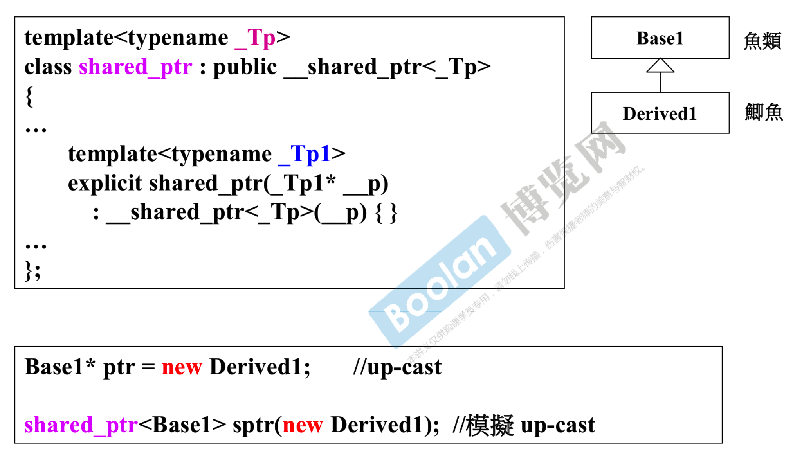

- new 一个鲫鱼，指针指向鱼类，是可以的。称为 up-cast。
- 既然指针可以，智能指针也必须可以，为了实现这一点，要写上方的成员模板代码
### 1.5.3 specialization（模板特化）
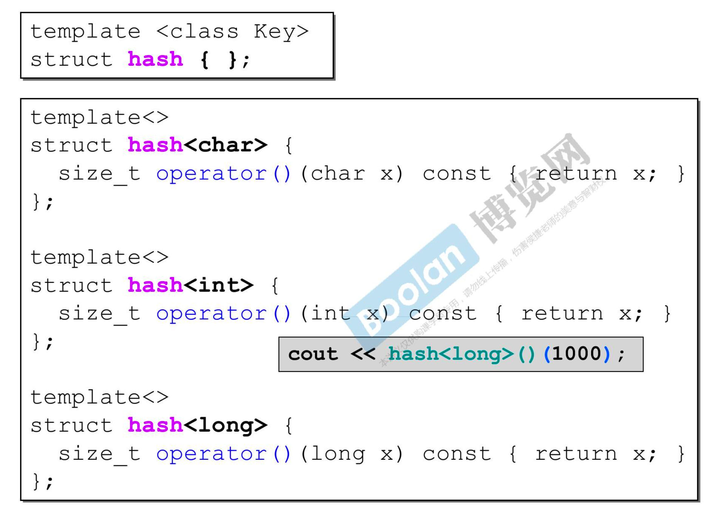

- 任意的类型都会来到 hash{}，但如果指定的是 char、int、long，编译器就会用这三段代码
- 上面的框是泛化，下面的框是特化
### 1.5.3 partial specialization（模板偏特化）
#### 1.个数上的偏
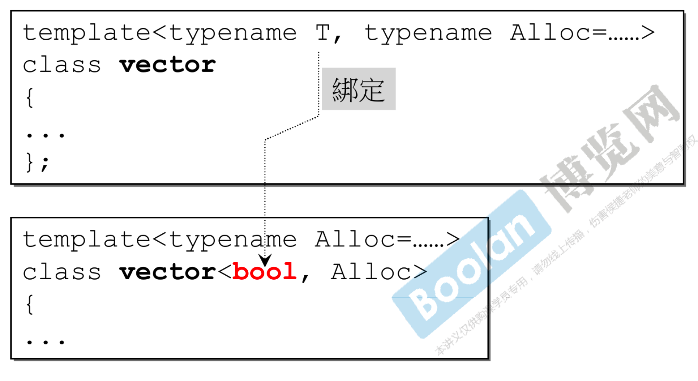

- 在有多个模板参数时，绑定其中一个参数
- 一定要严格的从左到右，比方说有五个模板参数，不能跳着绑定 1、3、5
#### 2.范围上的偏
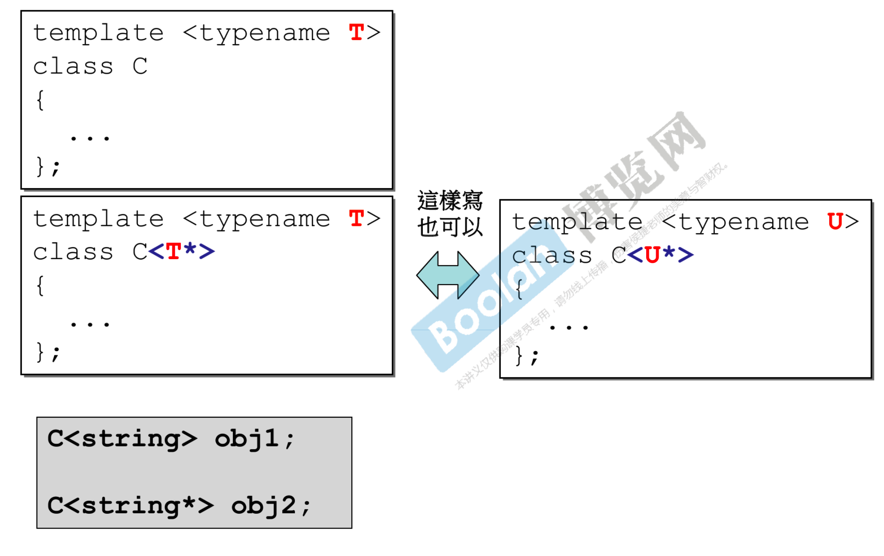

- 将什么类型都可以传的模板，偏特化为只有指针类型（指针什么都能传）能传的模板。
- 是指针用一套代码，不是指针用另一套代码
- 泛化的 T 和 T* 中的 T 是两样东西，为了避免混淆，可以写成 U 和 U*
### 1.5.4 template template parameter（模板的模板参数）
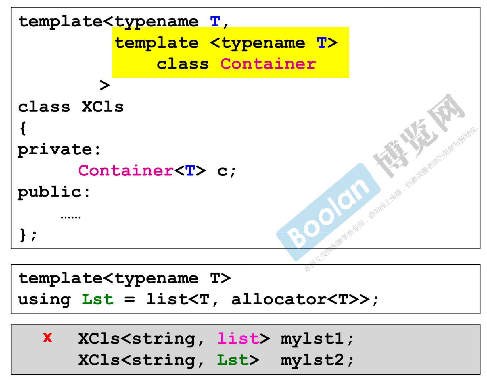

- 一个模板的参数是模板类型。例子中第二个参数是模板
- 只有在模板的尖括号中 typename 和 class 才能共通，其他地方都不可以
- 在例子中，使用者可以指定任意的元素类型和容器类型。但是`list`其实是有第二模板参数的，平时可以不写是因为有默认值，但这里会报错。为了解决这个问题，引入中间框内的两行（具体含义不解释，比较复杂，是 C++ 11 语法）

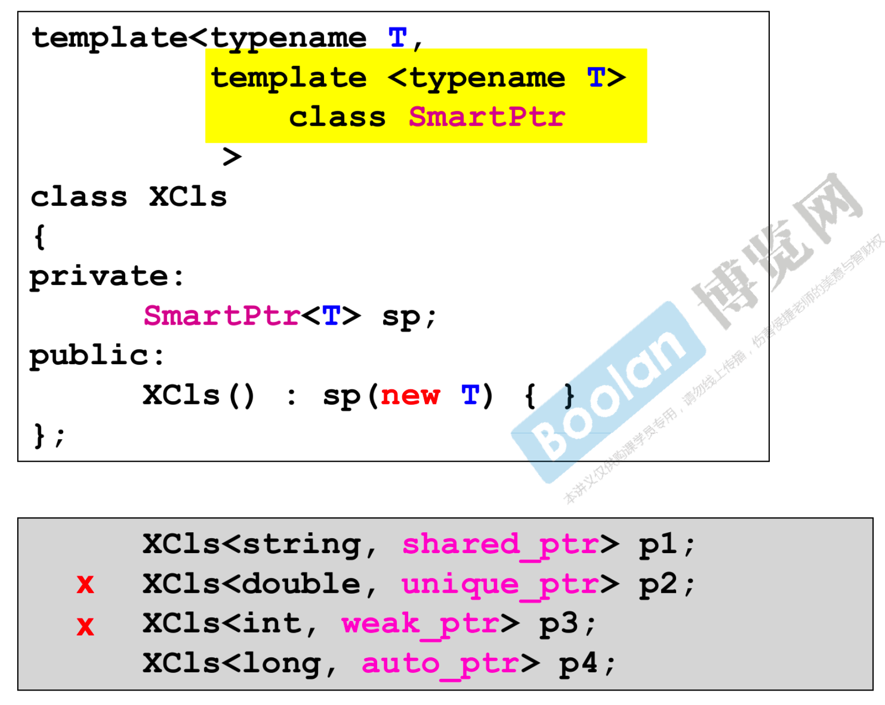

- 这个例子中不再传容器，而是传智能指针，因为大部分智能指针只有一个模板参数，不会报错。但`weak_ptr`和`auto_ptr`因为一些特性也不可以，这不是我们的重点

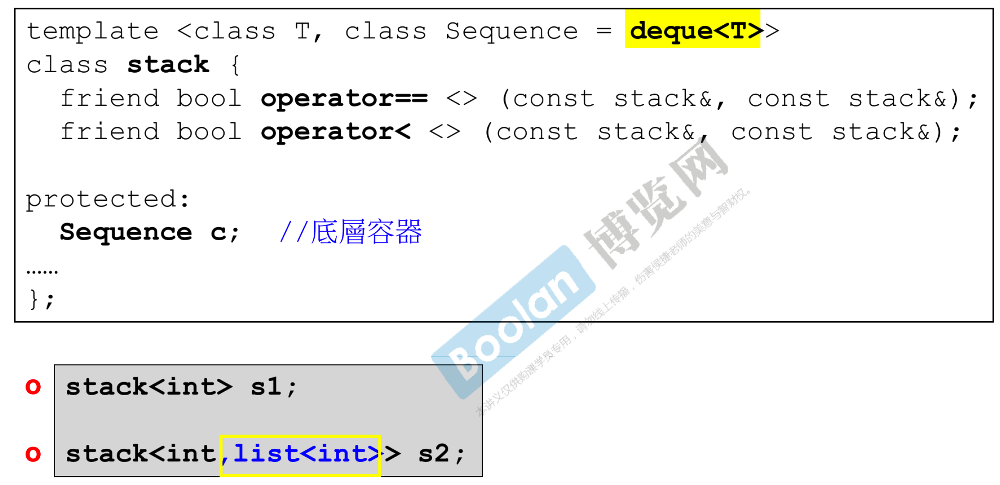

- Sequence 是模板里的参数，而且本身是模板，但确实不是模板的模板参数
- 如果我们在使用时把两个参数都写出来，必须写成`stack<int, list<int>>`，会发现它已经不是模板了，而是已经完全绑定写死了，所以与前面的例子并不相同
## 1.6 C++ 标准库
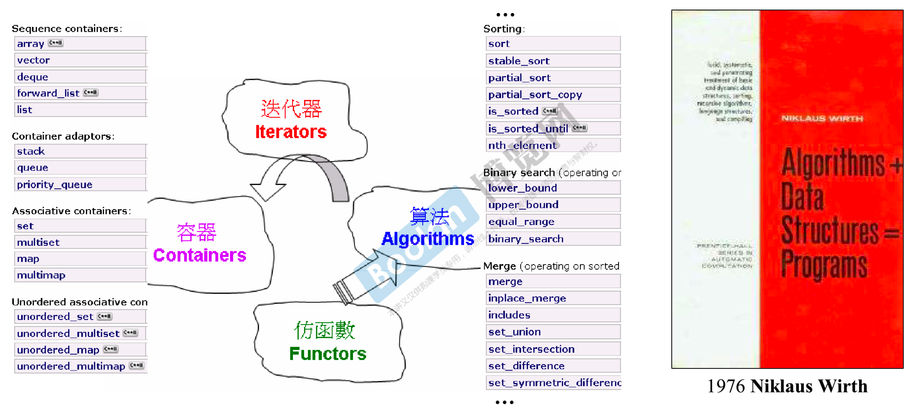

- 标准库提供给我们可以直接用的一个就是容器（数据结构），另一个就是算法
- 建议大家都用一遍，测试一遍，熟记有哪些内容，避免未来重复造轮子
# 2.C++11 和 reference
C++11 有专门的课程，这里挑选了三个重要的小主题讲解
## 2.1 variadic templates（可变模板参数）
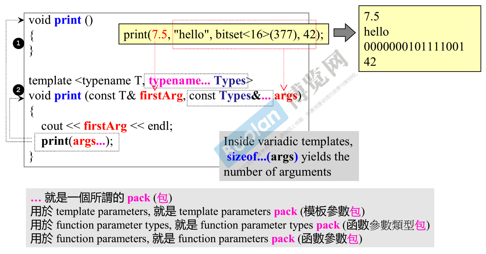

- 三个里面最重要的，其他两个只是语法糖
- 可以传入数量不定的模板参数，它把传入的参数分为：**一个**和**一包**。一包使用`...`表示，注意一个是`typename... Types`，一个是`Types&... args`，位置不同
- 例子中使用了递归，输出完 42 的时候`args...`就是空了，所以有写了上面的`void print()`，调用它来结束。当然，实际使用中也不一定递归，还有其他很多运用。
- 如果你想确定这“一包”参数具体有多少个，可以用语法：`sizeof...(args)`
- 整个标准库都用这个新语法翻新了
## 2.2 auto
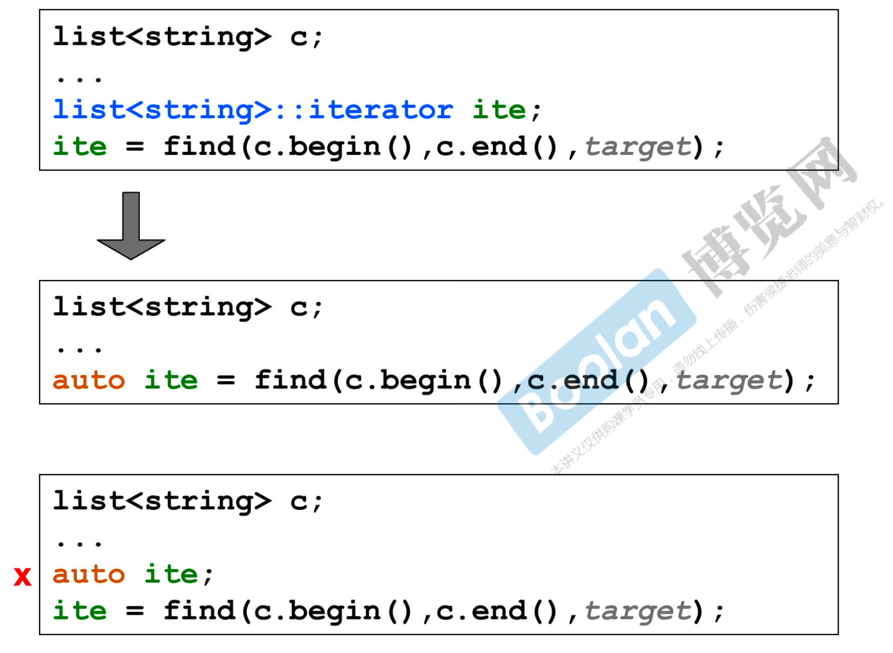

- 面对复杂的返回类型可以用`auto`自动推导出来
- 过去 ite 的类型要写很长，现在写成`auto`就可以了
- 使用`auto`的时候一定要让编译器能帮你推，最下面的框就不行
- 作为标准库的使用者，都应该具备能把容器类型写出来的能力，`auto`只是方便我们而已，但`lambda`的类型是真写不出来
## 2.3 ranged-base for
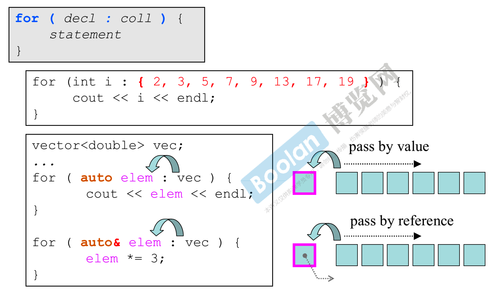

- 它有两个参数，一个是自己创建的变量，另一个是一个容器
- 范围 for 循环可以将一个容器(第二个参数)里的元素依次传到第一个参数，并在该循环体中依次对每一个元素做操作
- 如果你不想影响容器中的参数，请 **pass by value**，否则请 **pass by reference**
- 这里引出一个概念，引用其实是一种指针（从编译器实现的角度）
## 2.4 reference
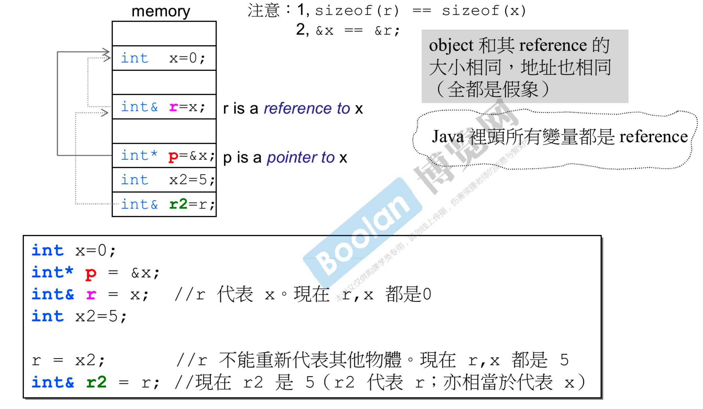

- x 是整数，p 是指向 x 的指针，r 是 x 的引用。x、p、r 都是变量，都占用内存，x 是整数占 4 个字节，p 是指针，也占 4 个字节，r 代表 x，所以也是整数，它代表的东西多大，它也多大，也是 4 个字节
- 其实编译器是把 r 当成指针处理的，r 实际上就是 4 个字节，但编译器会制造“假象”，如果 x 大小是 100 字节，`sizeof(r)`也会是 100 字节，并且 r 和 x 的地址也是完全相同的，这是好事，符合我们对 r 逻辑上的解读（r 是 x 的代表，x 是什么，r 就应该是什么）
- reference 一定要有初值，说清楚它代表谁，而且设完之后不能再变了，不能再代表其他了。
- `r = x2`相当于`x=x2`，所以并不是说 r 变成代表 x2 了，而是 r 和 x 都变成 5 了。

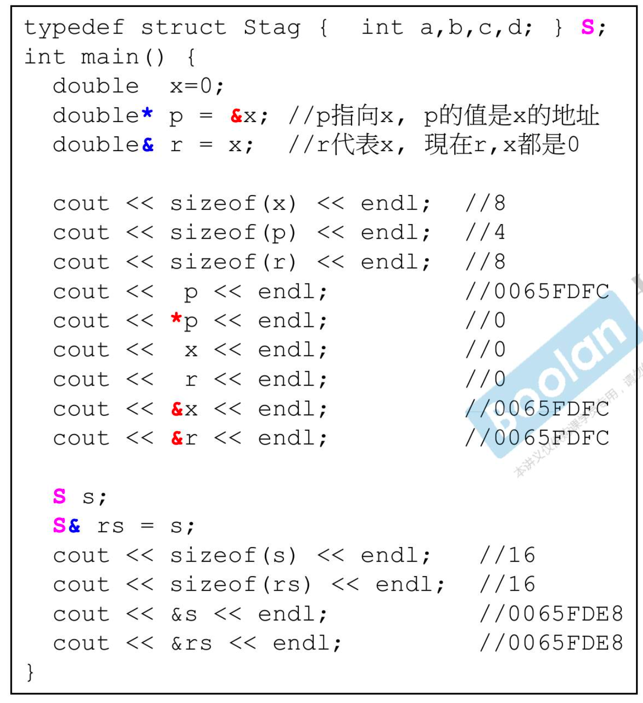

- 验证代码，object 和其 reference 的大小相同，地址也相同（全都是假象）

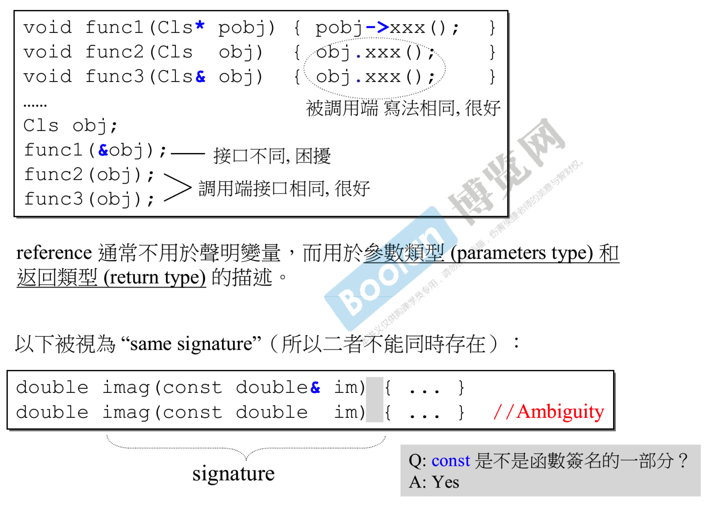

- reference 是一种漂亮的 pointer
- reference 通常不用于声明变量，而**用于参数类型（parameters type）和返回类型（return type）**的描述，即多用于参数传递上
- 可以发现，pass by value（func2） 和 pass by reference（func3）在被调用端写法是相同的，这是件很棒的事，不会像 pass by pointer（func1）一样不同，并且 reference 在保证写法相同的前提下速度又更快了
- 如果 `imag(const double& im){...}`和`imag(const double im){...}`被视为不同的话就麻烦大了，因为在调用 imag 时，编译器就会不知道你要调用哪个，所以二者不能同时存在。
- `const`是函数签名的一部分，加不加 const 是两个函数
# 3.Object Model（虚函数、虚指针、虚表、动态绑定）
一些底层的，表面看不到的东西，对于 C++ 理解至关重要
## 3.1 **复合&继承关系下的构造和析构**
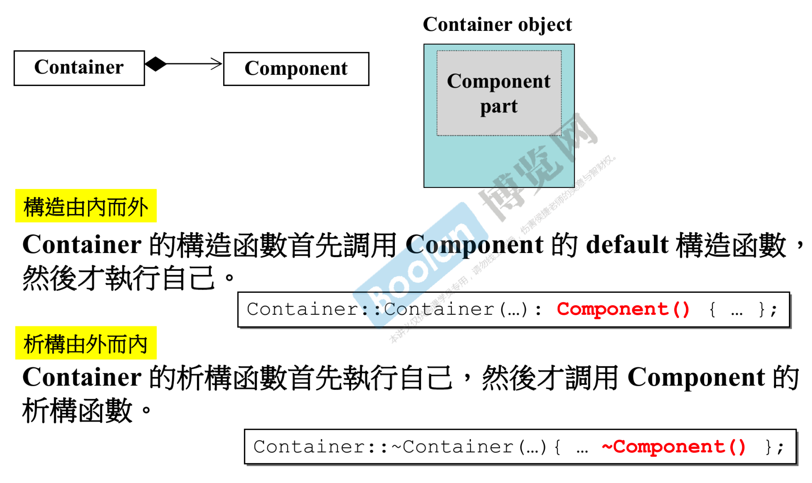

- 回顾一下之前讲过的复合关系下的构造和析构顺序，继承关系下的构造和析构顺序

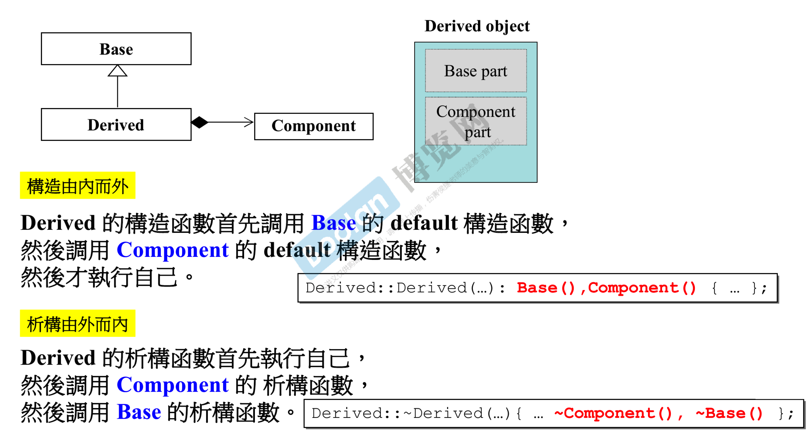

- 考虑继承+复合关系下的构造和析构，以下结论为老师手头编译器得到的结果
- 先调用父类构造函数、再调用 Component，最后自己；析构反过来，先自己、再 Component、再 Base

## 3.2 **关于 vptr（虚指针）和 vtbl（虚表）**
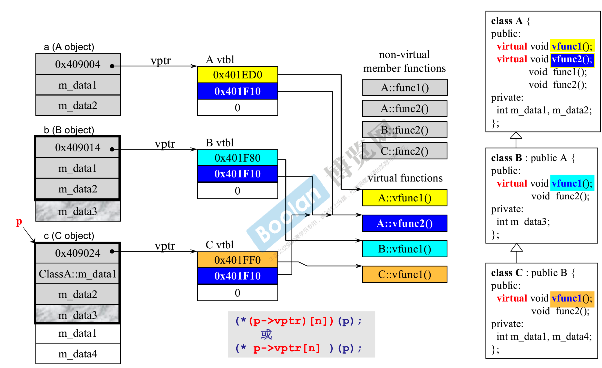

- B 继承 A，C 继承 B
- 当子类继承父类时，除了继承数据之外，同时会继承父类的函数（父类如果有虚函数，子类也一定有）
- 子类继承父类的函数，继承的其实是它的**调用权**，而不是大小
- A、B、C 总共有 8 个函数，4 个非虚函数，4 个虚函数
- A 有两个虚函数 vfunc1、vfunc2 以及两个非虚函数 func1、func2；B 类继承 A 类的 vfunc2，同时覆写A类的 vfunc1，此时 B 有两个虚函数(vfunc1 和 vfunc2)；C 类继承了 B 类的 vfunc2（vfunc2 其实是 A 的），同时覆写了 vfunc1，也有两个虚函数。
- 只要一个类拥有虚函数，则就会有一个虚指针 vptr，该 vptr 指向一个虚表 vtbl，虚表 vtbl 中放的都是函数指针，指向虚函数所在的位置。可以观察到，关系图中虚表中的函数指针都指向相应的虚函数的位置，编译器也是用相同的路径调用到正确的函数，这其实就是**动态绑定**的关键（静态绑定地址都是写死的，动态绑定会看 p 指向什么）。
- 上面的步骤写成 C 的形式就是`(*(p->vptr)[n])(p);`或`(* p->vptr[n])(p);`n 指的是要调用的虚函数在虚表中的第几个。n 在写虚函数代码的时候编译器看该虚函数第几个写的则 n 就是几。

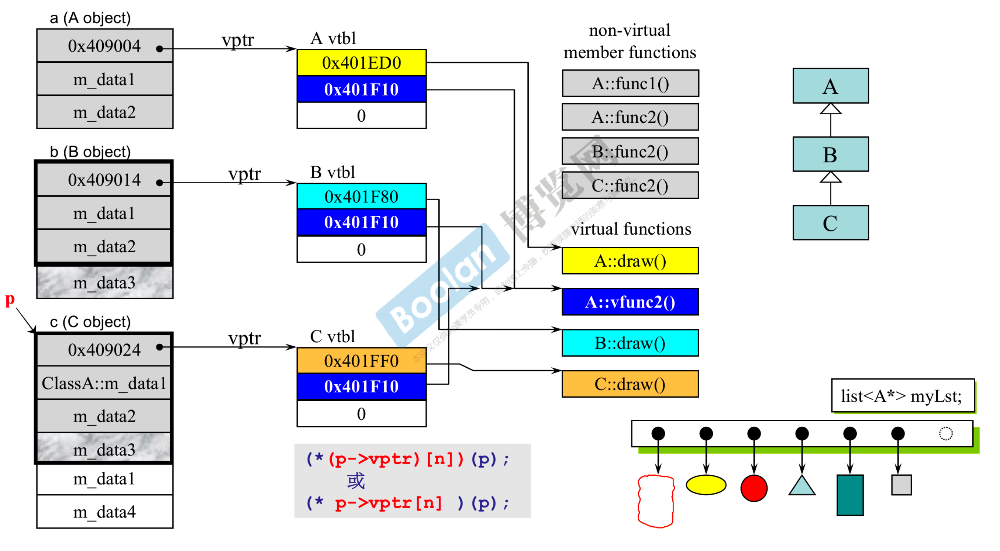

- 换一个生活中的例子
- 我们为了让容器能够存放不同的形状，必须让它放置指针，否则不同形状在内存中的占用大小不一，容器无法存放
- 在绘制时，每个图形都各自用自己的`draw()`绘制（类似上一页的 `vfunc1()`），因此需要用虚函数实现。如果是 C，只能用代码判断是什么形状，再用对应函数绘制，这很不好，如果未来要添加新的形状，代码也要多写 if  else
- 总结一下，C++编译器看到一个函数调用，它有两个考量：
   - 是静态绑定吗？（Call ×××）
   - 还是动态绑定，要想动态绑定要满足三个条件：
      - 第一：必须是**通过指针来调用**
      - 第二：该指针是**向上转型**（up-cast）的
      - 第三：调用的是**虚函数**
- 这种用法被称为多态（polymorphism），可以发现，多态、虚函数、动态绑定是指的一回事，把这部分基础打牢，能很好的理解面向对象
## 3.3 关于 this
## 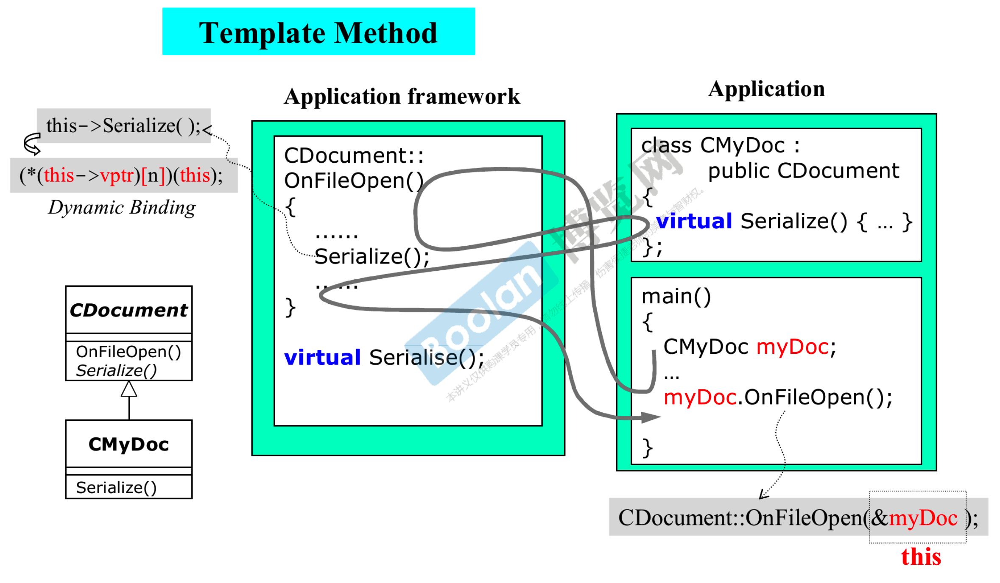

- 通过对象调用一个函数，那个对象的地址就是`this`
- 对于`this`概念要很清晰，不然在分析继承体系的时候会搞不清谁调用谁
- 子类对象调用父类的函数，执行到`Serialize()`时会跑到子类重写的部分再跑回去，为什么会跑到这来呢，答案是动态绑定
- `myDoc.OnFileOpen();`中，myDoc 在调用它，所以 myDoc 的地址就是 this，传进来之后，`OnFileOpen()`中所有的动作都是通过 this 调用的，到`this->Serialize()`时，编译器发现：
   - this 是指针
   - myDoc 是子类对象，this 指向子类对象，所以是向上转型
   - this 调用的是虚函数
- 于是满足动态绑定的条件，实际执行为`(*(this->vptr)[n])(this);`，编译器发现 this 指向子类，所以调用的是子类的虚函数，而不是父类的
## 3.4 关于动态绑定
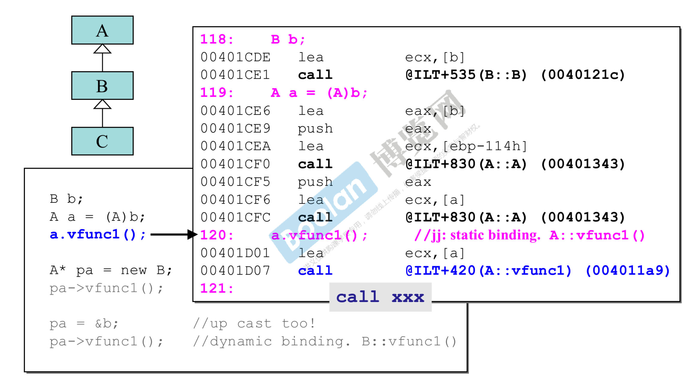

- 为什么动态绑定解析成 C 语言是`(*(p->vptr)[n])(p);`或`(* p->vptr[n])(p);`呢，下面从汇编角度分析
- a 是 A 的对象，它不是指针，调用方式是静态绑定，可以看到汇编呈现的是：call 一个地址

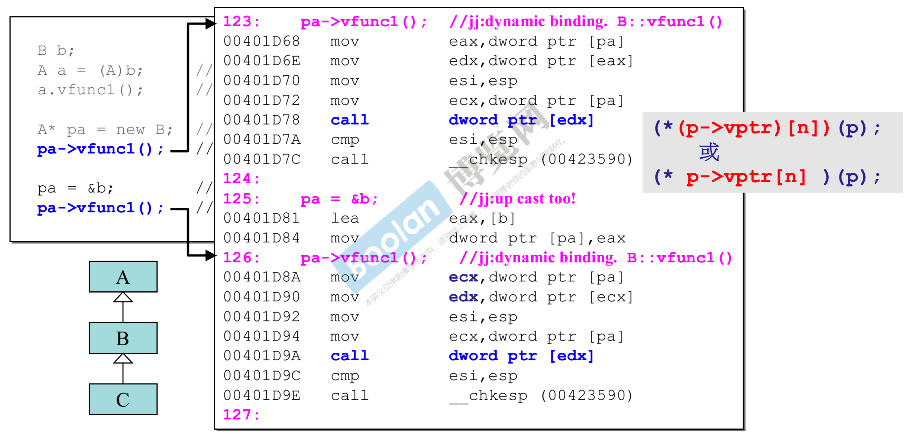

- 下面通过 pa 调用，pa 满足动态绑定的三个条件，可以看出，call 后面不再是固定的地址，而汇编呈现的内容等价于 C 语言的`(*(p->vptr)[n])(p);`或`(* p->vptr[n])(p);`
# 4.const、动态分配与 new、delete
## 4.1 谈谈 const
## 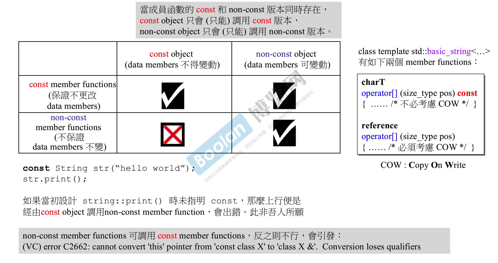

- 之前课程的例子`double real() const {return re;}`
- 加 const 的意图是告诉编译器，成员函数不打算改变 class 的 data，只是读，请编译器帮忙把关，看有没有违反意图
- 对象调用成员函数的时候，对象可能是 const，也可能不是，成员函数同理，于是产生了四种情况。我的数据是不能改变的，这个函数却可能改变我的数据，所以 const object 不能调用 non-const 函数
- const也是函数签名的一部份，即可构成函数重载。
- 标准库的字符串时能共享的，四份相同的字符串会共享一个，所以其中一个人要改的时候，要单独拷贝一份修改，另外三个人继续共享原来的。使用者可能会写`a[5]='B'`，意味着 [] 有可能被用来修改数据，因此不带 const 的 [] 必须要考虑 Copy On Write 行为。考虑常量字符串，它不会改变内容，可以不必考虑 COW，所以如果能区分两个函数会很好。
- 当成员函数的 const 和 non-const 版本同时存在，const 对象只能调用 const 版本的成员函数，non-const 对象只能调用 non-const 版本的成员函数。
   - 如果这条规则不存在，non-const 的字符串有可能会调用 const 的 []，这样 const 的 [] 依然要考虑 COW，不符合我们的想法
   - 这条规则保证只有常量字符串才会调用 const 的 []，const 的 [] 可以放心地不必考虑 COW。
## 4.2 关于 new、delete
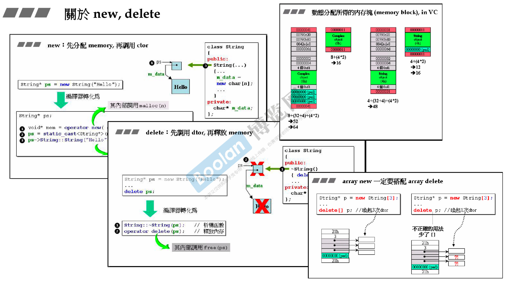

- 全部是回顾之前讲过的
- 使用 new，其实会有三个动作，依次为：分配内存、转型、构造函数；delete 有两个动作：析构函数、释放内存
- 当我们 new 一个对象或 delete 一块内存的时候，这个 new、delete 是一个 expression（表达式），不可以重载。但是他们的内部 new、delete 是 operator（操作符）可以重载。重载后可用来写内存池
- array new 一定要搭配 array delete。
## 4.3 **重载 operator new，operator delete**
### 4.3.1 全局重载 ::operator new, ::operator delete, :: operator new[], ::operator delete[]
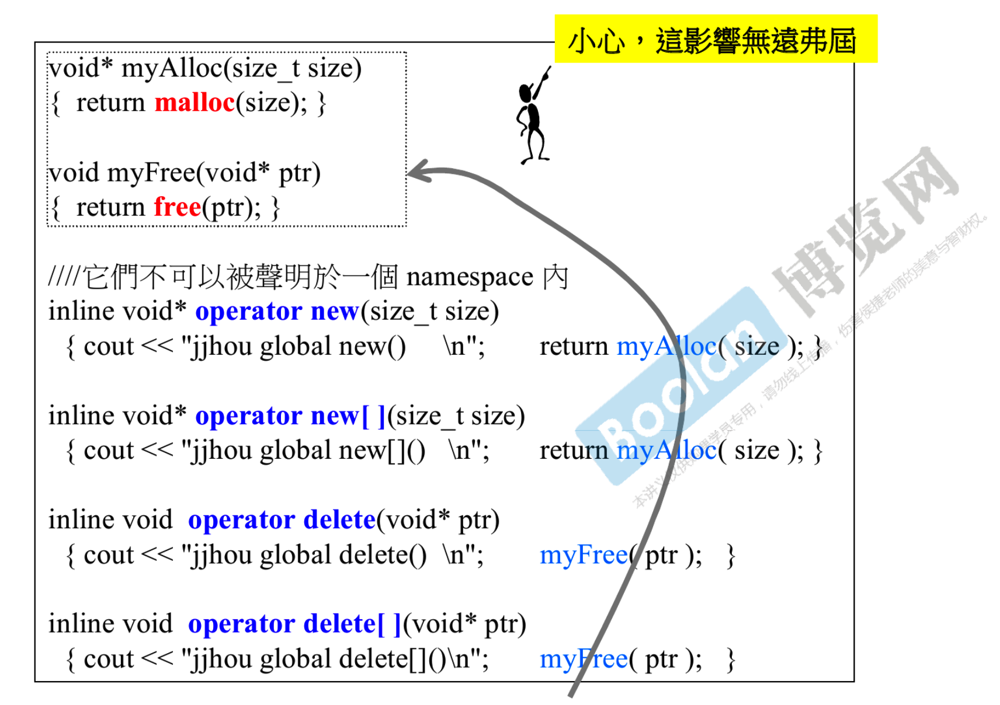

- `::`代表全局的
- 着用这种重载要小心，它影响范围是全局。
### 4.3.2 重载 member operator new/delete
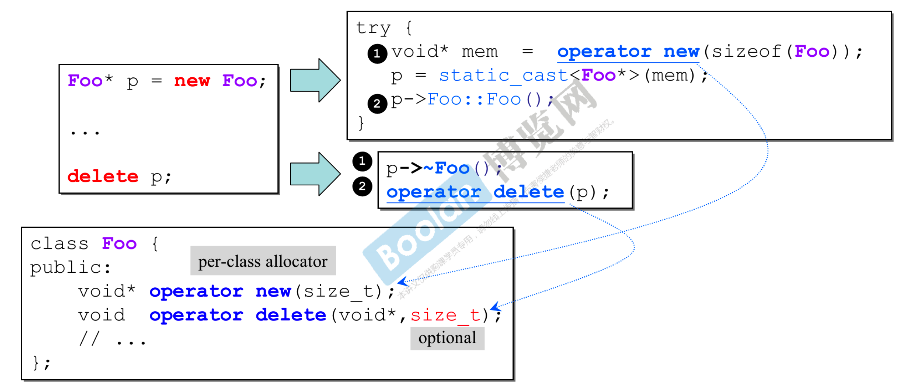

- 现在是在类里
- delete 重载的第二个参数时是可选的，可以不写
### 4.3.3 重载 member operator new[] / delete[]
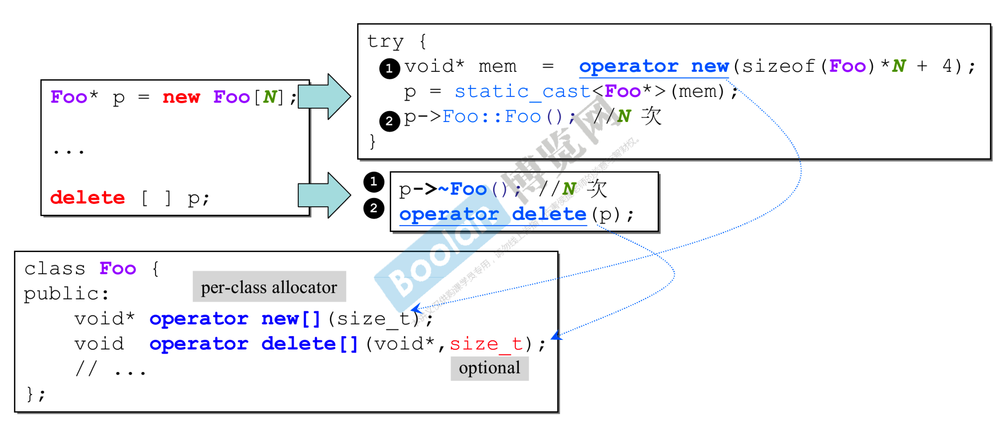

- 和上一页比对，只有 [] 的区别
### 4.3.4 接口示例
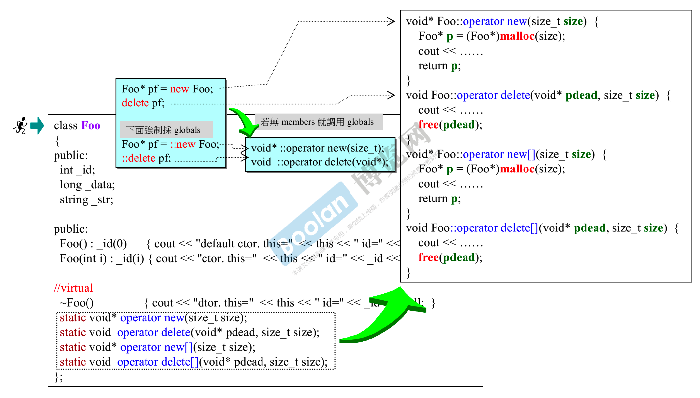

- 如果使用者想绕过重写，可以加全局作用域`Foo* pf = ::new Foo;``::delete pf;`（虽然很难想象什么场景下会有这种需求）

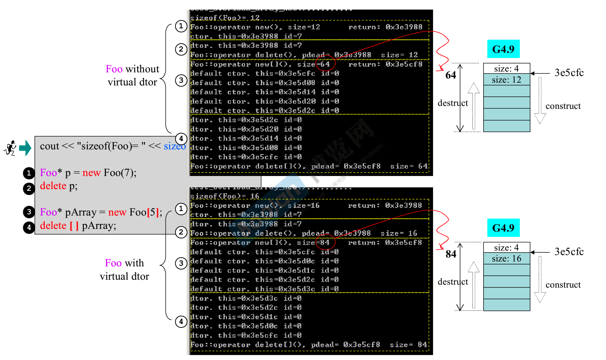

- Foo 有 一个 int 一个 long 一个 string，int 占 4 字节，long 占 4 字节，string 里面其实是指针，占 4 字节。所以第一行显示，一个 Foo 占 12 个字节
- 如果 Foo 有虚函数，就会多一个指针，大小为 16 字节
- `new Foo[5];`，12*5=60，但显示出来是 64，为什么会多出一个 4？这个 4 记录的其实是数组大小（5），这样编译器才能很快的知道，下面要调用 5 次构造或 5 次析构

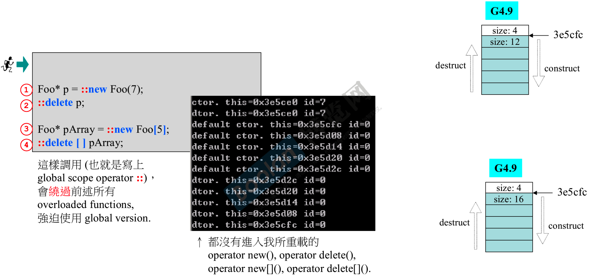

- 通过测试程序可以发现，加上`::`后确实没有进入重写的部分
## 4.4 **重载 new()，delete()**
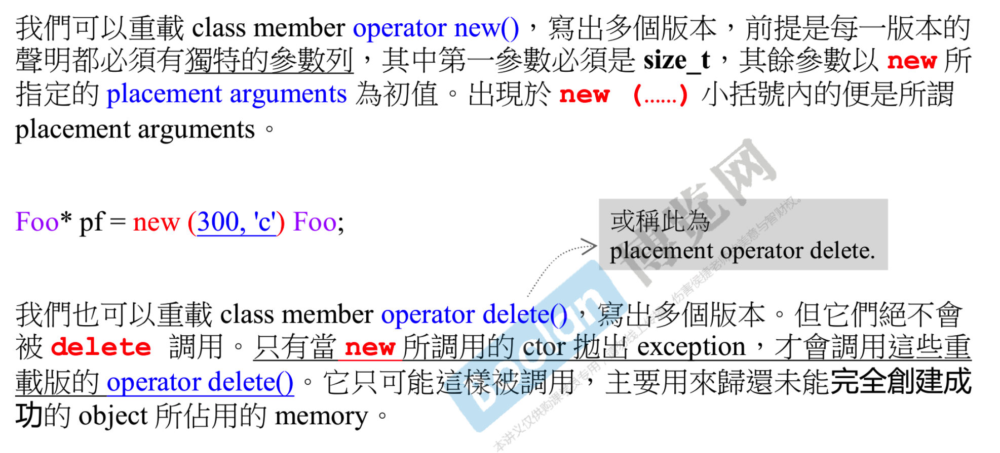

- 这种形式叫作 placement new
- 使用形式：`Foo* pf = new(300,'c') Foo;`
- 可以重载多个 class member operator new() 版本，但每一个版本的**参数列表必须独一无二**
- 且参数列表的第一个参数必须为 **size_t**，其余参数以 new 所指定的 placement arguments 为初值。出现在new(......) 小括号内的便是所谓的 placement arguments。
   - 很合理，因为必须知道大小才能分配内存
- 所以上述的使用形式小括号内虽然看到有两个参数(300，‘c’)，但其实有三个。

- 可以重载多个 class member operator delete() 版本，但绝不会被 delete 调用（这个 delete 是指可以被分解为两步的那个 delete）
- 唯一被调用的时机：只有当 new 所调用的构造函数(new 被分解的第一步)抛出异常，才会调用与 new 对应的那个重载 operator delete()，主要用来归还未能完全创建成功的对象所占用的内存。

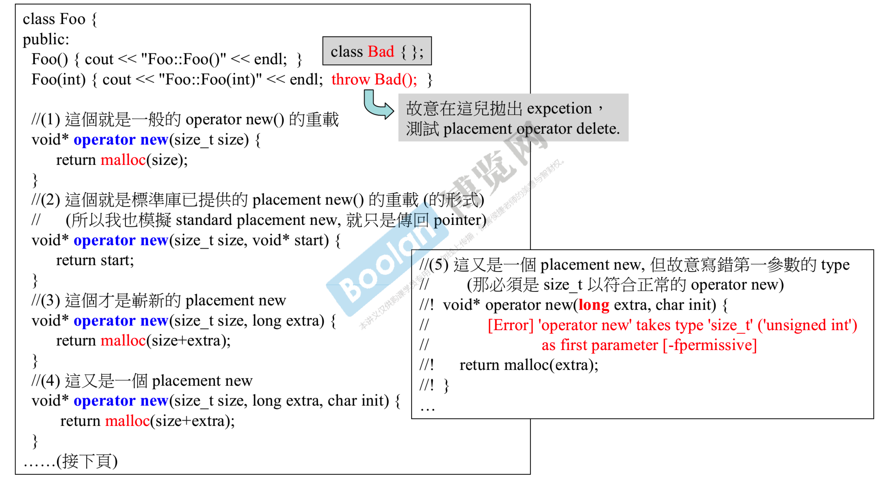
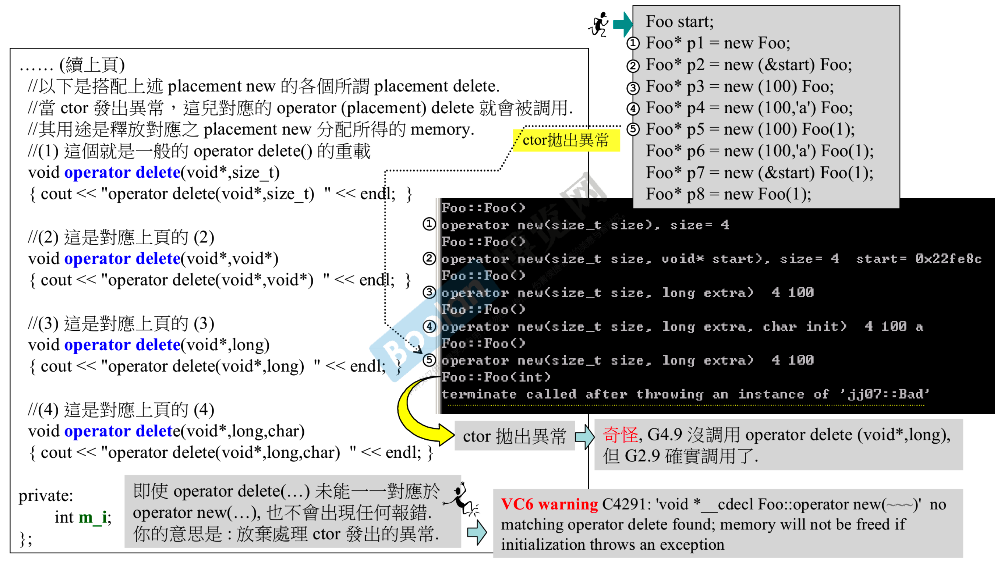

- (5) 是故意写错第一个参数的版本，会报错
- 为了测试 placement operator delete，故意在第一页抛出异常
- 下面的四个 operator delete 每个都是对应上面的一个 operator new
- 如果 operator new 调用构造函数时发生异常，应该把刚刚分配的内存释放掉才对，否则会发生内存泄漏，就在这时，对应的 operator delete 就会被调用，去释放内存
- p1、p2、p3、p4 都是调用默认的构造函数，p5 故意调用了会抛出异常的带参数的构造函数（C++ 程序在抛出异常后就不会继续执行了，所以 p6、p7、p8 不用管），但奇怪的是，这次测试中没有调用 operator delete，之前的测试却调用了，可能和编译器有关
- 即使 operator delete 未能一一对应 operator new，也不会出现任何报错，编译器只会认为你不在乎异常，而不会强制要求你处理

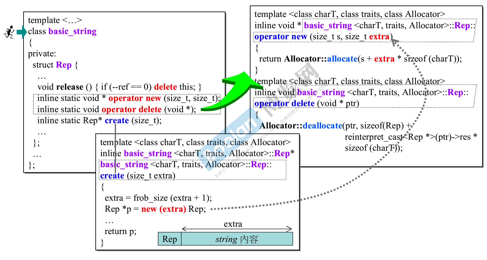

- 标准库重载 placement operator new 的例子
- 字符串是放到 extra 部分里，Rep 做计数器
- 他这样做可以无声无息地多分配一部分内存
