# 1.前言
揭秘 CRT startup code
“生前”指的是`main()`之前的动作，“死后”指的是`main()`之后执行的动作

几个问题：

- C++ 进入点是 main() 吗？
- 什么代码比 main() 更早被执行？
- 什么代码在 main() 结束后才被执行？
- 为什么上述代码可以如此行为？
- Heap 的结构如何？
- I/O 的结构如何？

课程目标是彻底解决上述疑问

整个课程没有测试程序，但是会观察 VC6、VC10 的代码

推荐书籍：《程序员的自我修养：链接、装载与库》
# 2.startup code（启动代码）
## 2.1 自定 startup code（Entry-Point Symbol）
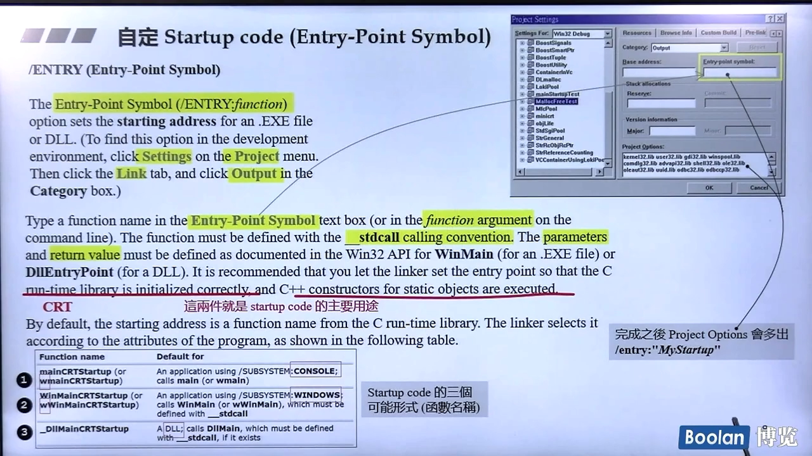

- VC6 的自定义方法
- 除非你有把握能让 CRT 库正确初始化且 C++ 静态对象构造函数能正确执行，否则不要自己写 startup code
- startup code 有三种可能形式，链接器会自动判断是哪种

```cpp
#include <windows.h>
int MyStartup(void)
{
    int a=10;
    HANDLE crtHeap=HeapCreate(HEAP_NO_SERIALIZE,0x010,4000*1024);
    int *p=(int*)HeapAlloc(crtHeap,HEAP_ZERO_MEMORY,0X010);
    int i,j;
    
    for(i=0;i<100;i++)
    {
        for(j=0;j<100;j++,p++)
        {
            *p=i*100+(j+1);
        }
    }    
 
    MessageBoxA(NULL,p,"abcd",MB_OK);
    return 0;
}
```

- 自己写 startup code（只针对 Windows）

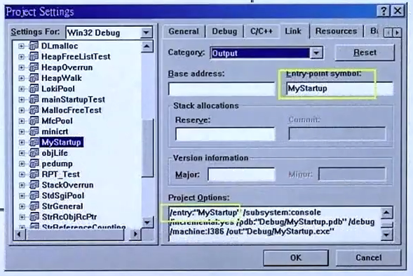

- 然后按照上一页的说明填入 Entry-point symbol
- 代码可以正常运行，但没什么用，而且因为没有调用`main()`也根本没有写`main()`，`main()`不会被执行

```cpp
$ cat entrypoint.c
 
int blabla(){ printf("Yes it works!\n"); exit(0); }
int main(){ printf("not called!\n");}
 
$ gcc entrypoint.c -e blala    //-e：告诉链接器使用 balala 函数作为进入点
 
$ ./a.out
Yes it works!                 //main 函数并没有执行
```

- Linux 下的启动码函数写法

总结：任何的 C/C++ 程序，在`main()`之前，有一个启动代码函数，`main()`必须由启动代码函数调用起来，启动代码也是最早执行的函数。
## 2.2 startup code 在哪
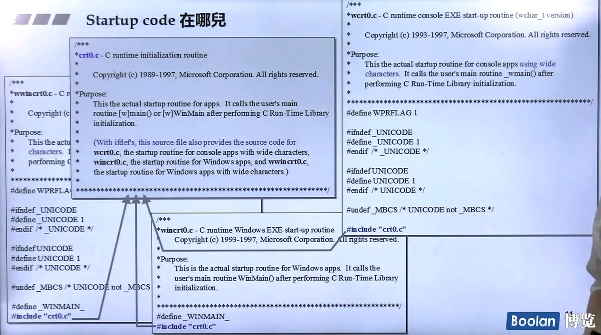

- 后面的代码都会在最上面写上文件名，方便你自己查找翻阅
- VC6 下的三个文件都 include 了`crt0.c`，说明真正的 startup code 在`crt0.c`

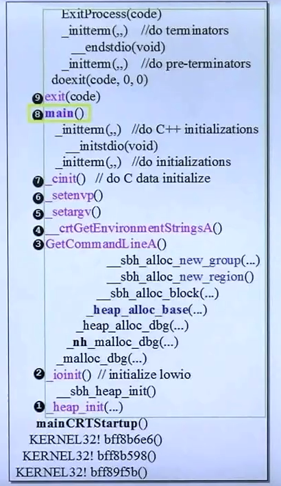

- call stack
- 最下面的是最早调用起来的，`mainCRTStartup()`就是 Windows 下的启动代码函数，里面主要调用了 9 个动作，8 才进入`main()`
- 不只调用了这些函数，实际上还调用了更多，这里只把我们关注的部分列出来
## 2.3 startup code 源码摘要
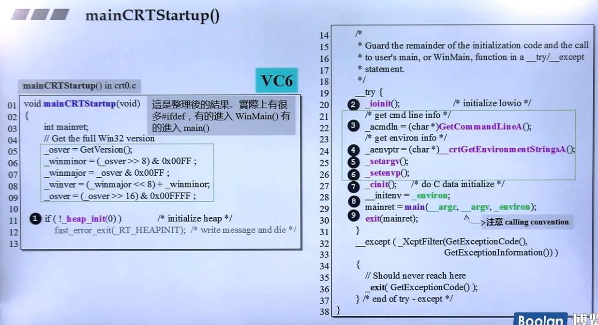

- 不是完整代码，删节了不重要的部分
- 九个步骤分别为
   - 1、 heap 的初始化
   - 2、 io 的初始化
   - 3-6、字符串的处理，比较琐碎
   - 7、C 的初始化
   - 8、进入`main()`
   - 9、`exit()`
- 因为 calling convention，`main()`里传零个参数还是三个都传都可以

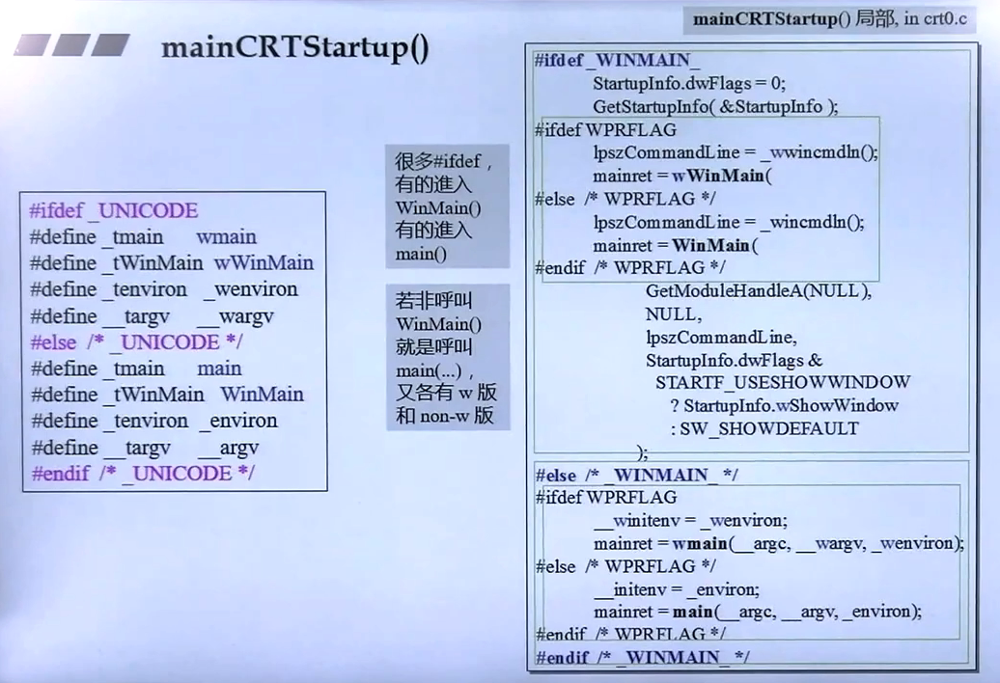

- 这页是为了说明完整代码中有很多的条件编译
# 3._heap_init——startup 首要工程
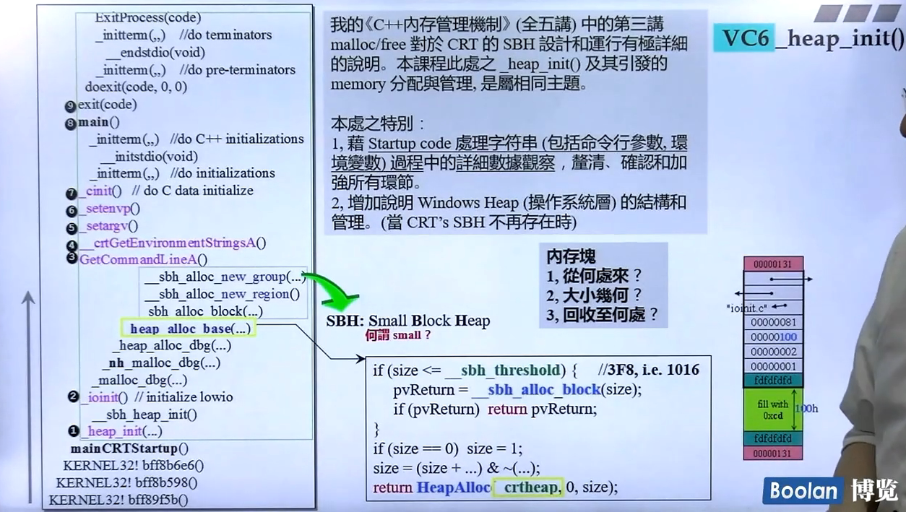

- 和《C++ 内存管理机制》课程的第三讲有重合的地方
- 本课程特别的地方：startup code 处理字符串的详细观察数据，Windows Heap（操作系统层面）的结构和管理。
- `__heap_init()`看起来没做什么，是因为等用户真正要求分配内存的时候，复杂的结构才会生成出来，而`ioinit()`就有要求分配内存的操作，于是我们观察它

具体内存分配的部分和《C++ 内存管理机制》的 3.3、3.4 部分相同

# 4.main 生前所有内存分配
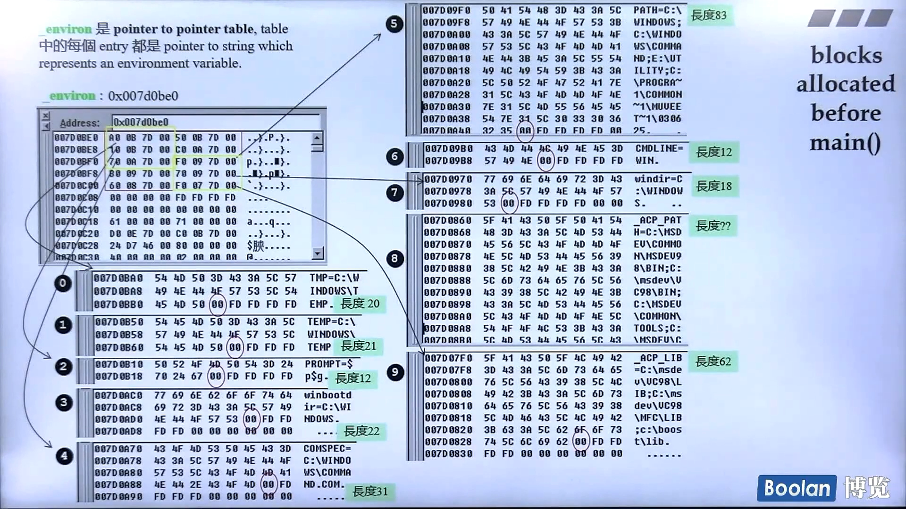

- `_environ`是 pointer to pointer tabale（指针指向指针形成的表），table 中的每个 entry（元素）都是 pointer to string which represents an environment variable
- 把 `_environ` 画成图，就是下一张图右下角的样子，本次测试中有 10 个环境变量
- 看左上角的图，00 00 00 00 前面都是`_environ`指向的指向字符串的指针（规定 0 为结束），而四个字节为一个指针，所以有 10 个。这 10 个都通过箭头一一对应了，没有问题，我们可以知道每个字符串的长度

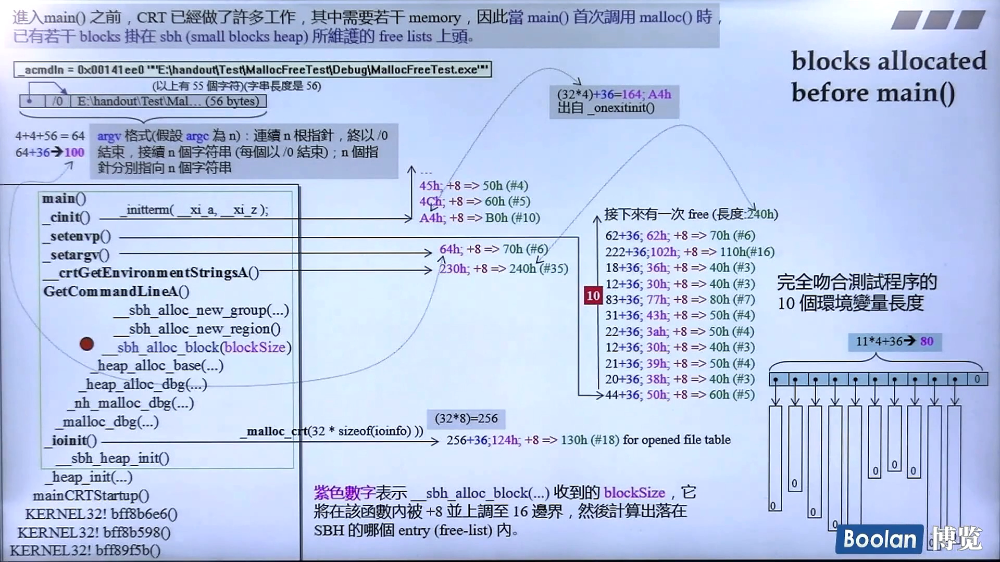

- 验证一下分配的内存是否和字符串能对应上
- `main()`之前的内存分配都通过断点观察到了
- `_ioinit()`要了 256，加上 debug header、cookie，再调到 16 的倍数，就是 130h
- `__crtGetEnvironmentStringA()`，要了 230h（前面 10 个环境变量加起来差不多是这么多，但不是正好是 230h），总共分了 240h。
- `_setargv()`，命令行的 arg。命令行内容是`E:\handout\Test\MallocFreeTest\Debug\MallocFreeTest.exe`，共 55 个字符，字符串长度是 56，可以看做`_environ`的简化版，只不过`_environ`有 10 个指针，这个只有 1 个。总大小是一根指针（4）+0（4）+字符串（56）= 100，加上 debug header 后是 100（64h），和下面可以对应。最后再加上 cookie 和调整 16 倍数后是 70h
- `_setenvp()`，刚才`__crtGetEnvironmentStringA()`拿到一大块，`_setenvp()`要把这一大块切开来。引发了 11 次的内存分配，10 个环境变量+ 1 个 table。table 有 10 个指针和最后的 0，大小为 11*4+36（debug header）=80（50h），10 个字符串也与上一页完全吻合。前面要一大块把所有环境变量都拷贝过来，现在已经切割成 10 个字符串了，240h 已经功成身退，可以还了，于是 free
- 之前讲内存分配（《C++ 内存管理机制》3.4节）的时候，第一次 130h，第二次 240h，第三次 70h，其实都是 从这来的
- 可见，进入`main()`之前，CRT 已经做了许多工作，其中需要若干内存，因此当`main()`首次调用`malloc()`时，其实已经有若干内存块挂在 sbh 所维护的自由链表上了
# 5.Windows Heap Management
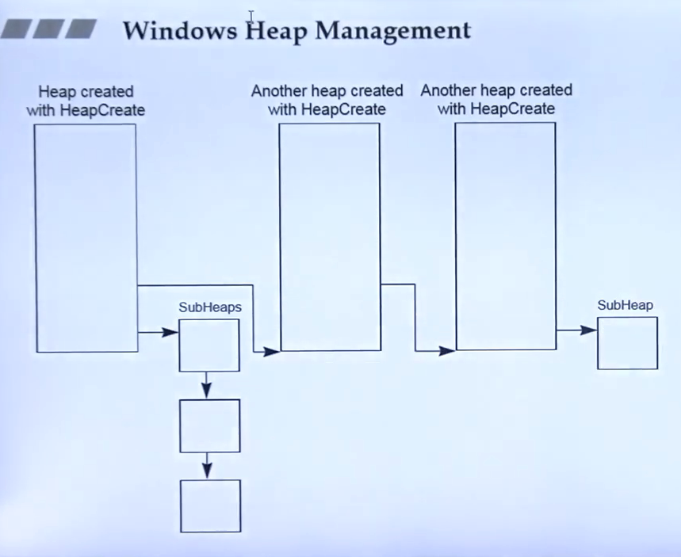

- 之前说 VC10 没有 sbh，把小区块管理交给操作系统了，所以我们来看一下 Windows Heap Management。这里没有源代码，但是可以观察，看看它有没有体现出 sbh 的关键特性

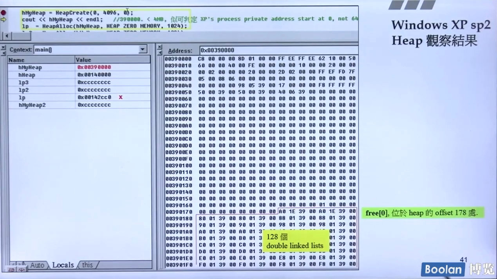

- 在 heap 起点偏移 178h 的地方，有 128 条双向链表

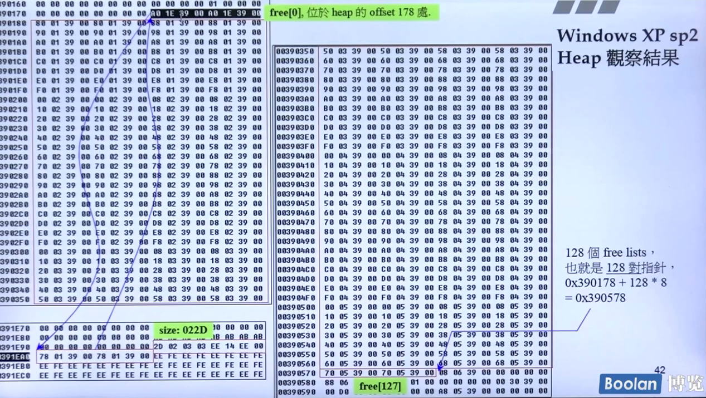

- 128 条双向链表，就是 128 对指针，0x390178 + 128 * (4*2) = 0x390578。之前 sbh 每个 group 里有 64 条自由链表，这里有 128 条，sbh 每条负责 16 字节，这里每条负责 8 字节
- 第一条链表的两根指针记录的地址是 00 39 1E A0（要倒过来看）

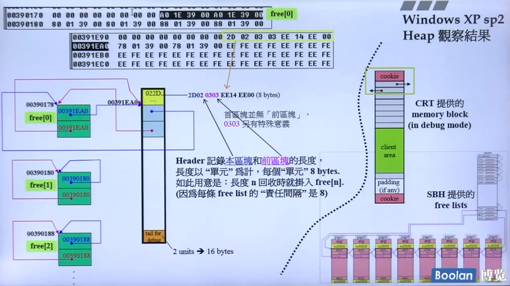

- 详细观察 00 39 1E A0，看看能否找到可以对应 sbh 的关键结构
- free[1] 和 free[2] 的指针都是指向自己的，说明是空链表，没有挂任何 block
- 然后我们把 free[0] 指向的部分前后都抄过来。黄色部分就是 cookie，cookie 下面两根指针。但是这里只有上 cookie 没有下 cookie，但 cookie 记录了本块和前一块的大小，所以也可以做上下融合。自此我们判定，sbh 是挪到 Windows 里了
- 022D 并不是字节数，而是单元数，每个单元 8 字节。好处是以前要回收的时候必须要除以 16 再减 1 才能计算归属哪条链表，现在如果 cookie 记录的是 7，那么它就是 7 号链表
- 需要注意，因为我们观察的这一块是首区块，并没有上一块，所以本来记录上一块大小的 0303 有其他意义

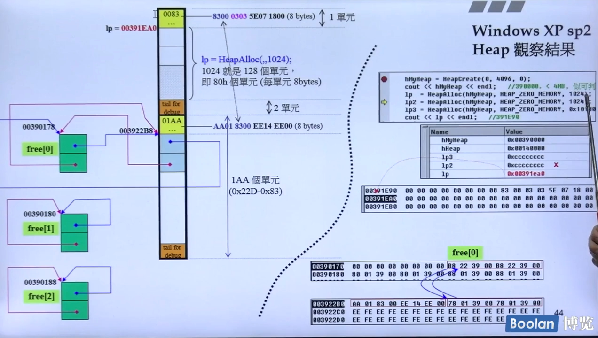

- 挖出 1024 的空间，观察变化
- 1024 是 128（80h）个单元，再加上 1 单元的 cookie 和 2 单元的 debug tail，总共 83h。可以发现 cookie 记录的确实是 83h。剩余 22dh-83h = 1aah，也可以对应，我们的目的达成
# 6._cinit——startup 第三项大工程
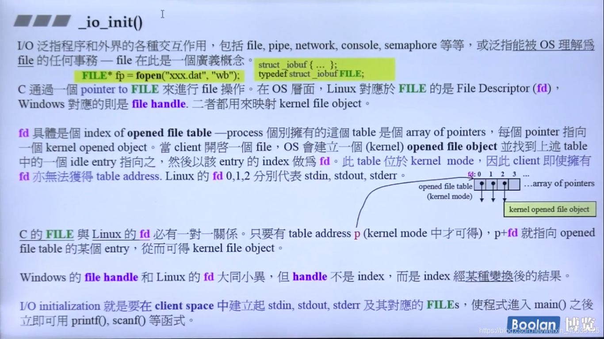
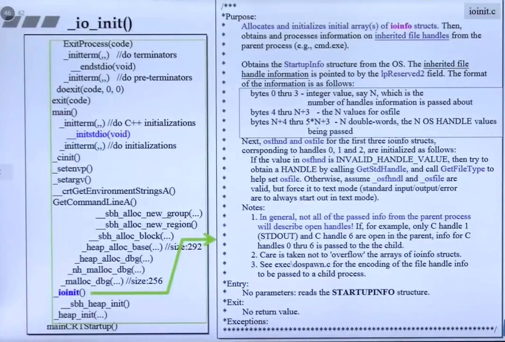

- 视频缺失

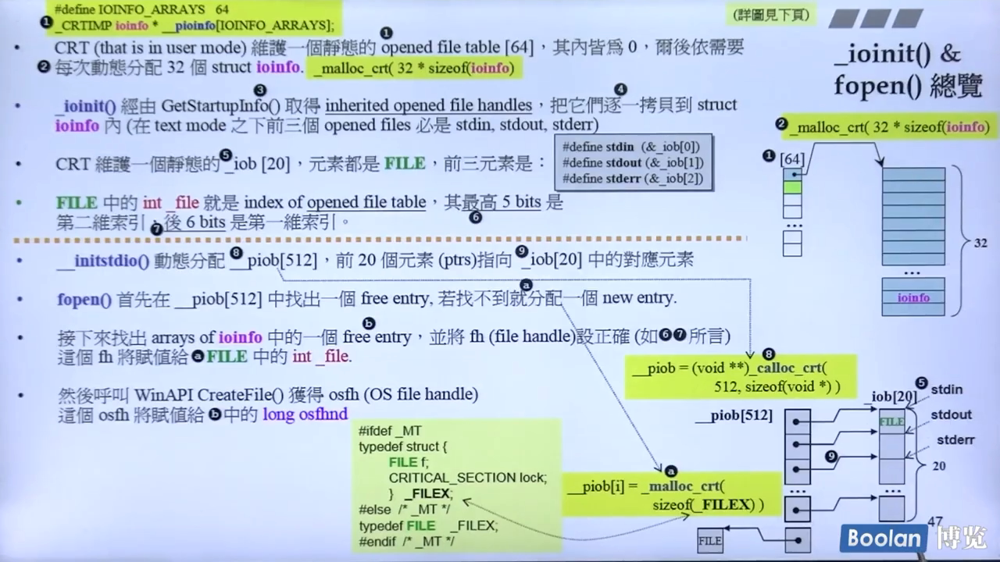

- 这张图和下一张图是最关键的两张图，讲的是一回事，可以将序号一一对应

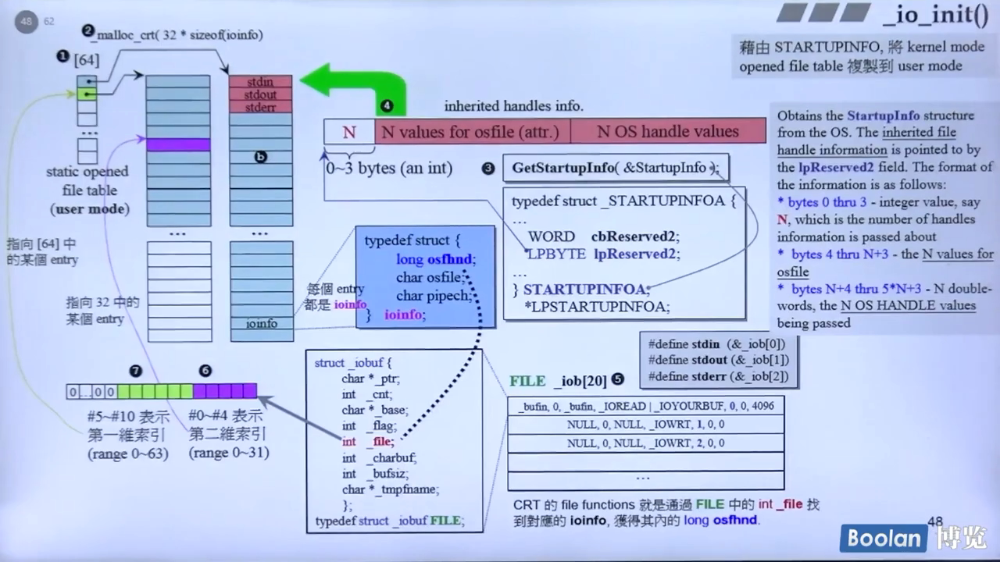

- `_cinit()`使得程序在一开始启动的时候就获得了一个静态的数组，数组里最多 64 个指针，每个指针指向 32 个元素，每个都是 ioinfo，所以程序最多可以开 2048 个广义上的 file
- `GetStartupInfo()`是 Windows 提供的函数，用来取得结构，继承而来的 file handle information 是用指针`lpReserved2`指的，格式分为三块
   - 字节 0~3 是一个整数值 N，意思是继承了几个 file handle
   - N 个 osfile 对应 ioinfo 里的 osfile
   - N 个 OS handle 对应 ioinfo 里的 osfhnd
- `fopen()`会从 2048 里找出一个还没有用的拿去用
- 可以发现 stdin、stdout、stderr 是取`_iob`的地址，每个`_iob`都是 FILE

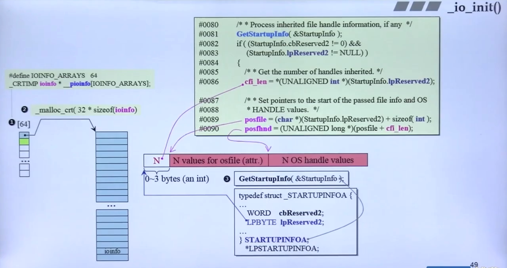
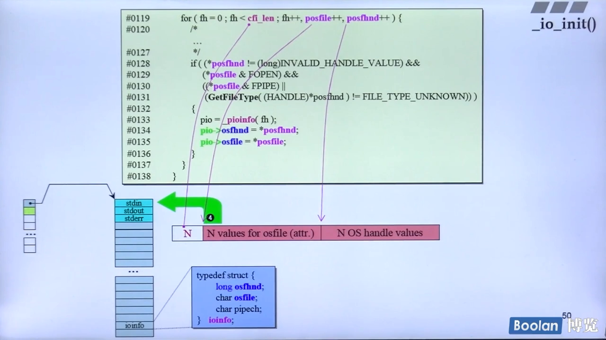

- 对应源码，分别取出 N 和两段数据的起始位置，然后 copy
- 从父亲进程里获得继承而来的 file handle

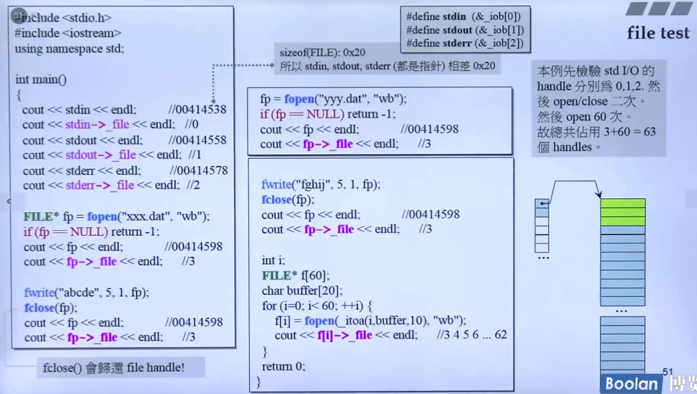

- FILE 里有 8 个东西，每个都是 4 字节，共 32 字节（20h），所以打印出来的地址间隔都是 20h
- 总共 2048，已经用掉 0、1、2 了，再开一个，发现确实用的是 3
- `fclose()`之后再打印一次，依然可以打印出 3，虽然`fclose()`会归还 file handle，但并没有清为 0，如果不小心用到它会出错


其它参考：


