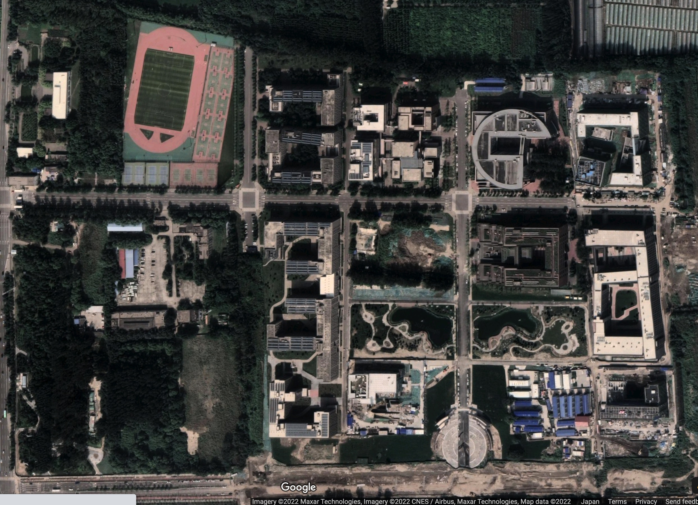
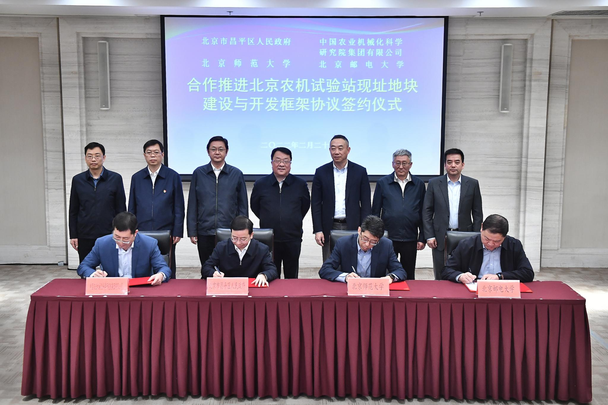
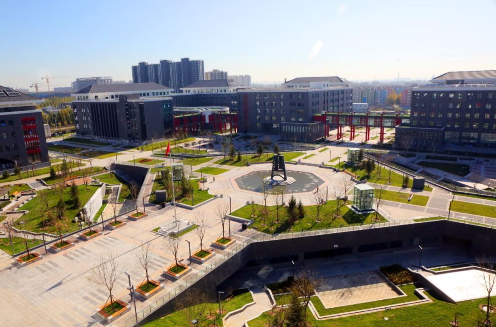
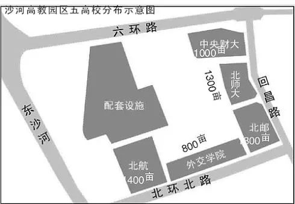
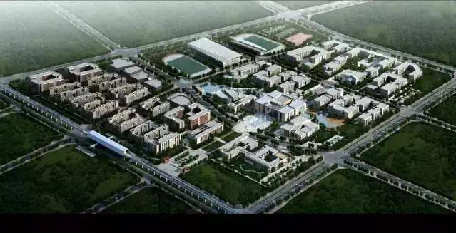
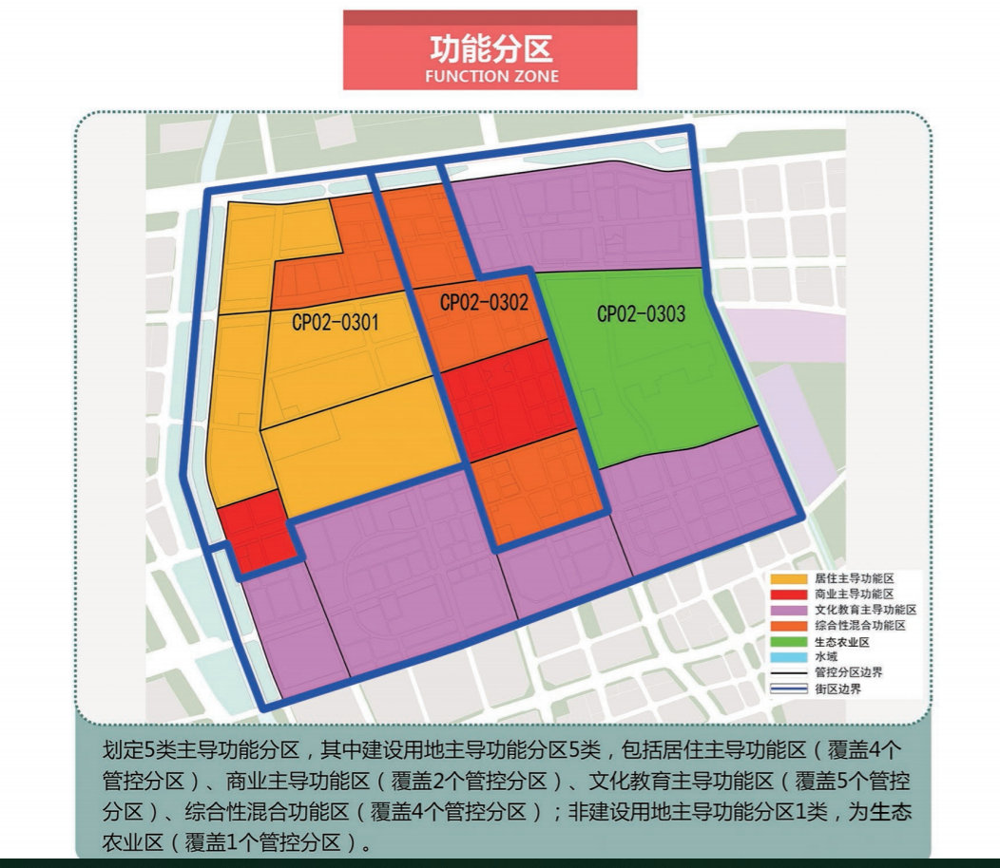
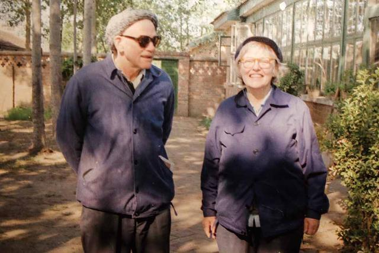
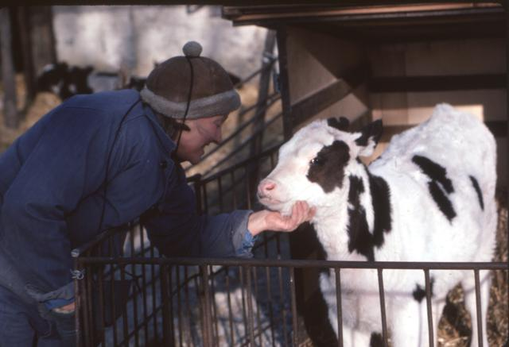

## 引子

对于住在沙河校区的小伙伴们来说，每天晚上准时飘来的粪味总是提醒着大家，学校北边存在着一家农机院。

而就在前不久的 2 月 27 日，传来了期待已久也振奋人心的好消息：昌平区人民政府与中国农业机械化科学研究院集团有限公司、北京师范大学、北京邮电大学，就推进北京农机试验站开发建设和北京师范大学、北京邮电大学新校区建设签署四方合作协议。

大家可能会有许多困惑：“农机试验站的搬迁和北邮沙河校区建设有什么关系？”“北师大的沙河校区现在不是在另一个完全不同的位置？”“为什么农机试验站的搬迁意味着历史性的进展？”相信我，看完这篇文章，你一定会有所收获。

## 北邮沙河校区与农机试验站

作为一名北邮人（自豪），我们先来聊聊北邮沙河校区与农机院之间的联系。下图为沙河校区的地块示意图，其中红色线条包围的便是尚未完成征收的地块，可以看出，农机试验站占据了相当的面积。

简单计算一下，**沙河校区总规划用地约 1348 亩**，根据地图估算（这里是用像素数来估计面积，很不准确，仅供参考），已征地块约 643 亩，未征地块约 705 亩，**农机试验站占地约 403 亩**。光看数字大家可能没有概念，要知道，北邮本部不算南家属区占地也就只有仅仅 500 亩左右，**如果少掉农机试验站的 403 亩，沙河校区就近乎损失了 1/3 的地块。**

再来看看按照规划，农机院所在地块会建设些什么：一个运动场、一大片多功能景观活动区、多幢学院楼、学生宿舍和食堂。虽然沙河校区现有设施也可以基本满足这些需求，但**在得到充分的空间进行建设后，无疑会更有利于发展学生身体素质、创建绿色校园以及改善办学条件。**

## 北师大沙河校区的曲折建设

北师大现建成的沙河校区（G 区）

北师大的故事相比北邮要曲折得多，要远远追溯到 21 年前。2001 年，沙河高教园项目正式开始启动，总用地面积799.42公顷（11991.3亩），总投资60亿元，北师大和北邮一样，都是第一批确定进驻的高校。

可以看出，北邮、北航、财大、外交学院所在位置都和最初的规划相同，只有北师大，规划中的位置现在依然是农机试验站（泪）。

而在更新一些的规划图中，左下角矿大的旁边，又多出了一小块“北京师范大学”，也就是现在北师大沙河校区所在的位置（不到北邮校本部的一半大，连操场都没有）。为了区分二者，我们按官方文件，将**最初规划中位于农机试验站地块的北师大沙河校区称为 F 区**，左下角因农机试验站迟迟不搬迁而**妥协建设的现校区称为 G 区**。

下面，我们简单梳理一下北师大沙河校区建设的时间轴：

- 2001 年 北师大在“十五”发展规划纲要中提出：“力争 2003 年学生入住昌平校区，2005 年初具规模。”
- 2003 年 经过与教育部、北京市等有关部门反复协调，正式决定在沙河高教园建设新校区。
- 2005 年 毫无进展。
- 2006 年 北师大在“十一五”发展规划纲要中提出，力争“十一五”的后半期能够主体建成并部分投入使用。
- 2011 年 （此时北航、央财沙河校区已正式启用，北邮沙河校区也正在进行主体建设）由于北京农机试验站搬迁尚无时日，提出 G 区地块的征地工作先期进行，F 区地块的征地工作待农机试验站搬迁问题解决后再予开展。
- 2013 年 北师大沙河校区（G 区）终于开始培土奠基。
- 2014 年 北师大沙河校区（G 区）开工建设。
- 2015 年 主楼、教学楼和办公楼都已经封顶，但地块西南角还有 6 户钉子户未完成拆迁。
- 2018 年，北师大沙河校区（G 区）正式投入使用。

从最初确定进驻高教园，到因农机试验站搬迁问题妥协，再到 G 区的成功启用，足足经历了近 18 年的漫长时光，**而到了 2022 年，这时间轴上又能加上浓墨重彩的一笔，即本次农机试验站地块协议的正式签署**。在停滞 11 年之后，北师大沙河校区 F 区的建设终于出现了曙光。

相比可能还没有一些中学面积大的 G 区，F 区才是北师大沙河校区本来的面貌，北师大本来就是是京城四大名校（清北人师）中校园面积最小的一所，在人大通州校区开工后（预计明年 9 月投入使用），北师大更是只能望尘莫及，**此次征地上取得的巨大进展，让 F 区的建设不再只停留在纸面上，校舍条件有望得到极大改善，与世界一流大学的名号相称，想必这也是万千师大人翘首以盼的吧。**

## 农机试验站的搬迁为什么这么难

（注：以下仅为个人见解，欢迎大家在评论区积极讨论）

在我看来，农机试验站地块的搬迁经过这么多年才得以与两所学校达成协议，主要有两个原因：国家对农用地实行特殊保护和历史价值特殊。

### 国家对农用地实行特殊保护

几乎每年的中央一号文件中都会提到：**“严守 18 亿亩耕地红线”**。并且在法律法规中还有更详细的展开，乡村振兴促进法第二章第十四条规定：

> 国家建立农用地分类管理制度，严格保护耕地，严格控制农用地转为建设用地，严格控制耕地转为林地、园地等其他类型农用地。省、自治区、直辖市人民政府应当采取措施确保耕地总量不减少、质量有提高。

国家严格限制农用地转为建设用地，控制建设用地总量，对农用地实行特殊保护。

**在我的理解中，如果要将农用地转为建设学校用地，那么就必须在其他地方找到同样面积的未利用地转为农用地才能顺利完成农机试验站的搬迁。**这显然并非易事，甚至到 2020 年，北京市规划和自然资源委员会公示《北京沙河高教园区街区控制性详细规划（草案）》时，农机试验站的搬迁都是无望的。

如图所示，这份到 2035 年的规划中，农机试验站地块被规划为了“生态农业区”，而非“文化教育主导功能区”，笔者曾在公众意见征集阶段提出疑惑，得到了如下答复：

> 设计单位意见：自2004年《北京市沙河高教园区控制性详细规划》获得批
> 复以来，北京农机试验站规划为教育科研用地，至今，该地块尚未征地实施。目前，按照《昌平分区规划（国土空间规划）（2017年一2035年）》总体要求，为加快推进沙河高教园规划建设，在本次的控规编制中，保留农机试验站原址，其余规划为非建设用地。
> 分局意见：设计单位意见符合事实，予以采纳。关于北京师范大学规划选址事宜，需结合该校建设发展需求，统筹研究。

设计单位不光决定保留农机试验站原址，还推翻了之前文件中农机试验站划为教育科研用地的决定，**征地搬迁难度之大，可见一斑。**

### 历史价值特殊

说起中国农机院北京农机试验站，就不得不提到阳早和寒春这两位美籍农业专家，二人曾得到周恩来总理的五次接见，其中寒春更是第一个获得《外国人永久居留证》，即中国“绿卡”的外国人。

两位美籍人士为何会与我们学校紧挨的农机试验站产生联系呢，各位还请听我慢慢道来：阳早出身于美国普通农民家庭，从小与农牧业打交道，曾在康奈尔大学农学院进修，寒春来头则更大，为核物理学家，曾参与“曼哈顿计划”，与杨振宁是同学。阳早在美国目睹了贫苦人民和黑人所受到的压迫，对于中国革命谋求的人人平等的新政权充满向往，于 1946 年卖掉自己的农场，来到延安光华农场工作。而寒春呢，核武器造成的巨大伤亡打破了她“纯科学”物理研究的梦想，在受到阳早的影响后，她也被中国的革命事业深深吸引，**一个梦想的破灭，换来的是另一个信仰的开始**，1949 年，寒春抵达延安，并与阳早举行婚礼。

二人之后便从事畜牧业的工作，主要包括饲养奶牛和农具革新，寒春从顶尖核物理学家摇身变为普通的放牛人，一心发展新中国的牛奶事业。**1979 年，二人来到昌平沙河农机试验站从事奶牛品质改良和奶牛场机械化工作**，到 2001 年，二人把中国奶牛单产从年产奶量不足 7000 公斤，变成了年产奶 9088 公斤，个别甚至超过13000公斤，并提前实现了奶牛饲养的机械化，推动了中国奶牛业的迅猛发展。

中国奶牛场管理专家梁子哲这样评价阳早和寒春的贡献：

> 他们直接推动了中国奶牛业乃至乳业的发展……堪称中国奶牛业的袁隆平。

1984年，寒春在中国农机院沙河农机试验站观察牛犊。

**寒春和阳早在中国农机院农机试验站工作生活近 30 年。**今天，北京农机试验站依然沿用着阳早和寒春设计的奶牛挤奶流程、路线和根据奶牛产奶量科学喂养的方式。**可以说，没有二人，就没有现在的北京农机试验站**，农机试验站所在地块也因此被赋予了别样的历史意义。

## 结语

本篇文章动笔之初只是想简单梳理一下协议签订对北邮北师大两所高校的影响，然而在查阅资料的过程中，却意外发现了阳早和寒春的动人故事，他们把毕生都献给了革命事业，是中国人民真正的朋友，感兴趣的读者可以自行深入了解二人的事迹，**也希望未来北邮北师的同学在这片二人曾奉献过的地块上生活、学习的时候，能够继续将这样的精神传承发扬下来，在农机试验站搬迁后续写新的篇章**。

## 参考资料

北师大沙河新校区：一部神一般的十八年建设史

[沙河高教园区控规公示，打造三城一区的人才孵化地](https://baijiahao.baidu.com/s?id=1668911972475447439&wfr=spider&for=pc)

[学校签署农机试验站现址地块四方合作框架协议-北京邮电大学基建处](https://jjc.bupt.edu.cn/info/1009/1341.htm)

[寒春阳早：持绿卡在中国放牛60年，功成身退时，没有留下一块墓碑](https://baijiahao.baidu.com/s?id=1670106467589459397&wfr=spider&for=pc)

[搞核研究的，为何奔赴中国来养牛——“红色孺子牛”阳早、寒春的故事](https://baijiahao.baidu.com/s?id=1694647184833691042&wfr=spider&for=pc)

[首张绿卡获得者寒春，27岁前为美造核弹，27岁后却甘愿为中国养牛](https://baijiahao.baidu.com/s?id=1716459397288123681&wfr=spider&for=pc)

[他们以赤子之情参与新中国建设](https://baijiahao.baidu.com/s?id=1704432399529579692&wfr=spider&for=pc)

[长子眼中的寒春：她是普通人 父母都崇拜毛泽东-搜狐新闻](http://news.sohu.com/20100619/n272903954.shtml)

[中国农机院北京农机试验站现址建设与开发四方协议顺利签署-中国农业机械化科学研究院集团有限公司](http://www.caams.org.cn/zxzx/qydt/ywxw/2022/03/75532.shtml)

[签署四方合作框架协议，推动北师大昌平校园建设发展！](https://news.bnu.edu.cn/zx/ttgz/126676.htm)