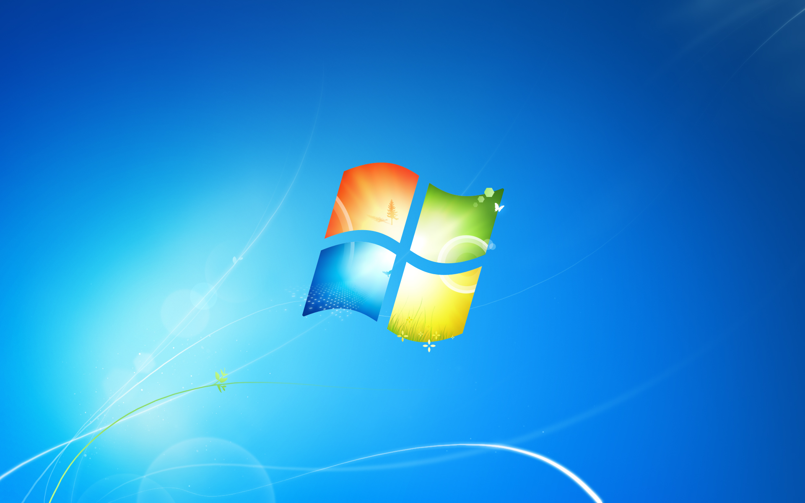
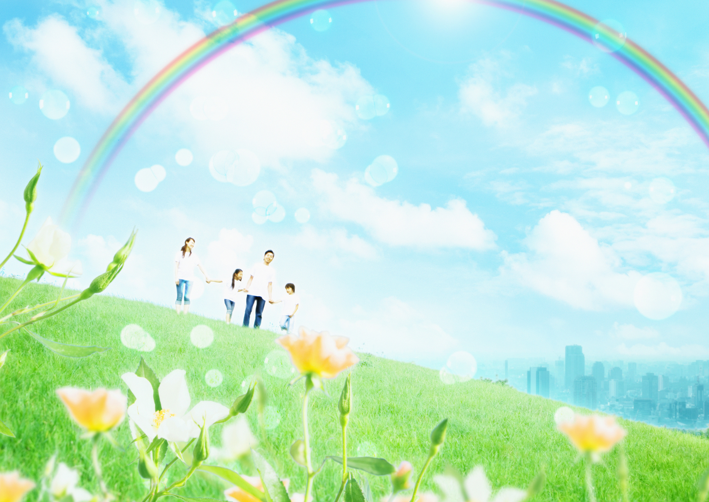

标题的这句话来自油管视频[《LEASE by Takeshi Abo but slightly bitcrushed for nostalgia》](https://www.youtube.com/watch?v=xsdWibwQdZE)的评论区，《LEASE》本是视觉小说游戏《皋月物语》的 BGM，却因为其极具千禧年代特色的旋律和音色，给人一种怀旧之感，并被广泛收录进各大 Frutiger Aero 歌单。

关于 Frutiger Aero，我有许多话要说，但又很难用文本准确的描述出来，就好像到底哪样的图片/音乐算是 Frutiger Aero 也并没有完全严格的界定一样，Frutiger Aero 更像是一种感觉，而我相信它给不同人在生命过程中带来的体验也截然不同。

我可以说，我怀念 Windows Vista/ iPhone 3GS 当年给我带来的惊艳；我怀念 3DS/Wii U 系统内丰富的内置应用和 BGM；我怀念那科技干净、简单又富含无限想象的日子。

   
  Windows 7 默认壁纸，同时蕴含科技感与自然要素

前两年的时候我也会听 Frutiger Aero 的音乐，而真正让我越来越萌发怀旧之情的并非我持续增长的年龄（当然，也不排除这个因素），而是正在颠覆一切的 LLM，bug 频出的 Windows 11/MacOS 26，无孔不入的短视频和推荐算法，以及日趋复杂的现代科技。

上个月 openclaw 正热的时候，我突然意识到，现代科技看起来好像很便利，但给人的感受却更累了：

+ 以前想看电视打开电视就能看。现在就算订阅好几家的会员都不一定能看全想看的东西，而且哪怕只是简简单单想看个电视台直播都得搞半天。
+ 以前买份体量大一点的报纸就能对各种新闻了解个大概。现在光看标题什么都看不出来，华尔街日报、彭博社等权威媒体还要花巨额订阅，门户和聚合平台新闻质量良莠不齐，自己搜集 RSS 费时耗力，更别说还能随时在 SNS 看到各种大大小小天南海北的资讯，以及不同观点的人在底下对骂。
+ 以前买东西，有优惠的话商场会在宣传单和价签上写的明明白白。现在几乎一人一个价，而且还有各种不同的优惠券和满减活动，精打细算之后可能也只是得到本来就该有的折扣。
+ 以前找餐馆吃饭，主要靠听回头客介绍，好的店都有口皆碑。现在大众点评之类的平台完全成了刷赞的场所，小红书上的避雷和推荐也让人怀疑这些博主是不是味觉失灵，真正的好店可能一直都不多，但又贵又普通的店可完全不见少。
+ 以前想了解点什么，找个专业论坛或去问人、看书都是不错的选择，哪怕信息可能有偏差，但也能自洽；现在信息散落在各个互不相通也不能统一检索到的“孤岛”不说，各种互相矛盾的观点也数不胜数，UGC 平台让每个人都可以发声，是真的什么人都可以发声。如果是去看 PGC 或“大 V”则更加热闹，不直播带货就算谢天谢地。真正的知识不仅可能更垄断，也更难在层层迷雾下被发掘出来了。
+ 以前买衣服，去店里可以最直观的看到试穿效果和选尺寸。现在线下店只剩优衣库还算“平价”，剩下的要么样式稀少，要么因为租金等原因价格居高不下，线上买很难根据商品介绍和评价买到合适的，买走眼了就只能退换货，折腾买家更折腾卖家。
+ 以前买火车票，有票就是有，没票就是没有，想去哪去火车站或代收点买就行。现在不知道有多少脚本在和你一起抢票，还通过“候补”来动态调整放票，逼迫用户买长乘短。
+ 以前用电脑、手机，虽然也能做不少事情，但本质上还是类似洗衣机、电话、微波炉一样的工具而已。现在几乎每个应用都想让你把更多时间留在屏幕上，而且为了迭代更多功能，作为工具本身也越来越不稳定了，再加上无孔不入的 AI，已经越来越说不清面前的这个东西到底是“计算机”还是“老虎机”。

这一切都让我想起了《Virtual Insanity》中的那句歌词 “useless, twisting, our new technology”。你可以说我在岁月史书，其实当年做各种事情就是远不如现在方便；你也可以大举各种理论，说这是因为用户成了被出售的商品，我们都被异化了。而真正令我感到遗憾和惋惜的是，Frutiger Aero，这个当初我们被承诺的未来，可能真的永远不会到来了。

没有错，未来。那个时候，我们相信科技会进一步造福人类，我们相信城市让生活更美好，我们相信明天真的会更好。而当我真正置身于未来，科技的确更发达了，城市也的确更现代了，但是却并不像想象中的那样轻盈、干净、可理解，连带那份对更远未来的相信，也逐渐消散了。

我们自然没有办法再回到过去的千禧年时光，也不可能时空跳跃到另一个不同的时间线，但好像也正因为这样，我们才更需要一些原始到几乎被忽略的选择：

去看真实的世界。

去和真正的人说话。

多接触自然，多接触真人。

   

  

