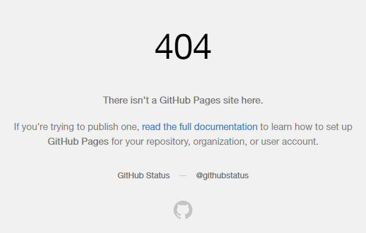

主要参考教程：

[使用vuepress搭建GitHub pages静态博客页面 - 站住，别跑 - 博客园](https://www.cnblogs.com/zjjDaily/p/13633786.html)

## cmd 找不到命令

npm 装的包（如 yarn）可以找到，但 yarn 装的包，如 theme-cli 找不到，需要用 `yarn global bin` 查询路径并添加到环境变量

```
git init
git add -A
git commit -m 'deploy'
git branch -m master main
git push -f git@github.com:duolanda/blog.git main
```


## GitHub Pages 404

根目录增加 `.nojekyll` 解决 GitHub Pages 访问时 404




## Maximum call stack size exceeded

[中文名字的 markdown 文件路由跳转会引起错误 · Issue #340 · vuepress-reco/vuepress-theme-reco](https://github.com/vuepress-reco/vuepress-theme-reco/issues/340)

文件名包含中文路径导致报错：

安装插件

``` 
$ yarn add -D vuepress-plugin-permalink-pinyin
```

配置插件

```js
module.exports = {
  plugins: [
      // 支持中文文件名
      [
        "permalink-pinyin",
        {
          lowercase: true, // Converted into lowercase, default: true
          separator: "-", // Separator of the slug, default: '-'
        },
      ],
  ]
}
```


## 编译 Typora 中的图片

[Vuepress 图片资源中文路径问题 ](https://segmentfault.com/a/1190000022275001)

1. 安装 `markdown-it-disable-url-encode`

   ```livescript
   $ yarn add markdown-it-disable-url-encode
   ```

2. 将其注入`vuepress` 配置文件中

   .vuepress/config.js

   ```javascript
   module.exports = {
     // .....
     markdown: {
       // ......
       extendMarkdown: md => {
         md.use(require("markdown-it-disable-url-encode"));
       }
     }
   };
   ```


## 插入公式

安装插件

```
$ yarn add markdown-it-katex
```

修改 `.vuepress/config.js` 下的配置，添加 `md.use(require("markdown-it-katex"))`

```js
module.exports = {
  markdown: {
     "extendMarkdown": md => {
        md.use(require("markdown-it-katex"))
      },
  }
}
```

对于 `markdown-it-katex` 来说，还需要修改 `head` 项，在 `.vuepress/config.js` 的 `head` 中添加如下两行：

```js
module.exports = {
  head: [
    // ...
    ["link", { rel: 'stylesheet', href: 'https://cdnjs.cloudflare.com/ajax/libs/KaTeX/0.7.1/katex.min.css' }],
    ["link", { rel: "stylesheet", href: "https://cdnjs.cloudflare.com/ajax/libs/github-markdown-css/2.10.0/github-markdown.min.css" }]
  ]
  // ...
}
```

在编写行内公式时，要注意`$`不要和内容间有空格：

```markdown
$z = \sqrt{x^2+y^2}$ 是可以的
$ z = \sqrt{x^2+y^2} $ 将无法正常渲染
```


## 时间格式错误

### 本地主题方法

该方法需要将主题复制到本地，详见 [vuepress reco主题优化与修改](https://blog.csdn.net/howareyou2104/article/details/107412555)，否则修改后再 yarn 别的包设置会被覆盖成原始的。

每篇文章开头的时间格式显示为 `08/19/2021`，不符合习惯。

进入 `node_modules\vuepress-theme-reco\components`（），打开 `PageInfo.vue`。

原始内容：

```vue
 const formatDateValue = (value) => {
 		  return new Intl.DateTimeFormat(instance.$lang).format(new Date(value))
    }
```

修改为：

```
 const formatDateValue = (value) => {
          let localDate = new Date(value).toJSON().split('T')[0]
          return localDate
    }
```

原因是，`toJSON()`方法返回的形式：`2021-01-13T23:15:30.000Z`，以字符 `T` 作为分割，取获得的数组第一个对象：`2021-01-13`。

### 改默认地区方法

将默认的 `lang` 改为 `zh-CN`，进入 `config.js`，添加如下内容：

```js
module.exports = {
  // 国际化相关
  locales: {
    // 键名是该语言所属的子路径
    // 作为特例，默认语言可以使用 '/' 作为其路径。
    '/': {
      lang: 'zh-CN', // 将会被设置为 <html> 的 lang 属性
    }
  },
} 
```


