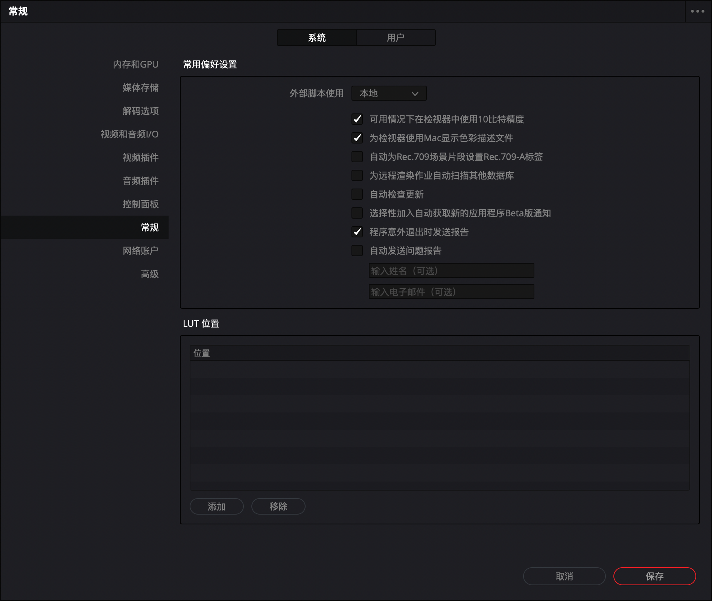
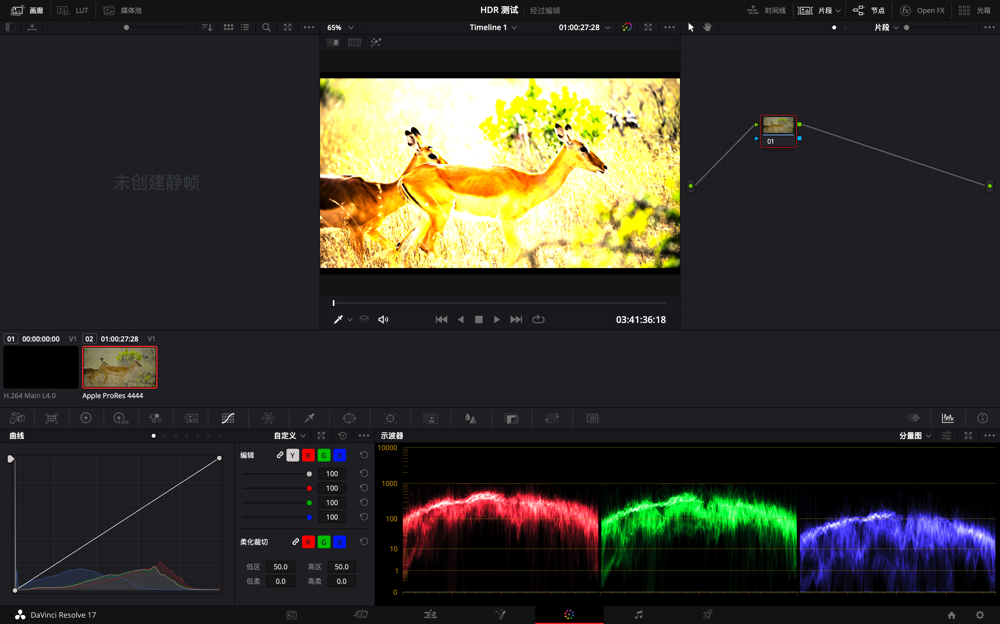
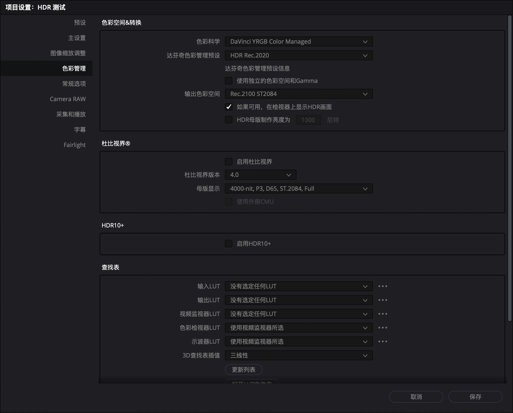
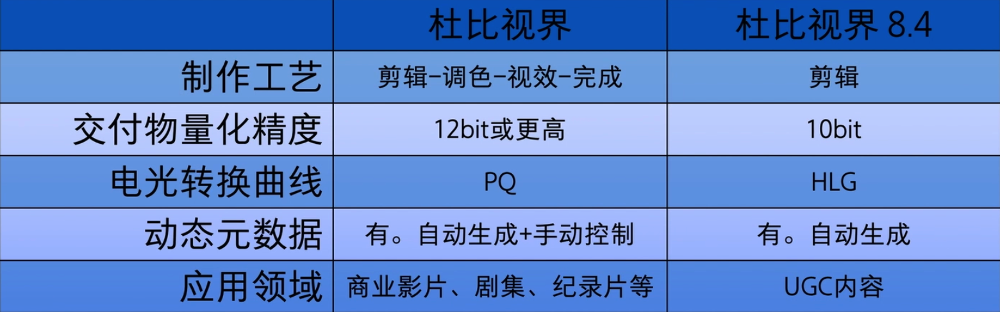
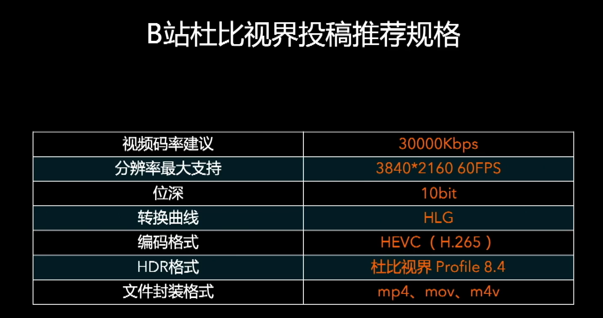
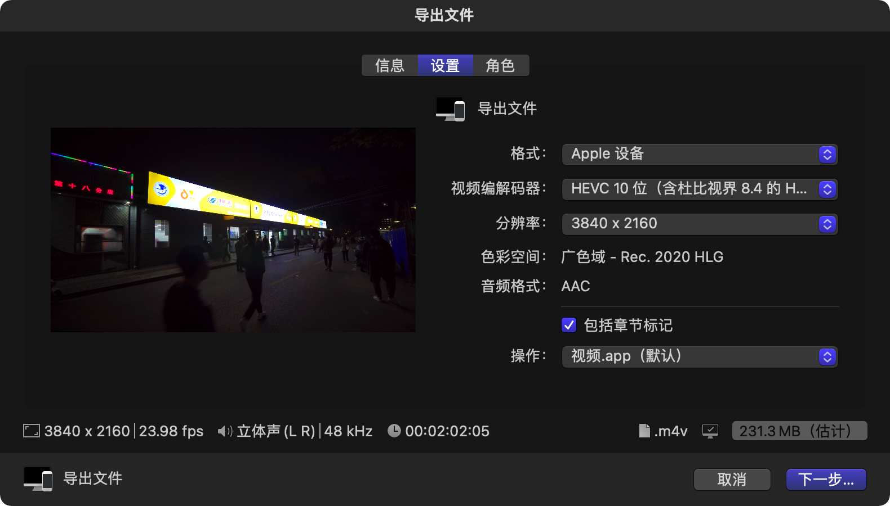

 ##	 达芬奇中启用 HDR 预览

> 将 PQ 曲线的 HDR 素材导入达芬奇并修改项目颜色设置后，虽然缩略图已经呈现出了 HDR 效果，但预览窗口中的画面并没有随之改变，甚至都没有按照曲线正常映射。

首先，需要在达芬奇的设置中，系统-常规，勾选`可用情况下在监视器中使用10比特精度`和`为监视器使用Mac显示色彩描述文件`。

重启达芬奇，接下来，可以看到预览窗口明显的发生了变化，说明 PQ 曲线得到了正常映射，但依然还是在 SDR 的范围内，即画面出现明显过曝。

进入项目设置，色彩管理-色彩空间&转换，勾选`如果可用，在监视器上显示HDR画面`，需要注意的是，只有在之前勾选了`可用情况下在监视器中使用10比特精度`才会出现这个选项。

保存设置好达芬奇即可在预览窗口中正确的显示 HDR 内容。

## 杜比视界

两种杜比视界交付规格的对比：

B 站只支持后者，但达芬奇的杜比视界做的是前者。

如果要在 PC 上制作，目前只能通过 Final Cut Pro 或 Compressor 输出基于【Rec.2020 / HLG】的 Dolby Vision Profile 8.4 的文件投稿 B 站。

如果用 DaVinci Resolve 做了基于 `Rec.2020 / PQ` 的 HDR 画面，可以通过 Final Cut Pro 的`HDR工具` 进行技术转换，配合 Compressor 输出为基于 `Rec.2020 / HLG` 的 Dolby Vision Profile 8.4 的 HDR 文件进行投稿。

## 参考

[Blackmagic Forum • View topic - No HDR on Apple's Pro Display XDR?](https://forum.blackmagicdesign.com/viewtopic.php?f=21&t=105930)

[HDR自习室｜不用IO卡和HDR监视器，笔记本制作和播放HDR节目？](https://xw.qq.com/cmsid/20210111A0FMVH00)

[【来复习】杜比视界UGC创作课程](https://www.bilibili.com/video/BV15v411u7za)

[杜比视界 UGC 视频制作（二）│ FCP 制作杜比视界内容_哔哩哔哩_bilibili](https://www.bilibili.com/video/BV1R44y1k7Qn)

[raytao423的动态](https://t.bilibili.com/560185660936529928)

