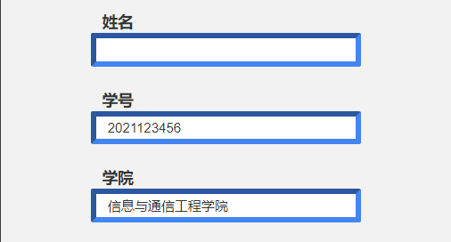
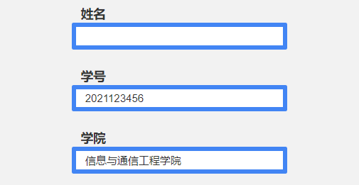

## border 边框颜色和设置不一样

[css border颜色显示不一致](https://blog.csdn.net/tang_zeyu/article/details/38558191)



在 css 中，border-color 的四个颜色设置都是相同的，但是显示出的结果却不一样，左侧和上方颜色与其他两边不同，也不是受到了其他 css 的影响。经排查，原因在 border 的格式上，添加如下代码

```css
border: solid;
```

解决问题



