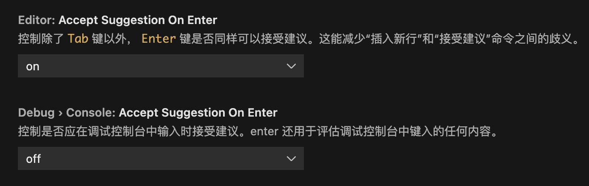

## 为 VS Code 的调试控制台切换成回车补全

不知道从哪个版本起，VS Code 在调试控制台中的补全从 enter 键变成了 tab 键。

网络上有人说需要编辑 VS Code 的快捷键配置 json 文件，但经过实际尝试后发现无效。实际上的解决方法要简单很多，直接在 VS Code 的首选项中，将 Accept Suggestion On Entter 从 off 改为 on 即可。

