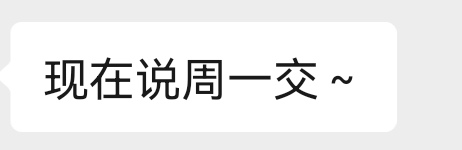

## 制作过程

**星期一：** 下午收到通知，交代了要做的基本内容，提供相机、脚架、灯棒，目前素材只有其他学院的竞品视频和文字稿（删减前）。晚上到处找模板，最后能用上的不多，也无法评估需要的模板类别（片头片尾形式不确定）。

**星期二：** 上午 8:30 去明光楼拍乒乓球机和门口牌子，下午马洋终于提供了素材（未分类），晚上把素材按章节分类，在 pr 里与演讲稿（自己配音）完成对应，标出缺少和不清晰的素材。

**星期三：** 上午去 107 和马洋对线，索要更多素材，调平稳定器，拍摄楼道、 118 奖状和公会角。下午去王书记办公室拍空镜，拍罗书记致辞。晚上，用新的素材、王书记录音、王书记新的想法重新在 Pr 里做对应剪辑，p 图，做好人名条。

**星期四：** 上午去拍档案文件的空境、王书记开场白，下午在课上找模板、拍充电桩，实拍素材全部完成，归还器材（晚上还让拍老师文创实物，但素材够了，没有去）。晚上先把当天的补充素材加到 Pr 轨道上，改标题模板，渲染标题，加 BGM（初步），做片尾，做文件，加字幕，加BGM（完全），调整节奏。改照片模板，套照片模板贯穿整个晚上，包括找、改、套、渲，每个部分一个模板，非常耗费时间，渲染快的十分钟，慢的俩小时，从周四晚上一直到周五早上七点。

**星期五：** 

## 修改意见

1. 所有领导讲话时的职位介绍要一直在，名字条名字颜色加黑。王莹直接写学院工会主席，罗书记直接写学院党委书记，李院长直接写学院院长 
2. 所有涉及到的红头文件以刚刚给你发的QQ版本为准，应该是全部需要更新
3. 第四点抓实活力建设工程所有的照片都是歪的（没法快速看清照片内容），需要换一个动效模板

4. 视频的4:35分处有一个吞音（档案管理有五档），不知道是音频处理的问题还是？

## 问题与总结

### 节奏控制

使用 Pr 最初进行粗剪时就要做好节奏的控制，在这个视频中，王书记为了压缩时长到五分钟，节奏很紧凑，每个部分小标题和内容间几乎没有间隔，每个部分结尾与下一部分标题也几乎没有间隔。如果不做额外处理，完全按照录音文件进行组织，视频成片几乎没有给观众喘息的空间，高密度的内容也容易带来视觉疲劳。

Pr 的粗剪节奏会牵涉到 BGM、字幕、铺于其上的模板渲染成片，越晚进行改动花费的成本就越高，哪怕粗剪素材可能会影响判断，也应及早进行调整。

模板展示图片的节奏同样要纳入考虑，在没有足够时间对模板做针对性修改的情况下，往往通过变速完成与粗剪的匹配。在这个项目中出现了有的部分速度过快（300%），有的部分速度过慢（75%）的问题，相同时间内有的展示照片多，有的少，节奏非常不统一。

### 模板的定制

即使不需要向大型项目那样对模板进行非常深度的定制改造，也不能低估在这方面耗费的精力，这个项目中，对模板的定制主要涉及到以下部分：

- 画幅，一些模板为了展示证书/文件会兼含横幅、竖幅的合成内容，除了修改合成尺寸之外，还要调整与之匹配的文字标题等。

- 颜色，将模板五花八门的主题色统一到数媒紫，因为整体的风格偏简洁现代，也需要修改掉不适宜的颜色，或将暗色背景提亮。

- 表达式，这次遇到了模板表达式是中文的情况，不被英文 AE 所兼容，建议寻找或自己编写插件，同时解决中文 AE 英文表达式、英文 AE 中文表达式的问题。

- 去除不需要的元素，如装饰性的❌、多余的解释文字、过于花哨的粒子/光线。

一个部分可能会有多次套用同一模板的情况，建议每次导出后都另存一个 aep，以便修改返工。

### 看准效果

在本次制作中出现了几次因为没有看准模板最终呈现效果而不得不返工的问题，如下：

- 摄像机倾斜角度过大，导致照片内容不是很明显，问题严重到被在意见反馈时提出。
- 原模板摄像机对焦参数有误，最后输出视频中的照片都被虚化了。
- 修改证书模板，原文是先两张后一张，改模板时做成了先一张后两张，不得不通过更改剪辑中音频的顺序来解决。
